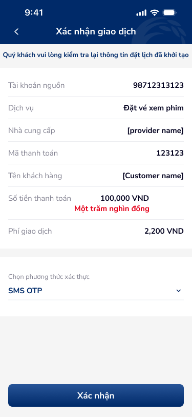
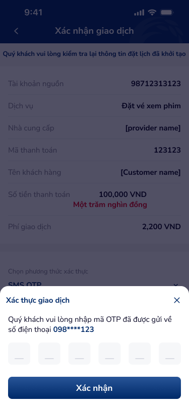

# SCR-TT-005 — Thanh toán vé xem phim › Xác nhận giao dịch

> `SCR-TT-005` · confirm · 2 artboards (base + OTP overlay)

## 1. User Flow

| Bước | Hành động | Kết quả |
|------|-----------|---------|
| 1 | Từ SCR-TT-004, nhấn "Tiếp tục" | Hiển thị xác nhận GD |
| 2 | Review: TK nguồn, dịch vụ, nhà cung cấp, mã TT, tên KH, số tiền, phí | Read-only |
| 3 | Chọn phương thức xác thực | SMS OTP (dropdown) |
| 4 | Nhấn "Xác nhận" | Mở OTP bottom-sheet |
| 5 | Nhập 6 số OTP | Fill digit cells |
| 6 | Nhấn "Xác nhận" OTP | → SCR-TT-006 |
| 7 | Nhấn X đóng OTP | Quay về base confirm |

## 2. User Story

**US-001:** Là khách hàng, tôi muốn xác nhận thông tin đặt vé xem phim trước khi thanh toán.

- AC1: Review đầy đủ: TK nguồn, dịch vụ, nhà cung cấp, mã TT, tên KH
- AC2: Số tiền bằng số + bằng chữ (đỏ): "100,000 VND" + "Một trăm nghìn đồng"
- AC3: Phí giao dịch hiển thị rõ

**US-002:** Là khách hàng, tôi muốn xác thực giao dịch bằng SMS OTP.

- AC1: 6 digit OTP input cells
- AC2: Số ĐT masked: 098****123

## 3. Mô tả màn hình (Wireframe)

### Variants

| # | Variant | Ảnh | Mô tả |
|---|---------|-----|-------|
| 1 | Xác nhận base |  | Banner vàng, 7 info rows, SMS OTP, CTA |
| 2 | OTP overlay |  | Bottom-sheet OTP 6 cells |

### Thành phần UI

| Thành phần | Loại | Mô tả |
|------------|------|-------|
| Header | Navigation bar | "Xác nhận giao dịch", back arrow |
| Banner | Warning | Banner vàng "kiểm tra lại thông tin đặt lịch đã khởi tạo" |
| Info rows | Label-value | TK nguồn, Dịch vụ, Nhà cung cấp, Mã TT, Tên KH, Số tiền, Phí |
| Amount text | Red text | "Một trăm nghìn đồng" |
| Auth selector | Dropdown | "SMS OTP" + chevron |
| OTP sheet | Bottom-sheet | Title, masked phone, 6 digit cells, X close, "Xác nhận" |

## 4. Database / Entities

| Entity | Fields | Constraints |
|--------|--------|-------------|
| MovieConfirmation | transaction_id, source_account, service, provider, payment_code, customer_name, amount, amount_text, fee, auth_method | provider e.g. "CGV" |
| OTPSession | session_id, phone_masked, digits, expires_at | ttl=120s |

## 5. NFR

- **Bảo mật:** OTP session timeout 120s, max 3 attempts
- **Trải nghiệm:** Banner text "đặt lịch" mismatch với context "đặt vé" — cần fix
