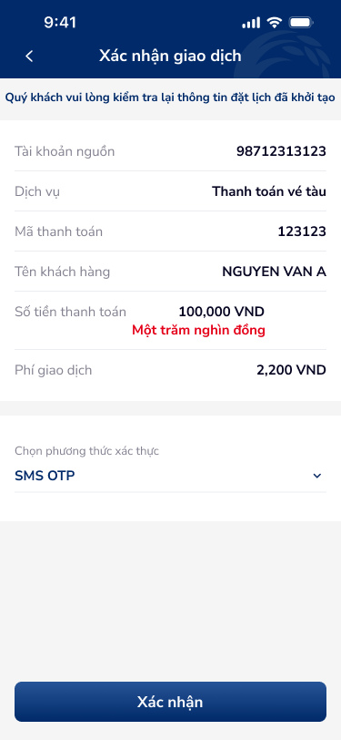
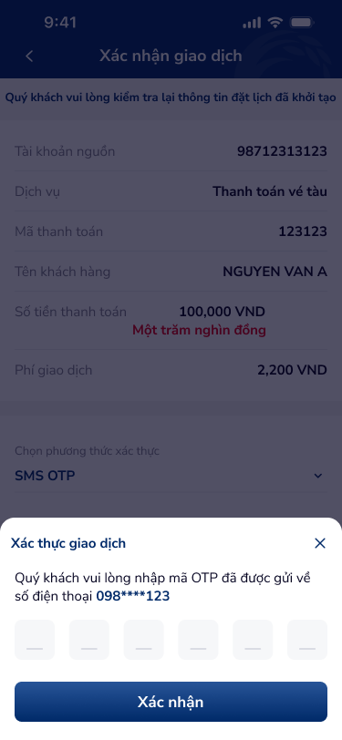

# SCR-TT-008 — Thanh toán vé tàu › Xác nhận giao dịch

> `SCR-TT-008` · confirm · 2 artboards (base + OTP overlay)

## 1. User Flow

| Bước | Hành động | Kết quả |
|------|-----------|---------|
| 1 | Từ SCR-TT-007, nhấn "Tiếp tục" | Hiển thị xác nhận |
| 2 | Review: TK, dịch vụ, mã TT, tên KH, số tiền, phí | Read-only |
| 3 | Chọn SMS OTP | Dropdown |
| 4 | Nhấn "Xác nhận" | Mở OTP sheet |
| 5 | Nhập 6 số OTP | Fill cells |
| 6 | Nhấn "Xác nhận" OTP | → SCR-TT-009 |

## 2. User Story

**US-001:** Là khách hàng, tôi muốn xác nhận thanh toán vé tàu trước khi hoàn tất.

- AC1: Review TK nguồn, dịch vụ "Thanh toán vé tàu", mã TT, tên KH
- AC2: Số tiền + bằng chữ (đỏ): "100,000 VND" + "Một trăm nghìn đồng"
- AC3: Phí GD: 2,200 VND
- AC4: OTP bottom-sheet 6 cells

## 3. Mô tả màn hình (Wireframe)

### Variants

| # | Variant | Ảnh | Mô tả |
|---|---------|-----|-------|
| 1 | Xác nhận base |  | Banner vàng, 6 info rows, SMS OTP, CTA |
| 2 | OTP overlay |  | Bottom-sheet 6 digit cells |

### Thành phần UI

| Thành phần | Loại | Mô tả |
|------------|------|-------|
| Header | Navigation bar | "Xác nhận giao dịch", back |
| Banner | Warning | "kiểm tra lại thông tin đặt lịch đã khởi tạo" |
| Info rows | Label-value | TK, Dịch vụ, Mã TT, Tên KH, Số tiền, Phí |
| Amount text | Red | "Một trăm nghìn đồng" |
| Auth | Dropdown | SMS OTP |
| OTP sheet | Bottom-sheet | 6 cells, X close, CTA |

## 4. Database / Entities

| Entity | Fields | Constraints |
|--------|--------|-------------|
| TrainConfirmation | transaction_id, source_account, service, payment_code, customer_name, amount, fee, auth_method | Similar to SCR-TT-002 |

## 5. NFR

- **Bảo mật:** OTP 120s timeout, max 3 attempts
- **Trải nghiệm:** OTP spacing tight — cần tăng padding
