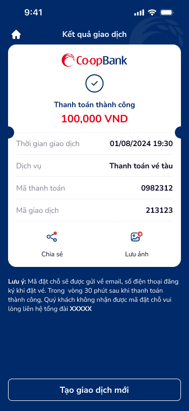

# SCR-TT-009 — Thanh toán vé tàu › Kết quả giao dịch

> `SCR-TT-009` · result · 1 artboard

## 1. User Flow

| Bước | Hành động | Kết quả |
|------|-----------|---------|
| 1 | OTP success từ SCR-TT-008 | Hiển thị kết quả |
| 2 | Nhấn "Chia sẻ" | Share biên nhận |
| 3 | Nhấn "Lưu ảnh" | Lưu screenshot |
| 4 | Nhấn "Tạo giao dịch mới" | Quay lại flow |
| 5 | Nhấn home | Về trang chủ |

## 2. User Story

**US-001:** Là khách hàng, tôi muốn thấy kết quả thanh toán vé tàu thành công.

- AC1: Checkmark + "Thanh toán thành công" + 100,000 VND green
- AC2: Chi tiết: thời gian, dịch vụ, mã TT, mã GD
- AC3: Lưu ý mã đặt chỗ email/SMS 30 phút + hotline

## 3. Mô tả màn hình (Wireframe)

### Variants

| # | Variant | Ảnh | Mô tả |
|---|---------|-----|-------|
| 1 | Kết quả thành công |  | Result card, 4 detail rows, notice, CTA outlined |

### Thành phần UI

| Thành phần | Loại | Mô tả |
|------------|------|-------|
| Header | Navigation bar | "Kết quả giao dịch", home icon |
| Result card | Card | CoopBank logo, checkmark, success, 100K VND green |
| Detail rows | 4 label-value | Thời gian, Dịch vụ, Mã TT, Mã GD |
| Actions | Icon + label | "Chia sẻ", "Lưu ảnh" |
| Notice | Warning box | Mã đặt chỗ + tổng đài XXXXX |
| CTA outlined | Button | "Tạo giao dịch mới" |

## 4. Database / Entities

| Entity | Fields | Constraints |
|--------|--------|-------------|
| TrainResult | transaction_id, status, amount, timestamp, service, payment_code, reference_code | status = "success" |

## 5. NFR

- **Bảo mật:** Mã đặt chỗ gửi riêng
- **Trải nghiệm:** Hotline placeholder "XXXXX" cần số thật
- **Peak-end:** Success card prominent
