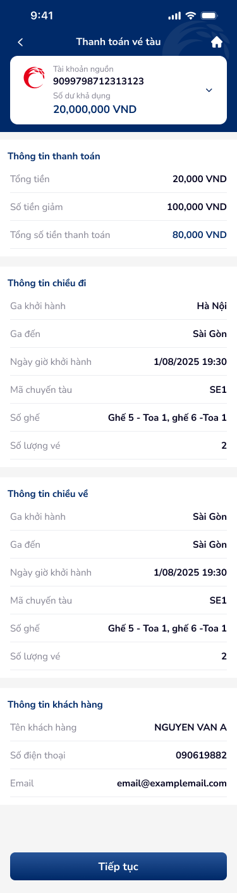
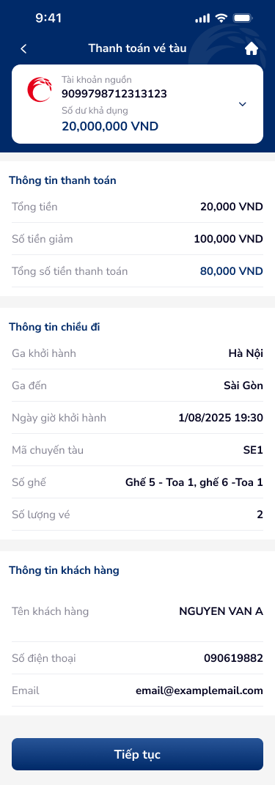

# 03 — Chi tiết phát hiện

> 12 vấn đề được xác định, sắp xếp theo mức độ ảnh hưởng

---

## UXP-001 · 🔴 Critical

### Thông tin xác nhận giao dịch lặp lại gây quá tải nhận thức

| | |
|---|---|
| **Ảnh minh họa** |  |
| **Hiện trạng** | Màn hình xác nhận hiển thị lại toàn bộ thông tin đã có ở form trước đó — tài khoản nguồn, dịch vụ, mã thanh toán, số tiền. Banner "kiểm tra lại thông tin đặt lịch đã khởi tạo" dùng từ "đặt lịch" không khớp context thanh toán. |
| **Tác động** | • Người dùng "lướt qua" thay vì đọc kỹ — bỏ qua lỗi dữ liệu |
| | • Banner text sai gây nhầm lẫn |
| **Heuristic vi phạm** | **Aesthetic & Minimalist Design** (Nielsen #8) — Chỉ hiển thị thông tin cần thiết, giảm nhiễu. |
| **Đề xuất cải thiện** | **Tối ưu màn hình xác nhận:** |
| | • Áp dụng Smart Summary: chỉ hiện key fields + expandable "Xem chi tiết" |
| | • Sửa banner text theo context cụ thể: "thanh toán vé xem phim" |
| **Tags** | `Xác nhận` · `Cognitive Load` |
| **Tham chiếu** | DDL: UXG-52 (Information Hierarchy), Cognitive Load Theory |

---

## UXP-002 · 🔴 Critical

### Xác thực OTP thiếu bộ đếm thời gian và nút gửi lại mã

| | |
|---|---|
| **Ảnh minh họa** |  |
| **Hiện trạng** | Tất cả 3 luồng thanh toán đều có overlay OTP với 6 ô nhập nhưng không hiển thị bộ đếm ngược thời gian hết hạn OTP và không có nút "Gửi lại mã" khi hết thời gian chờ. |
| **Tác động** | • OTP hết hạn mà người dùng không biết — phải thoát và bắt đầu lại |
| | • Tỷ lệ bỏ ngang tăng cao ở bước xác thực |
| **Heuristic vi phạm** | **Visibility of System Status** (Nielsen #1) — Người dùng cần biết trạng thái OTP: còn bao lâu, có thể gửi lại không. |
| **Đề xuất cải thiện** | **Bổ sung timer và resend:** |
| | • Hiển thị countdown "Còn 02:00" bên dưới ô nhập OTP |
| | • Nút "Gửi lại mã OTP" hiện khi timer = 0 |
| | • OTP tự gửi khi đủ 6 ký tự (giảm 1 thao tác) |
| **Tags** | `OTP` · `Xác thực` |
| **Tham chiếu** | DDL: COMP:otp-input-1 (canResend, timeLeft) |

---

## UXP-003 · 🔴 Critical

### Form thanh toán vé tàu khứ hồi quá dài — cuộn hơn 1400 pixel

| | |
|---|---|
| **Ảnh minh họa** |  |
| **Hiện trạng** | Variant khứ hồi chứa khoảng 20 dòng thông tin across 4 mục (thanh toán, chiều đi, chiều về, khách hàng). Người dùng phải cuộn gần 2 lần viewport để thấy nút "Tiếp tục". |
| **Tác động** | • Mệt mỏi khi cuộn — không review toàn bộ dữ liệu |
| | • Tăng tỷ lệ bỏ ngang ở form dài |
| **Heuristic vi phạm** | **Flexibility & Efficiency of Use** (Nielsen #7) — Form dài cần collapsible sections. |
| **Đề xuất cải thiện** | **Tối ưu form dài:** |
| | • Collapsible sections — tap để thu gọn/mở |
| | • Sticky summary bar: tổng tiền + số vé |
| | • Nút "Tiếp tục" luôn hiển thị sticky ở bottom |
| **Tags** | `Vé tàu` · `Long Form` |
| **Tham chiếu** | DDL: UXG-52 (Long List Orientation) |

---

## UXP-004 · 🟠 Major

### Banner cảnh báo dùng từ "đặt lịch" không phù hợp với context thanh toán

| | |
|---|---|
| **Ảnh minh họa** |  |
| **Hiện trạng** | Banner "Quý khách vui lòng kiểm tra lại thông tin đặt lịch đã khởi tạo" được sao chép nguyên văn cho cả 3 dịch vụ: Vietlott, vé xem phim, vé tàu. Từ "đặt lịch" không đúng trong bất kỳ context nào. |
| **Tác động** | • Người dùng nhầm lẫn — "đặt lịch gì?" |
| | • Banner mất hiệu quả cảnh báo |
| **Heuristic vi phạm** | **Match Between System & Real World** (Nielsen #2) — Ngôn ngữ phải phù hợp với context. |
| **Đề xuất cải thiện** | **Context-specific banner:** |
| | • Sửa text banner theo từng dịch vụ: "kiểm tra lại thông tin thanh toán vé xem phim" |
| **Tags** | `Content` · `Copy` |
| **Tham chiếu** | DDL: UXG-78 (Content Quality) |

---

## UXP-005 · 🟠 Major

### Dropdown phương thức xác thực chỉ có một lựa chọn duy nhất

| | |
|---|---|
| **Ảnh minh họa** |  |
| **Hiện trạng** | Dropdown "Chọn phương thức xác thực" chỉ hiển thị "SMS OTP" là lựa chọn duy nhất — dropdown với 1 option là giao diện thừa, tạo thêm 2 thao tác không cần thiết. |
| **Tác động** | • Tăng friction mỗi giao dịch (2 thao tác thừa) |
| | • Dropdown 1 option = anti-pattern UX |
| **Heuristic vi phạm** | **Flexibility & Efficiency of Use** (Nielsen #7) — Giảm bước không cần thiết. |
| **Đề xuất cải thiện** | **Auto-select khi chỉ 1 option:** |
| | • Nếu chỉ 1 phương thức → hiển thị text tĩnh "Xác thực qua SMS OTP" |
| | • Giữ dropdown nếu lộ trình có thêm phương thức |
| **Tags** | `Xác nhận` · `Efficiency` |
| **Tham chiếu** | DDL: Hick's Law — 1 option ≠ choice |

---

## UXP-006 · 🟠 Major

### Số tổng đài hỗ trợ hiển thị placeholder "XXXXX" thay vì số thật

| | |
|---|---|
| **Ảnh minh họa** |  |
| **Hiện trạng** | Lưu ý trên kết quả giao dịch vé xem phim và vé tàu ghi "liên hệ tổng đài XXXXX" — đây là placeholder chưa được thay bằng số tổng đài thật. |
| **Tác động** | • Người dùng không thể liên hệ hỗ trợ khi cần |
| | • Mất niềm tin vào ứng dụng ngân hàng |
| **Heuristic vi phạm** | **Help & Documentation** (Nielsen #10) — Thông tin hỗ trợ phải chính xác và khả dụng. |
| **Đề xuất cải thiện** | **Thay placeholder:** |
| | • Thay "XXXXX" bằng số tổng đài thật (1900xxxx) |
| | • Làm số tổng đài có thể nhấn gọi (tel: link) |
| **Tags** | `Kết quả` · `Content` |
| **Tham chiếu** | DDL: UXG-78 (Content Quality) |

---

## UXP-007 · 🟠 Major

### Thông tin khách hàng hiển thị placeholder thô "[Customer name]"

| | |
|---|---|
| **Ảnh minh họa** | ![⚠️ Placeholder "[Customer name]"](ui/1000thanh-toan-ve-xem-phim.png) |
| **Hiện trạng** | Form thanh toán vé xem phim chứa "[Customer name]", "[Phone number]", "email@examplemail.com" — placeholder thô từ SDK hiển thị trực tiếp, gây nhầm lẫn. |
| **Tác động** | • Người dùng nghi ngờ: "Tên tôi là [Customer name]?" |
| | • Thiết kế không thật → developer có thể ship placeholder |
| **Heuristic vi phạm** | **Aesthetic & Minimalist Design** (Nielsen #8) — Thiết kế phải dùng dữ liệu mẫu thật. |
| **Đề xuất cải thiện** | **Dữ liệu mẫu thật:** |
| | • Thay bằng dữ liệu mẫu: "Nguyễn Văn A", "098****123" |
| **Tags** | `Form` · `Data Quality` |
| **Tham chiếu** | DDL: UXG-78 (Content Quality) |

---

## UXP-008 · 🟠 Major

### Dữ liệu mẫu vé tàu có lỗi toán học và lỗi sao chép

| | |
|---|---|
| **Ảnh minh họa** |  |
| **Hiện trạng** | Tổng tiền: 20,000 VND nhưng Số tiền giảm: 100,000 VND — không hợp lý (tổng < giảm). Chiều về: Ga khởi hành = "Sài Gòn", Ga đến = "Sài Gòn" — lỗi sao chép dữ liệu. |
| **Tác động** | • Mất niềm tin — ngân hàng tính sai tiền? |
| | • Lỗi dữ liệu trong thiết kế → developer ship lỗi logic |
| **Heuristic vi phạm** | **Error Prevention** (Nielsen #5) — Validation dữ liệu phải đúng từ khâu thiết kế. |
| **Đề xuất cải thiện** | **Sửa dữ liệu mẫu:** |
| | • Fix toán: Tổng 120K, Giảm 40K, Thanh toán 80K |
| | • Fix chiều về: Ga đến = "Hà Nội" (ngược chiều đi) |
| **Tags** | `Vé tàu` · `Data` |
| **Tham chiếu** | DDL: UXG-243 (Error Prevention) |

---

## UXP-009 · 🟡 Minor

### Thiếu tùy chọn tải biên nhận PDF cho mục đích chứng từ

| | |
|---|---|
| **Ảnh minh họa** |  |
| **Hiện trạng** | Kết quả giao dịch chỉ có "Lưu ảnh" (screenshot) — không có tùy chọn tải biên nhận PDF, cần thiết cho chứng từ ngân hàng. |
| **Tác động** | • Screenshot chất lượng thấp hơn PDF cho lưu trữ chứng từ |
| **Heuristic vi phạm** | **Flexibility & Efficiency of Use** (Nielsen #7) — Cung cấp nhiều định dạng cho người dùng chuyên nghiệp. |
| **Đề xuất cải thiện** | **Thêm tải PDF:** |
| | • Thêm "Tải biên nhận PDF" cạnh "Lưu ảnh" |
| **Tags** | `Kết quả` · `Export` |
| **Tham chiếu** | DDL: COMP:receipt-preview-1 |

---

## UXP-010 · 🟡 Minor

### Header màn hình xác nhận thiếu icon trang chủ so với form

| | |
|---|---|
| **Ảnh minh họa** |  |
| **Hiện trạng** | Form thanh toán có cả nút back + home, nhưng xác nhận giao dịch chỉ có nút back — không nhất quán. |
| **Tác động** | • Muốn về trang chủ từ xác nhận phải qua nhiều bước |
| **Heuristic vi phạm** | **Consistency & Standards** (Nielsen #4) — Header phải nhất quán giữa các màn hình. |
| **Đề xuất cải thiện** | **Đồng bộ header:** |
| | • Thêm icon home cho tất cả màn hình xác nhận |
| **Tags** | `Navigation` · `Consistency` |
| **Tham chiếu** | DDL: COMP:app-header-1 |

---

## UXP-011 · 🟡 Minor

### Kết quả giao dịch thiếu nút chính "Về trang chủ"

| | |
|---|---|
| **Ảnh minh họa** |  |
| **Hiện trạng** | Nút hành động chính chỉ là "Tạo giao dịch mới" (outlined) — hành vi phổ biến nhất là "về trang chủ" nhưng chỉ có icon nhỏ ở header. |
| **Tác động** | • Người dùng phải tìm icon home nhỏ khi muốn thoát |
| **Heuristic vi phạm** | **User Control & Freedom** (Nielsen #3) — Cung cấp lối thoát rõ ràng. |
| **Đề xuất cải thiện** | **Đảo ưu tiên nút:** |
| | • "Về trang chủ" (filled) + "Tạo giao dịch mới" (outlined) |
| **Tags** | `Kết quả` · `Navigation` |
| **Tham chiếu** | Peak-End Rule |

---

## UXP-012 · 🟡 Minor

### Khoảng cách giữa các ô nhập OTP và nút xác nhận quá hẹp

| | |
|---|---|
| **Ảnh minh họa** |  |
| **Hiện trạng** | Overlay OTP có 6 ô nhập sát nhau, khoảng cách giữa ô nhập và nút "Xác nhận" nhỏ — có thể chạm nhầm. |
| **Tác động** | • Chạm nhầm giữa các ô nếu khoảng cách quá nhỏ |
| **Heuristic vi phạm** | **Error Prevention** (Nielsen #5) — Khoảng cách vùng chạm tối thiểu. |
| **Đề xuất cải thiện** | **Tăng spacing:** |
| | • Tăng cellGap lên 12px |
| | • Thêm 24px padding giữa ô nhập và nút |
| **Tags** | `OTP` · `Touch Target` |
| **Tham chiếu** | DDL: COMP:otp-input-1, Fitts's Law |

---

## Tổng hợp Findings

| ID | Tên vấn đề | Severity | Heuristic |
|---|---|---|---|
| UXP-001 | Thông tin xác nhận giao dịch lặp lại gây quá tải nhận thức | 🔴 Critical | Aesthetic & Minimalist Design |
| UXP-002 | Xác thực OTP thiếu bộ đếm thời gian và nút gửi lại mã | 🔴 Critical | Visibility of System Status |
| UXP-003 | Form thanh toán vé tàu khứ hồi quá dài — cuộn hơn 1400 pixel | 🔴 Critical | Flexibility & Efficiency of Use |
| UXP-004 | Banner cảnh báo dùng từ "đặt lịch" không phù hợp với context thanh toán | 🟠 Major | Match Between System & Real World |
| UXP-005 | Dropdown phương thức xác thực chỉ có một lựa chọn duy nhất | 🟠 Major | Flexibility & Efficiency of Use |
| UXP-006 | Số tổng đài hỗ trợ hiển thị placeholder "XXXXX" thay vì số thật | 🟠 Major | Help & Documentation |
| UXP-007 | Thông tin khách hàng hiển thị placeholder thô "[Customer name]" | 🟠 Major | Aesthetic & Minimalist Design |
| UXP-008 | Dữ liệu mẫu vé tàu có lỗi toán học và lỗi sao chép | 🟠 Major | Error Prevention |
| UXP-009 | Thiếu tùy chọn tải biên nhận PDF cho mục đích chứng từ | 🟡 Minor | Flexibility & Efficiency of Use |
| UXP-010 | Header màn hình xác nhận thiếu icon trang chủ so với form | 🟡 Minor | Consistency & Standards |
| UXP-011 | Kết quả giao dịch thiếu nút chính "Về trang chủ" | 🟡 Minor | User Control & Freedom |
| UXP-012 | Khoảng cách giữa các ô nhập OTP và nút xác nhận quá hẹp | 🟡 Minor | Error Prevention |
