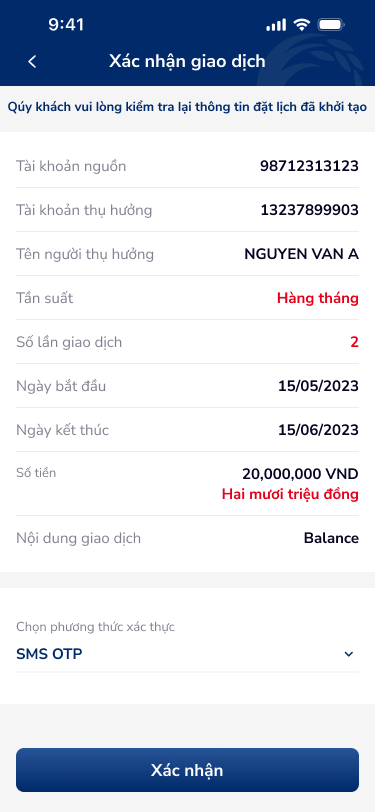

# Chuyển tiền nội bộ khác chủ (Xác nhận) — PRD (Xác nhận giao dịch)

Tài liệu PRD cho bước kiểm tra thông tin và nhập OTP xác thực giao dịch chuyển tiền. Khu vực `package-2/chuyen-tien-noi-bo-khac-chu`.

---

## 1. User Flow

### 1.1. Luồng Xác thực
| Bước | Tên màn hình | Tên hành động | Kết quả |
|:---:|---|---|---|
| 1 | `chuyen-tien-noi-bo-khac-chu-confirm` | Kiểm tra Label-Value (Card) và Nhấn "Xác nhận" | Mở Bottom Sheet Nhập SMS OTP |
| 2 | `chuyen-tien-noi-bo-khac-chu-confirm-otp` | Nhập đủ 6 số OTP (098****123) | Sang màn hình kết quả Result |

---

## 2. User Story

| STT | Mã US | Mục tiêu | Lợi ích | Business Rule | Acceptance Criteria |
|:---:|:---:|---|---|---|---|
| 1 | US-004 | Kiểm tra thông tin | Xác nhận số tiền và thụ hưởng | 🤖 by AI | Hiển thị highlight đỏ "Hàng tháng", "2", "20,000,000 VND" |
| 2 | US-005 | Nhập SMS OTP | Bảo mật xác thực chủ tài khoản | 🤖 by AI | Box gồm 6 ô, nhập vào focus tự chuyển, sai OTP cảnh báo. |
| 3 | US-006 | Phương thức xác thực | Tuỳ chọn bảo mật | 🤖 by AI | Combo-box Dropdown "Chọn phương thức xác thực -> SMS OTP" |

---

## 3. Wireframe

### Hình ảnh minh họa

### Mô tả màn hình

| STT | Tên màn hình | Loại thành phần | Mô tả |
|---|---|---|---|
| 1 | Thông tin giao dịch | Card | TK nguồn: `98712313123`, Thụ hưởng: `13237899903`, Tên: `NGUYEN VAN A` |
| 2 | Option Auth | Combo-box/Dropdown | "Chọn phương thức xác thực" |
| 3 | OTP Dialog | Bottom Sheet | Tiêu đề: "Xác thực giao dịch", Icon Close, Label che số điện thoại (098****123) |

### Kết quả OCR (toàn bộ)
| Ảnh | Loại | Nội dung | Vị trí | Đã khớp spec |
|---|---|---|---|---|
| `internal-transaction-5` | Text | Quý khách vui lòng kiểm tra lại | (0,0) | Y |
| `internal-transaction-6` | Text | Quý khách vui lòng nhập mã OTP | (0,0) | Y |

### Đề xuất cải thiện UX (từ OCR)
> 🤖 by AI | Nguồn: ocr + components + DDL (ux-guidelines) | Độ tin cậy: Medium
- Cần tối ưu khoảng cách (touch target) cho nút Close(X) trên Sheet Xác thực (DDL: `web-interface.csv#14`).
- Tăng độ tương phản (contrast overlay) khi bật Bottom Sheet OTP so với nền mờ.

---

## 4. Thiết kế Database

### Entity: TransactionAuth (Xác thực giao dịch)
| Field | Data Type | Constraint | Description |
|---|---|---|---|
| `auth_method` | String | IN ('SMS OTP', 'Smart OTP') | Phương thức chọn |
| `auth_phone` | String(15) | CHE SĐT | Gửi về cho `098****123` |
| `auth_otp` | String(6) | MUST BE DIGITS | Value của 6 ô OTP input |

---

## 5. Non-functional requirement

- **Bảo mật:**
    - OTP expiration: 3 phút timeout bảo mật. (Che giấu chữ số nhập `***`)
- **Hiệu năng:**
    - Gửi SMS SMS OTP mất < 3s cho các mạng nội địa.
- **Trải nghiệm:**
    - Autofocus chuyển ô khi nhập số (Auto Move Next).

*Generated by VNPAY Agentic Framework*
