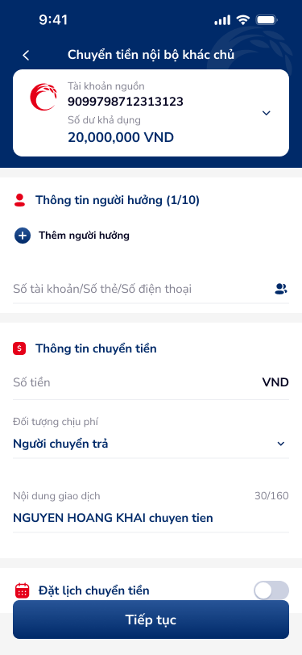
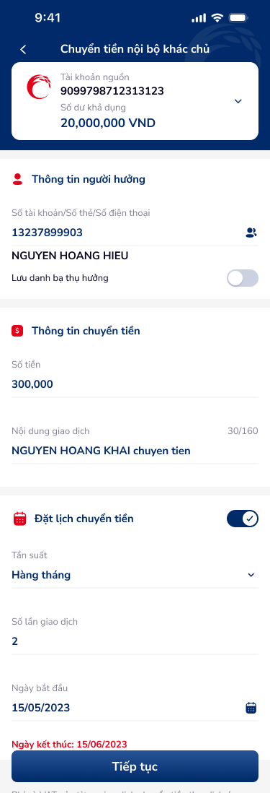
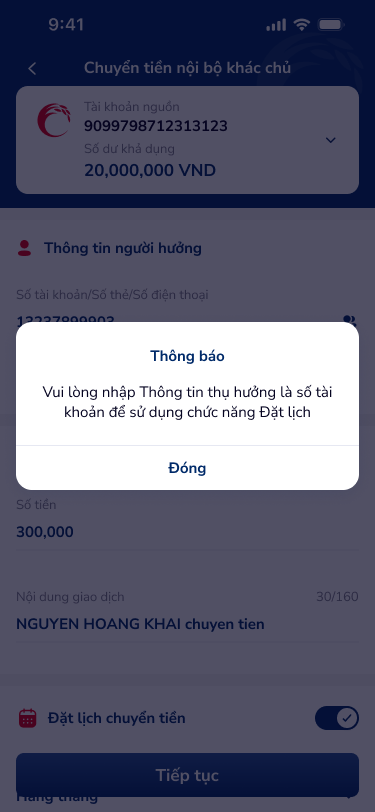
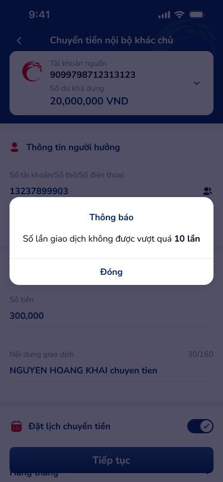

# Chuyển tiền nội bộ khác chủ — PRD (Chuyển tiền nội bộ khác chủ)

Tài liệu PRD cho tính năng chuyển tiền đi nội bộ qua số tài khoản. Có cho phép đặt lịch.

---

## 1. User Flow

### 1.1. Luồng chính (Happy Path)
| Bước | Tên màn hình | Tên hành động | Kết quả |
|:---:|---|---|---|
| 1 | `chuyen-tien-noi-bo-khac-chu` | Nhập "Số tài khoản / thẻ / điện thoại người thụ hưởng" | Tự động lấy "Tên người thụ hưởng" |
| 2 | `chuyen-tien-noi-bo-khac-chu-form` | Nhập "Số tiền", chọn "Tần suất" và nhấn "Tiếp tục" | Chuyển đến luồng Xác nhận `chuyen-tien-noi-bo-khac-chu-confirm` |

### 1.2. Luồng Exception
| Bước | Tên màn hình | Tên hành động | Kết quả |
|:---:|---|---|---|
| 1 | `chuyen-tien-noi-bo-khac-chu` | Nhấn "Tiếp tục" khi vượt quá "Số lần giao dịch" | Hiển thị Dialog (Thông báo: "Số lần giao dịch không được vượt quá 10 lần") -> Nút Đóng |
| 2 | `chuyen-tien-noi-bo-khac-chu` | Nhấn "Tiếp tục" với thông tin thụ hưởng không hợp lệ | Hiển thị Dialog (Thông báo: "Vui lòng nhập Thông tin thụ hưởng...") |

---

## 2. User Story

| STT | Mã US | Mục tiêu | Lợi ích | Business Rule | Acceptance Criteria |
|:---:|:---:|---|---|---|---|
| 1 | US-001 | Nhập thông tin thụ hưởng | Chọn người nhận tiền để tiếp tục | 🤖 by AI | Dữ liệu đúng định dạng số CMND/Số TK Tự động điền "NGUYEN HOANG HIEU" |
| 2 | US-002 | Nhập Số tiền | Số tiền giao dịch hợp lệ | 🤖 by AI | Nhập số > 0, <= 20,000,000 VND. Lỗi khi quá hạn mức |
| 3 | US-003 | Đặt lịch chuyển tiền | Tích hoạt tính năng Đặt lịch (Toggle On) | 🤖 by AI | On toggle, hiện Field "Tần suất", "Ngày bắt đầu", "Ngày kết thúc". Số lần giao dịch <= 10. |

---

## 3. Wireframe

### Hình ảnh minh họa

### Mô tả màn hình

| STT | Tên màn hình | Loại thành phần | Mô tả |
|---|---|---|---|
| 1 | Block Thông tin Nguồn | Header Card | Số tài khoản nguồn: `9099798712313123`, Số dư: `20,000,000 VND` |
| 2 | TextInput Thụ Hưởng | TextField | Nhập "Số tài khoản/Số thẻ/Số điện thoại", Có Icon Contact |
| 3 | TextInput Số tiền | TextField | Nhập "Số tiền" VNĐ |
| 4 | Setting Đặt lịch | Toggle/Dropdown | Cho phép Tần suất "Hàng tháng", Số lần "2", Ngày bắt đầu/Ngày kết thúc. |

### Kết quả OCR (toàn bộ)
| Ảnh | Loại | Nội dung | Vị trí | Đã khớp spec |
|---|---|---|---|---|
| `internal-transaction` | Text | Chuyển tiền nội bộ khác chủ | (0,0) | Y |
| `internal-transaction-2` | Text | Đặt lịch chuyển tiền | (0,0) | Y |

### Đề xuất cải thiện UX (từ OCR)
> 🤖 by AI | Nguồn: ocr + components + DDL (ux-guidelines) | Độ tin cậy: Medium
- Switch "Lưu danh bạ thụ hưởng" cần text status on/off. (DDL: `ux-guidelines.csv#11`)

---

## 4. Thiết kế Database

### Entity: TransactionInternal (Giao dịch nội bộ)
| Field | Data Type | Constraint | Description |
|---|---|---|---|
| `source_account` | String(16) | NOT NULL | Tài khoản trích tiền |
| `beneficiary_account` | String(20) | NOT NULL | TK/SĐT/CMND người nhận |
| `amount` | Decimal(15,2) | > 0 | Số tiền chuyển |
| `is_scheduled` | Boolean | DEFAULT FALSE | Trạng thái đặt lịch bật/tắt |
| `frequency` | String(20) | NULL | Hàng tháng / Hàng ngày... |
| `max_installments` | Integer | <= 10 | Tối đa 10 lần giao dịch |

---

## 5. Non-functional requirement

- **Bảo mật:**
    - Khởi tạo giao dịch đòi hỏi xác thực token API 2.0 theo chuẩn Co-op Bank.
- **Hiệu năng:**
    - Giao diện phản hồi < 1s cho các thao tác chuyển tab.
- **Trải nghiệm:**
    - 🤖 by AI: Touch target buttons > 44px (Tuân thủ AAA/AA WCAG).

*Generated by VNPAY Agentic Framework*
