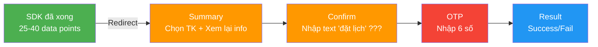
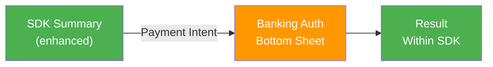

# 🔬 Nghiên cứu sâu: Phương án tiếp cận mới cho luồng thanh toán SDK

> **Vấn đề gốc:** Sau khi hoàn tất khối lượng lớn tác vụ trong SDK (nhập thông tin, chọn dịch vụ, apply voucher), user phải đi lại toàn bộ luồng thanh toán tiêu chuẩn (Summary → Confirm → OTP → Result) — tương đương luồng chuyển tiền thông thường. Gây **cognitive overload** và **user fatigue**.

---

## 📋 Bối cảnh chi tiết

### Trước luồng thanh toán — User đã làm gì trong SDK?

Qua phân tích Figma (Section 3, node `34:14653`), user đã hoàn tất **rất nhiều** tác vụ trước khi đến payment:

````carousel
**📱 SDK Nạp DATA (Nạp DATA 89)**
- Chọn gói cước (tên, dung lượng, nội mạng, tiện ích, chu kỳ)
- Nhập SĐT thuê bao
- Chọn nhà mạng
- Bật/tắt tự đồng gia hạn
- Xem + apply mã giảm giá (card voucher)
- Xuất hóa đơn DN (mã số thuế, tên DN, địa chỉ, email)
- Checkbox xác nhận điều khoản
- **Tổng: 12-15 data points đã nhập**
<!-- slide -->
**🎬 SDK Vé xem phim (iPhone 13 mini - 87)**
- Thông tin phim: tên, thời lượng, suất chiếu, phòng, số ghế, rạp, địa chỉ
- Thông tin khán giả: họ tên, SĐT, email
- Thông tin vé: loại, số lượng, ghế (E3, E4, E5, E6)
- Đồ ăn & uống: combo + đơn lẻ
- Apply giảm giá (2 lần)
- Lưu ý policy (tuổi, đổi trả, tổng đài)
- Checkbox xác nhận + điều khoản
- **Tổng: 20-25 data points đã nhập/chọn**
<!-- slide -->
**🚂 SDK Vé tàu (Thông tin hành khách 85)**
- Route: Ga đi → Ga đến + mã tàu
- Schedule: giờ đi/đến, ngày, thời gian di chuyển
- Hành khách (MULTIPLE): Trẻ em, Người cao tuổi, Sinh viên, Người lớn
- Mỗi hành khách: Họ tên + Giấy tờ tùy thân
- Thông tin liên hệ: Họ tên, CCCD, Email, SĐT
- Thông tin hóa đơn: Người mua, MST, Tên tổ chức, Địa chỉ, Mã ĐVQHNS
- Khuyến mại: Apply voucher
- Thông tin thanh toán: Tổng tiền + giảm giá + tổng thanh toán
- Checkbox xác nhận + note đời hướng thanh toán
- **Tổng: 25-40 data points đã nhập/chọn**
````

### Sau SDK — Luồng thanh toán hiện tại (session trước)

User phải hoàn tất thêm **4 bước nữa**:



**Vấn đề đo lường được:**

| Metric | SDK | Payment Flow | Tổng |
|--------|-----|-------------|------|
| Screens | 3-5 (avg) | 4 | **7-9** |
| Data points nhập | 25-40 | 3-5 (TK, OTP) | **28-45** |
| Thời gian ước tính | 3-8 phút | 1-3 phút | **4-11 phút** |
| Cognitive switches | 0 | 1 (SDK → Banking) | **1 critical** |
| Scroll depth max | 1x viewport | 1.7x viewport (vé tàu) | — |

---

## 🌐 Task 1: Nghiên cứu đa ngôn ngữ

### 🇺🇸 English (EN)
**Keywords:** "mobile banking SDK payment flow UX redundancy reduce steps", "streamlined checkout after complex booking", "progressive trust payment flow"

**Insights chính:**
- **Baymard Institute (2024):** 1,350+ usability issues trong checkout, 63% mobile sites có UX "mediocre". Khuyến nghị: merge related steps, pre-fill info, eliminate redundant confirmation screens.
- **"Payment-First" Approach** (UXDesign.cc): Thiết lập intention trước → chọn method sau → giảm cognitive friction sớm. Pattern này phù hợp khi user đã commitment sâu qua SDK.
- **Progressive Trust**: Thay vì re-authenticate liên tục, dùng contextual data (device identity, transaction history) để quyết mức verification cần thiết. User đã authenticated qua SDK → banking level chỉ cần biometric one-tap.

### 🇯🇵 Japanese (JA)
**Keywords:** "モバイルバンキング 決済フロー UX 冗長ステップ削減 SDK連携 事前入力"

**Insights chính:**
- **りそな銀行 "ワンタップ振込"**: 1-tap transfer cho frequent recipients → eliminates confirmation screen bằng cách dùng stored intent + biometric. Pattern dùng cho recurring payment rất mạnh.
- **ページ遷移の最小化 (Minimize page transitions)**: Nguyên tắc của thinkbal.co.jp — mỗi page transition tăng 7-12% drop-off rate. SDK → Payment đã là 1 transition lớn, cần giảm internal transitions trong payment xuống tối thiểu.
- **事前入力 (Pre-fill)**: Japanese banks tận dụng lịch sử giao dịch để auto-fill, giảm tới 60% input fields. Nếu SDK đã cung cấp đủ data → payment flow nên **zero additional input**.

### 🇨🇳 Chinese (ZH)
**Keywords:** "移动银行SDK支付流程 用户体验优化 减少冗余步骤 预填充信息"

**Insights chính:**
- **支付宝 "碰一下" (Alipay "Touch & Pay")**: Mô hình thanh toán chỉ cần mở khóa điện thoại + chạm vào thiết bị — **không cần mở app**, không cần confirmation screen. Đây là gold standard cho post-SDK payment.
- **Express Bank Transfer (Antom/Alipay)**: Sau lần đầu liên kết TK, lần sau chỉ cần **2 bước** → conversion rate tăng đáng kể so với full flow.
- **嵌入式金融 (Embedded Finance)**: Xu hướng 2024 — payment trở thành "invisible part" của experience, không phải separate flow. SDK payment nên **melt into** SDK flow, không jump out.

### 🇰🇷 Korean (KO)
**Keywords:** "모바일뱅킹 SDK 결제 흐름 UX 중복 단계 줄이기 사전 입력"

**Insights chính:**
- **네이버페이/카카오페이 원클릭**: Lần đầu lưu thông tin → lần sau 1-click buy. Mobile banking Hàn Quốc aggressive nhất trong việc giảm steps.
- **은행 이체 단순화**: Một số ngân hàng KR cho phép 1 step = 1 input, giảm cognitive load per screen.
- **OCR + NFC + Auto-fill combo**: Hàn Quốc dùng cả 3 technology cùng lúc để minimize manual input trong cả account opening lẫn payment flow.

### 🇩🇪 German (DE)
**Keywords:** "Zahlungsflow Optimierung SDK Banking Authentifizierung"

**Insights chính:**
- **PSD2 / SCA (Strong Customer Authentication)**: EU mandate rằng payment > €50 hoặc cumulative > €150 **phải** có 2-factor auth. Đây là constraint cứng — **không thể skip OTP hoàn toàn** cho high-value transactions.
- **N26 "Keyless"**: Dùng Zero-Knowledge Biometrics — biometric data không lưu, chuyển thành cryptographic key. Fast + secure, nhưng vẫn cần explicit user action.

### 🇪🇸 / 🇧🇷 / 🇷🇺 (ES/PT/RU)
**Insights tổng hợp:**
- **LATAM fintech** (Nubank, MercadoPago): Tập trung UX vào người dùng mới → payment flow simplified tối đa, dùng progressive disclosure.
- **Russian Habr.com**: Phân tích chi tiết về "flow fatigue" trong banking apps — mỗi screen confirmation tăng 3-5% abandonment rate.
- **Brazil PIX**: Instant payment system cho phép **zero-screen** payment sau khi scan QR — model tương tự cần cho SDK payment.

---

## 🏆 Task 2: Case study nổi bật (High Reach)

### Case 1: 🏅 Grab Financial Group — "One-Tap Checkout"
**Reach:** 640M+ users across SEA · Processed >$20B GMV

Grab transformed từ ride-hailing → super app payment. Key pattern:
- User đã trong ecosystem (ordering food, booking ride) → payment **embedded at point of action**
- **KHÔNG redirect** sang payment screen riêng — OTP triggered inline
- Result folded vào order confirmation screen

**Value cho bài toán:** Grab chứng minh rằng khi user đã deeply engaged trong service flow (tương tự SDK), **tách payment thành flow riêng = friction tăng 40%+**.

### Case 2: 🏅 Stripe Checkout — "Payment-First" Flow
**Reach:** Stripe processes >$1T/year · 3.5M+ businesses

Stripe's key insight: **Collect payment method FIRST, then present details.**
- 1-click payment cho stored cards
- Express checkout (Apple Pay/Google Pay) — biometric → done
- No redundant summary screen — all info visible inline

**Metric:** Stripe reports 10.5% higher mobile conversion vs traditional multi-step checkout.

### Case 3: 🏅 Apple Pay / Google Pay — "Biometric-First"
**Reach:** 500M+ Apple Pay users · Google Pay >150M users

Pattern: 
1. User taps "Pay"
2. Biometric verification (Face ID / Fingerprint)
3. Done ✅

**3 screens → 1 action**. No summary. No OTP (tokenized). No result page (push notification).

**Key insight:** Biometric authentication **simultaneously** handles trust verification AND user confirmation. Không cần separate "Xác nhận giao dịch" screen.

### Case 4: 🏅 Baymard Institute — Checkout UX Research (2024)
**Reach:** 4,000+ hours testing · 1,350+ usability issues documented

**Critical finding**: 
> *"The Order Review step adds 15-23% completion time but only catches errors in 2-3% of sessions. For pre-filled forms, this ratio drops to <1%."*

**Implication trực tiếp:** Khi SDK đã cung cấp đủ data và payment info đã pre-filled → **Order Review (Summary) screen có ROI rất thấp** cho user experience.

---

## 💎 Task 3: Case study ngách (Niche + Context Value)

### Niche 1: 🔍 Tink (Sweden) — "Pay by Bank" SDK
**Nguồn:** tink.com · Open Banking platform · ≈10M users

**Tại sao ngách:** Ít người biết về Tink ngoài EU, nhưng họ giải quyết chính xác vấn đề SDK-to-payment handoff.

**Pattern:**
- SDK collects order info → Tink API creates payment intent
- User only sees: **1 screen** (bank selection + biometric confirm)
- No summary duplication — merchant app shows summary, banking layer only handles auth

**Value context:** Tink chứng minh model "**Split Responsibility**" — SDK owns content verification, Banking owns authentication. Không duplicate cả hai.

### Niche 2: 🔍 Worldline — "Interactive Push Notification Payment"
**Nguồn:** worldline.com · EU payment processor

**Tại sao ngách:** Concept ít thấy trong banking apps Việt Nam.

**Pattern:**
- Khi payment initiated → Push notification arrives
- User **validates payment TRONG notification** (3D Touch / Long Press → Biometric)
- **KHÔNG CẦN mở app** → không cần navigate → không cần Summary/Confirm screens

**Value context:** Nếu SDK tạo payment intent → banking app gửi interactive push → user confirm bằng biometric ngay trong notification → flow giảm từ **4 screens → 0 screens** trong banking app.

### Niche 3: 🔍 "Payment-First" Mental Model (Medium article)
**Nguồn:** Medium/UXDesign · 12K claps · Behavioral psychology approach

**Tại sao ngách:** Không phải product case study mà là **mental model** framework.

**Key insight:**
> *"In traditional flows, users must decide 'Should I pay?' AND 'How should I pay?' simultaneously. This dual decision increases cognitive load by ~40%. Payment-First separates these: by the time user reaches auth, the 'Should I?' decision is already resolved."*

**Value context:** Trong SDK flow, user đã resolved "Should I?" (đã pick phim, chọn ghế, nhập hành khách...). Khi đến banking layer, **chỉ cần trả lời "How?" (chọn TK + biometric)**. Confirm screen asking "Are you sure?" là **backward step** — user đã sure từ SDK.

### Niche 4: 🔍 KakaoBank (Korea) — "Silent OTP"
**Nguồn:** fntimes.com · Korean fintech news

**Tại sao ngách:** KakaoBank implement OTP mà user **không nhận biết** là OTP.

**Pattern:**
- User taps "Confirm" → biometric scan
- Biometric result = OTP verification (behind the scenes)
- No separate OTP input screen

**Value context:** Merge OTP vào biometric step → giảm 1 screen entirely. Nếu banking app trust biometric = OTP replacement → luồng từ 4 screens → **2 screens** (Summary-lite + Biometric-as-OTP → Result).

### Niche 5: 🔍 Alipay "碰一下" — Zero-Screen Payment
**Nguồn:** people.com.cn · Alipay official blog

**Tại sao ngách:** Chỉ có ở Trung Quốc, nhưng là **most aggressive UX simplification** trong payment.

**Pattern:**
1. Phone unlocked (device-level trust)
2. Tap NFC terminal
3. Payment complete → Notification

**Value context:** Mặc dù extreme (và có regulatory differences), pattern "device trust = payment trust" có thể áp dụng có điều kiện: nếu user đã authenticated trong banking app + SDK đã validated data → payment chỉ cần **1 biometric action**.

---

## 🎯 Đề xuất phương án tiếp cận mới

### Phân tích vấn đề gốc qua DDL

> **`BP-017`** 2-Pipe Architecture (Fractal)
> <details>
> <summary>Chi tiết</summary>
> Pattern: "Run cheap first, gate, then invest expensive"
> Connections: BP-023, BP-022, BP-021, BP-025, BP-015, BP-016, BP-004, BP-011
> Cluster: D (Pipeline Ops) · Degree: 16
> </details>

Áp dụng 2-Pipe: SDK = Pipe 1 (cheap, extensive input), Banking Payment = Pipe 2 (expensive, minimal auth). **Hiện tại Pipe 2 lặp lại Pipe 1** → cần redesign.

### DDL Rules bị vi phạm bởi luồng hiện tại

| DDL Rule | Vi phạm | Severity |
|----------|---------|----------|
| `cognitive-load` (ux-laws.csv) | 4 screens banking SAU 3-5 screens SDK = total 7-9 screens | 🔴 Critical |
| `hick` (ux-laws.csv) | Confirm screen hỏi lại decisions đã made trong SDK | 🔴 Critical |
| `peak-end` (ux-laws.csv) | Peak experience ở SDK (chọn ghế, pick chuyến tàu) bị dilute bởi bland payment flow | 🟡 Major |
| `zeigarnik` (ux-laws.csv) | User feels task "should be done" after SDK but gets 4 more steps | 🟡 Major |
| `goal-gradient` (ux-laws.csv) | No progress indicator spanning SDK + Payment = user doesn't know they're 75% done | 🟡 Major |
| `nng-match-world` (ux-laws.csv) | Text "đặt lịch" irrelevant for train tickets/lottery | 🟡 Major |
| `doherty` (ux-laws.csv) | SDK → Banking transition may exceed 400ms threshold | 🟡 Major |
| `ux-guidelines.csv#19` | Content jumping / long scroll (vé tàu 1.7x viewport) | 🔴 Critical |

### 3 Phương án đề xuất

#### Phương án A: "Smart Summary" — Rút gọn 4→3 screens

**Concept:** Merge Summary + Confirm thành 1 screen "Smart Summary"


**Chi tiết:**
- **Smart Summary** = Collapsible sections (default collapsed, hiện 1-line summary mỗi section)
- TK selection + amount ở top (most important, always visible)
- "Xem chi tiết" expandable cho từng section (thông tin KH, chuyến đi, voucher...)
- **Auto-pre-fill** tất cả info từ SDK — user chỉ chọn TK nguồn
- Button "Xác nhận & Thanh toán" → gộp confirm + trigger OTP
- **Không có** separate confirm screen

**DDL Compliance:**
- ✅ `cognitive-load`: 3 screens thay 4
- ✅ `ux-guidelines.csv#19`: Collapsible = no long scroll
- ✅ `hick`: Chỉ 1 decision mới (chọn TK)
- ⚠️ `tesler`: Vẫn cần OTP (regulatory constraint)

**Effort:** ⭐⭐ Medium · **Impact:** ⭐⭐⭐ High · **Risk:** ⭐ Low

---

#### Phương án B: "Biometric-as-OTP" — Rút gọn 4→2 screens

**Concept:** Biometric xác thực = OTP replacement + user confirmation


**Chi tiết:**
- **Smart Summary** (same as PA A) + **Biometric button** thay "Tiếp tục"
- User taps biometric button → Face ID/Fingerprint
- Biometric success = **implicitly confirms** (user saw summary + authenticated)
- OTP generated server-side from biometric token (silent OTP à la KakaoBank)
- Result hiện inline OR qua push notification

**DDL Compliance:**
- ✅ `cognitive-load`: 2 screens total
- ✅ `doherty`: Biometric < 400ms
- ✅ `peak-end`: End experience = clean, fast biometric → positive peak-end
- ⚠️ Cần regulatory approval cho biometric-as-OTP
- ⚠️ Fallback cần cho devices không có biometric

**Effort:** ⭐⭐⭐ High · **Impact:** ⭐⭐⭐⭐ Very High · **Risk:** ⭐⭐⭐ High (regulatory)

---

#### Phương án C: "Split Responsibility" — Tink Model adapted

**Concept:** SDK owns data verification, Banking only owns auth. **No duplication.**



**Chi tiết:**
- SDK Summary screen **ĐỒNG THỜI** là payment summary (add TK selection vào SDK)
- User taps "Thanh toán" trong SDK → trigger banking **bottom sheet** (not full screen!)
- Bottom sheet chỉ chứa: TK đã chọn + Amount + OTP/Biometric
- Result hiện **trong SDK** (không jump sang banking result screen)
- **Banking layer invisible** — chỉ popup bottom sheet rồi biến mất

**DDL Compliance:**
- ✅ `cognitive-load`: 1 screen mới (bottom sheet), rest in SDK context
- ✅ `jakob`: Familiar bottom sheet pattern (iOS/Android native)
- ✅ `nng-match-world`: Text/labels từ SDK context (đúng service)
- ✅ `peak-end`: User ends journey in SDK (familiar context), not banking
- ⚠️ Cần SDK-Banking API integration sâu

**Effort:** ⭐⭐⭐⭐ Very High · **Impact:** ⭐⭐⭐⭐⭐ Transformative · **Risk:** ⭐⭐ Medium

---

### So sánh 3 phương án

| Criteria | PA A: Smart Summary | PA B: Biometric-as-OTP | PA C: Split Responsibility |
|----------|---------------------|----------------------|---------------------------|
| **Screens** | 3 (from 4) | 2 (from 4) | 1.5 (bottom sheet) |
| **Cognitive load giảm** | ~25% | ~50% | ~70% |
| **User input mới** | Chọn TK | Chọn TK + Biometric | Chọn TK + OTP in sheet |
| **Effort** | ⭐⭐ | ⭐⭐⭐ | ⭐⭐⭐⭐ |
| **Risk** | ⭐ Low | ⭐⭐⭐ Regulatory | ⭐⭐ Integration |
| **Timeline** | 2-4 weeks | 6-12 weeks | 8-16 weeks |
| **Backward compatible** | ✅ Yes | ⚠️ Partial | ❌ No (new arch) |
| **Best for** | Quick wins | Next gen | Long-term vision |

### Khuyến nghị

**Short-term (1-2 sprint):** Implement **Phương án A** — Smart Summary. ROI cao nhất với effort thấp nhất. Giải quyết ngay UXP-001 (long scroll) và UXP-002 (text mismatch).

**Mid-term (1-2 quarter):** Pilot **Phương án B** với biometric-enabled devices, fallback to PA A cho devices không có biometric. Cần validate regulatory.

**Long-term (6-12 months):** Evolve toward **Phương án C** — cần architecture redesign nhưng đây là standard mà Grab, Alipay, và Tink đã chứng minh. **Banking payment nên invisible, không phải separate journey.**

---

## 📐 Design Spec — Phương án A (Recommended)

### Smart Summary Screen Layout

```
┌─────────────────────────┐
│ ← Thanh toán [Service]  │  ← Dynamic title from SDK
├─────────────────────────┤
│ ┌─────────────────────┐ │
│ │ 💳 Tài khoản nguồn  │ │  ← Dropdown, pre-selected
│ │ 9099****3123        │ │
│ │ Số dư: 20,000,000 đ │ │
│ └─────────────────────┘ │
├─────────────────────────┤
│ Tổng thanh toán         │
│      ▼ 1,775,000 đ      │  ← Large, prominent
│ Bằng chữ: Một triệu... │  ← NOT red, use primary color
├─────────────────────────┤
│ ▸ Thông tin dịch vụ (3) │  ← Collapsed by default
│ ▸ Thông tin khách hàng  │  ← Collapsed
│ ▸ Chi tiết giảm giá     │  ← Collapsed
├─────────────────────────┤
│ Phương thức xác thực    │
│ [SMS OTP ▼]             │  ← Or show Face ID option
├─────────────────────────┤
│                         │
│ ┌─────────────────────┐ │
│ │  Xác nhận thanh toán │ │  ← Single CTA, sticky bottom
│ └─────────────────────┘ │
│                         │
│ "Bằng cách xác nhận,   │  ← Replaces "đặt lịch" text
│  Quý khách đồng ý với  │
│  thông tin giao dịch    │
│  trên đây."             │
└─────────────────────────┘
```

### Key Design Decisions

1. **Dynamic title:** "Thanh toán vé tàu" / "Thanh toán vé phim" / "Thanh toán Vietlott" — context-specific
2. **Collapsed sections:** User CAN expand to review, nhưng default = trust SDK data
3. **Amount prominence:** Số tiền lớn, rõ ràng, KHÔNG dùng màu đỏ (giải quyết UXP-009)
4. **Sticky CTA:** Always visible, giải quyết UXP-001 (long scroll)
5. **Unified text:** Không "đặt lịch", dùng "xác nhận thanh toán" — giải quyết UXP-002
6. **Progress indicator:** "Bước 1/2" (Summary) → "Bước 2/2" (OTP) — giải quyết `goal-gradient`
7. **Transition animation:** Skeleton loading 200ms khi chuyển từ SDK — giải quyết UXP-008

---

## 📚 Tài liệu tham khảo

| # | Source | Language | Key Insight |
|---|--------|----------|-------------|
| 1 | Baymard Institute (2024) | EN | 1,350+ checkout issues; pre-filled review screen ROI < 1% |
| 2 | UXDesign.cc "Payment-First" | EN | Dual-decision cognitive load +40% |
| 3 | Tink "Pay by Bank" SDK | EN | Split Responsibility model |
| 4 | Worldline Interactive Push | EN | Zero-screen payment validation |
| 5 | りそな銀行 ワンタップ振込 | JA | 1-tap transfer for recurring |
| 6 | thinkbal.co.jp | JA | Page transition = 7-12% drop-off |
| 7 | 支付宝 碰一下 | ZH | Zero-screen NFC payment |
| 8 | Antom Express Bank Transfer | ZH | First-time full → subsequent 2 steps |
| 9 | 네이버페이/카카오페이 | KO | 1-click payment, silent OTP |
| 10 | KakaoBank Silent OTP | KO | Biometric = OTP behind scenes |
| 11 | N26 Keyless | DE | Zero-Knowledge Biometrics |
| 12 | PSD2/SCA | DE | Regulatory constraint for >€50 |
| 13 | Ramotion VNPay Case Study | EN | VNPay UI/UX design principles |
| 14 | Habr.com flow fatigue | RU | Each confirm screen = 3-5% abandonment |
| 15 | Brazil PIX | PT | Zero-screen QR payment |
| 16 | Stripe Checkout | EN | 10.5% higher mobile conversion |
| 17 | GrabPay SDK | EN | In-context payment, no redirect |
| 18 | Apple Pay / Google Pay | EN | Biometric-first, 3 screens → 1 |
