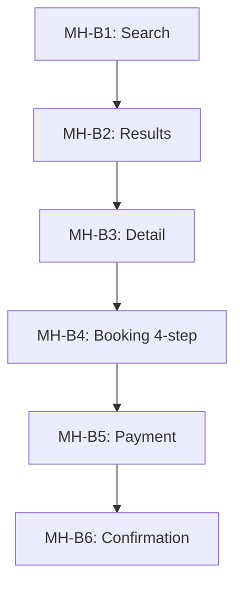
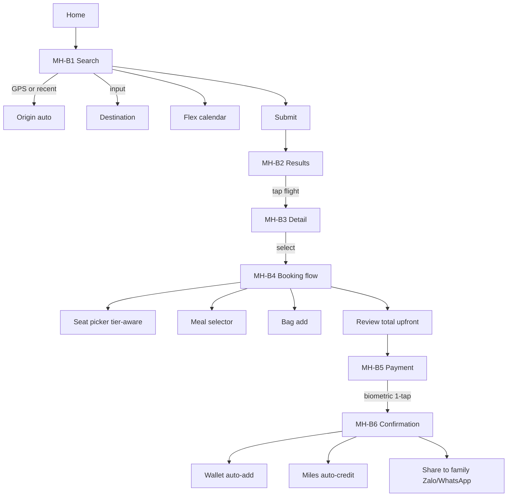

# 🔍 Deep Analysis: SF1 — Booking & Search

> **URD:** `urd/core/booking.md` §B · **MH:** 6 · **Pattern:** Transaction Flow

## 1. Tổng quan chức năng

Booking là **transaction flow module** — 6 screens linear flow từ search → confirmation.

| | Mô tả |
|---|---|
| Actors | KH, App Client, App Server, NDC API, Lotusmiles CRM, Payment Gateway |
| Pre-conditions | KH logged-in OR guest mode |
| Post-conditions | E-ticket issued + Wallet + miles credited |

## 2. Phân nhóm screens



| MH | Depth | Vai trò |
|:--:|:-:|---|
| MH-B1 | 1 Entry | Search inputs |
| MH-B2 | 2 Browse | Flight options |
| MH-B3 | 3 Action | Flight selection |
| MH-B4 | 3 Action | Seat+Meal+Bag+Review |
| MH-B5 | 3 Action | 1-tap pay |
| MH-B6 | 4 Result | Confirmation |

## 3. User Flow Map



## 4. UI Fields per screen

### MH-B1 Search

| # | Field | Kiểu | Bắt buộc |
|:-:|---|---|:-:|
| 1 | Origin | Auto-detect + override | ✅ |
| 2 | Destination | Input/voice/chips | ✅ |
| 3 | Date range | Calendar with flex heatmap | ✅ |
| 4 | Passengers | Counter (adult/child/infant) | ✅ |
| 5 | Fare class | Picker | ✅ |

### MH-B4 Booking (4-step composite)

| # | Field | Kiểu | Bắt buộc |
|:-:|---|---|:-:|
| 1 | Seat picker | Map + tier-free badge | ✅ |
| 2 | Meal selector | Category tabs + dietary | ❌ |
| 3 | Bag count | Counter | ❌ |
| 4 | Review total | Breakdown breakdown | ✅ |

### MH-B5 Payment

| # | Field | Kiểu | Bắt buộc |
|:-:|---|---|:-:|
| 1 | Saved card | Tokenized list | ❌ |
| 2 | Biometric prompt | Face ID / Fingerprint | ✅ if saved card |
| 3 | Apple/Google Pay | Quick option | ❌ |

## 5. Logic xử lý

```
ON search:
  Origin = GPS detect OR recent (AR-BKG-01)
  Calendar heatmap = NDC pricing API (AR-BKG-02)

ON booking review:
  total = base_price + taxes + fees + ancillaries (NO HIDDEN — AR-BKG-03)
  miles_preview = display earn estimate

ON payment:
  IF saved_card_token AND biometric_enabled:
    1-tap pay (AR-BKG-06)
  ELSE:
    full card entry → tokenize → save offer

ON confirmation:
  pnr = generate_pnr()
  email_eticket = send
  wallet_add = trigger Apple/Google Wallet
  miles_credit = Lotusmiles CRM auto
  return MH-B6
```

## 6. State Dimensions

| D | Values | UI Impact |
|---|---|---|
| D1 tier | 5 tiers | Tier discount pricing + free seat for Gold+ |
| D2 booking_step | 6 (search/results/detail/booking/payment/confirm) | Screen state |
| D3 fare_class | 4 (economy/premium/business/first) | Flight cards |
| D4 passenger_mix | 4 (solo/couple/family/group) | Flow complexity |
| D5 payment_method | 4 (saved/new/apple_pay/google_pay) | Payment screen |
| D6 voucher_state | 4 (none/tier_discount/irop/promo) | Pricing display |

State space: 5 × 6 × 4 × 4 × 4 × 4 = 7,680 lý thuyết → ~500 valid combinations

## 7. Depth Distribution

| Depth | Count |
|:-:|:-:|
| 1 Entry | 1 (MH-B1) |
| 2 Browse | 1 (MH-B2) |
| 3 Action | 3 (MH-B3, B4, B5) |
| 4 Result | 1 (MH-B6) |

## 8. API Mapping

| API | Trigger |
|---|---|
| GET /flights/search | MH-B1 submit |
| GET /pricing/flex | MH-B1 calendar |
| GET /flight/{id}/details | MH-B3 |
| POST /booking/create | MH-B4 review |
| POST /payment/process | MH-B5 |
| POST /loyalty/credit | MH-B6 auto |
| POST /wallet/add | MH-B6 auto |

## 9. Cross-reference

- M-04 FlightMiniCard (home) ↔ booking confirmation result
- M-13 MilesSnapshotCard (home) ↔ miles preview at review
- M-SUN-01 (tools-ar) ↔ seat sunlight prediction (cross-domain)

## 10. Observations

> [!WARNING]
> 1. AR-BKG-03 Total upfront — NO hidden fees revealed at payment
> 2. AR-BKG-06 1-tap pay biometric — eliminate re-entry friction
> 3. AR-BKG-05 Group flow — single session multi-pax
> 4. AR-BKG-01 Smart origin GPS detection
> 5. Voice input for destination (Pillar 3 cross-cutting)
> 6. Wallet auto-add at confirmation (eliminate manual step)
> 7. Tier discount badge visible on flight cards (Lotusmiles benefit visibility)
> 8. Miles earn preview at booking (positive reward anticipation)

### 10b — From EXEC-SUMM

> **[EXEC-SUMM]** 1-tap pay biometric — Priority: High — §8 Phase 1
> **[EXEC-SUMM]** Total price upfront — Priority: High — §8 Phase 1
> **[EXEC-SUMM]** Group/companion booking — Priority: Medium — §8 Phase 3
