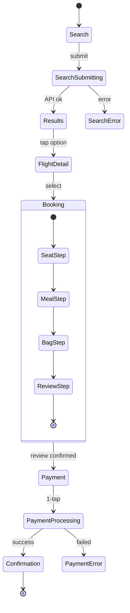

# 🧠 SF1 Booking Single Screen Model: 6 MH → 6 Screens, ~500 States

> Transaction Flow pattern — distinct screens, sequential navigation.

## 1. Tái định nghĩa: 6 MH → 6 Screens

| MH pair | Navigation? | Conclusion |
|---|:-:|---|
| MH-B1 ↔ B2 | ✅ Page push | Distinct |
| MH-B2 ↔ B3 | ✅ Page push | Distinct |
| MH-B3 ↔ B4 | ✅ Page push | Distinct |
| MH-B4 internal steps | Step indicator only (no nav) | Single screen w/ 4 internal states |
| MH-B4 ↔ B5 | ✅ Page push | Distinct |
| MH-B5 ↔ B6 | ✅ Page push (success path) | Distinct |

**Conclusion:** **6 MH = 6 Screens** (linear transaction flow)

## 2. State Machine per Screen



## 3. State Dimensions

Per screen state breakdown:

| Screen | States |
|---|:-:|
| MH-B1 Search | 8 (form variations + validation) |
| MH-B2 Results | 24 (flex × class × passenger filter) |
| MH-B3 Detail | 6 (info display variants) |
| MH-B4 Booking | 80 (4 steps × 5 tier × 4 passenger × seat selection) |
| MH-B5 Payment | 32 (4 method × 4 saved × validation) |
| MH-B6 Confirmation | 6 (success, share, calendar, etc.) |

**Total state space:** ~500 valid combinations

## 4. URD MH vs Actual Mapping

| MH | URD | Actual | Coverage |
|:--:|:-:|:-:|:-:|
| MH-B1 | 1 | 8 | 12% |
| MH-B2 | 1 | 24 | 4% |
| MH-B3 | 1 | 6 | 17% |
| MH-B4 | 1 | 80 | 1.25% |
| MH-B5 | 1 | 32 | 3% |
| MH-B6 | 1 | 6 | 17% |
| **Total** | 6 | ~500 | ~1.2% |

> Low coverage typical for transaction flows — UX team specs patterns + dimensions; states emerge.

## 5. Figma Component Architecture

```
📦 SearchShell, BookingShell, PaymentShell, ConfirmationShell (separate Component Sets)
├── SearchShell (Component Set)
│   └── 8 variants (passenger mix × validation)
├── BookingShell (Component Set, 4-step internal)
│   └── Property: step = seat | meal | bag | review (4 variants)
├── PaymentShell (Component Set)
│   └── Property: method = saved_card | new_card | apple_pay | google_pay (4 variants)
└── ConfirmationShell (Component Set)
    └── 6 variants (success states + post-actions)
```

## 6. So sánh với SFs khác

| Pattern | Booking (this) | HOME | Tools-AR |
|---|---|---|---|
| Screen count | 6 | 1 composite | 1 per tool |
| Variation driver | Step + tier + passenger | Server params | CPM gate |
| Cross-app | No | Yes (Zone A+F) | No |

Booking is **classic transaction flow** — different from Dashboard (HOME) and Feature-tool (Tools-AR).

## 7. Design Checklist từ State Coverage

| # | State | Type |
|:-:|---|:-:|
| 1 | Solo Silver booking | Default |
| 2 | Family Platinum group booking | Premium tier |
| 3 | Foreign tourist Korean booking | Multi-language |
| 4 | Hidden fee detection (none expected) | AR-BKG-03 |
| 5 | 1-tap biometric (saved card) | AR-BKG-06 |
| 6 | New card entry (camera scan) | AR-BKG-06 fallback |
| 7 | Voucher applied | Tier benefit |
| 8 | Empty state (search no results) | Edge case |
| 9 | Payment error → retry | Error recovery |
| 10 | Confirmation → Wallet auto-add success | Foundation P0 |

## 8. Kết luận

**Summary:** 6 MH → **6 Screens** + ~**500 valid UI states**

Key insight: Transaction flow needs **clear step indicators** + **never re-enter** (saved card + auto-load PNR + recent searches sync). 1-tap biometric pay is foundation P0.
