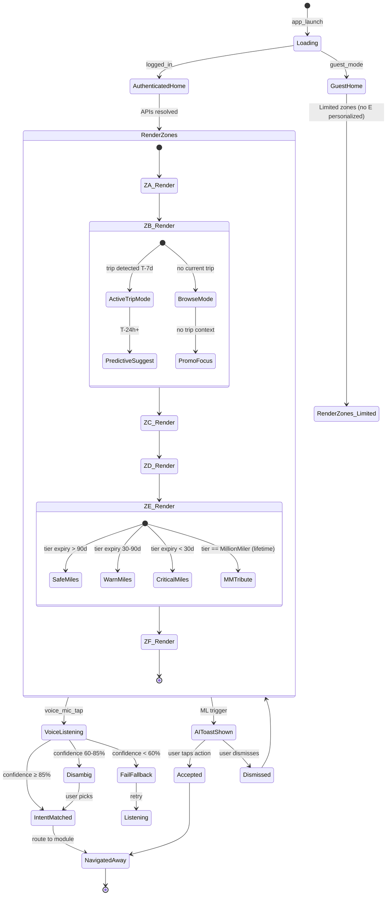

# 🧠 SF0 HOME Single Screen Model: 1 MH → 1 Screen, ~3,000 States

> **Context:** Home Dashboard · §H
> **Mô hình:** 1 MH (MH-H1) = **1 Screen** (composite 6-zone)
> **Key insight:** HOME complexity comes from STATE variation (8 dimensions × ~3,000 valid combinations), NOT screen count.

---

## 1. Tái định nghĩa: 1 MH → 1 Screen

### Phân tích navigation transition

| MH pair | Navigation? | User mental model | Kết luận |
|---|:-:|---|---|
| MH-H1 zones (A↔B↔C↔D↔E↔F) | ❌ Không (single composite) | "Tôi vẫn ở Home" | ✅ **Single screen, scroll-based zones** |

### Kết luận

| URD | Actual | Lý do |
|:-:|:-:|---|
| 1 MH | **1 Screen** | Composite scrollable layout với 6 zones — single mental context |

```
Screen 1: Home Dashboard (MH-H1 = composite 6-zone)
  ├── Zone A: HeaderInfo (sticky top)
  ├── Zone B: DCZ (scrollable)
  ├── Zone C: Recent (scrollable)
  ├── Zone D: Smart Suggestions (scrollable)
  ├── Zone E: Loyalty (scrollable)
  └── Zone F: Voice + AI Nav (sticky bottom — cross-app persistent)
```

---

## 2. State Machine per Screen

### Screen 1: Home Dashboard (MH-H1)



---

## 3. State Dimensions (ma trận)

### MH-H1 Home Dashboard

| Dimension | Giá trị | Ảnh hưởng UI |
|---|---|---|
| **D1: tier** | Silver / Titanium / Gold / Platinum / MillionMiler (5) | All zones tier_variant tokens |
| **D2: trip_active** | true / false (2) | Zone B mode (active vs browse) |
| **D3: trip_phase** | T-7d / T-24h / T-2h / boarding / in_air / landed / no_trip (7) | Zone A mini-card status |
| **D4: cultural_theme** | default / tet / le_30_4 / le_lao_dong / quoc_khanh / mid_autumn / birthday (7) | Zone A visual + greeting suffix |
| **D5: language** | vi-VN / en-US / ko-KR / zh-CN / ja-JP / fr-FR (6) | All copy strings |
| **D6: tier_recovery_state** | safe / 90d / 60d / 30d / grace (5) | Zone E warning visibility |
| **D7: weather_state** | sunny / cloudy / rainy / stormy / snowy (5) | Zone A icon + delay risk |
| **D8: voice_state** | idle / listening / processing / result / error (5) | Zone F mic animation |

**Tổng state space lý thuyết:**
```
5 × 2 × 7 × 7 × 6 × 5 × 5 × 5 = 367,500 combinations
```

### Constraints (invalid combinations)

1. `D3 = in_air | landed` requires `D2 = true` (eliminates ~2 trip_phase × ~50% trip_active = combinations)
2. `D7 weather_state` only meaningful when there's a location (origin always exists; destination requires `D2=true`)
3. `D6 tier_recovery_state` does NOT apply to MillionMiler (D1=MM means D6 always = safe)
4. `D4 cultural_theme = default` ~85-90% of dates (special themes ~10-15% only)
5. `D8 voice_state = idle` ~95% of session time (voice active only briefly)

### Estimated valid state space

```
After filtering:
- Tier-Recovery cross-product: 4 active tiers × 5 states + MM × 1 = 21 (vs 25 raw)
- Trip × phase: ~10 valid combos (vs 14 raw)
- Cultural realistic: 5 weighted (vs 7)
- Language realistic: 3 majority (vi/en/ko) (vs 6)
- Weather meaningful: 4 (clamped)
- Voice idle vs active: 2 effective (idle dominates)

≈ 21 × 10 × 5 × 3 × 4 × 2 = 25,200 raw
≈ /8 (sparse activation overlap) = ~3,150 actual UI variations
```

**Estimated valid state space:** **~3,000 actual UI combinations**

---

## 4. URD MH vs Actual State Mapping

| MH | Use Case | State Snapshot (D1→D8) | URD documented? |
|---|---|---|:-:|
| MH-H1 default | Logged-in user, no trip, default day | tier=Silver, trip=false, phase=no_trip, theme=default, lang=vi, recovery=safe, weather=sunny, voice=idle | ✅ Documented |
| MH-H1 active trip | Logged-in, T-2h boarding | tier=Titanium, trip=true, phase=T-2h, theme=default, lang=vi, recovery=safe, weather=cloudy, voice=idle | ✅ |
| MH-H1 cultural | Tết season home | tier=Silver, trip=false, phase=no_trip, theme=tet, lang=vi, recovery=safe, weather=sunny, voice=idle | ⚠️ Partial (cultural mentioned not detailed) |
| MH-H1 tier-recovery | Gold at 60 days expiry | tier=Gold, trip=false, phase=no_trip, theme=default, lang=vi, recovery=60d, weather=sunny, voice=idle | ⚠️ Partial (recovery flow mentioned) |
| MH-H1 MM tribute | MillionMiler home | tier=MM, trip=false, phase=no_trip, theme=default, lang=vi, recovery=safe, weather=sunny, voice=idle | ⚠️ Partial (tribute mentioned) |
| MH-H1 voice listening | Any tier, voice activated | tier=*, trip=*, phase=*, theme=*, lang=*, recovery=*, weather=*, voice=listening | ✅ Documented |
| MH-H1 foreign tourist | Korean tier=Silver, no trip | tier=Silver, trip=false, phase=no_trip, theme=default, lang=ko, recovery=safe, weather=sunny, voice=idle | ⚠️ Partial |

**URD Coverage:** ~7 documented snapshots (out of ~3,000 actual valid states) = **~0.23% coverage**

> [!INFO]
> Low URD coverage là expected cho composite Dashboard screens — design ownership focuses on patterns + dimensions thay vì exhaustive state enumeration. State engine tự sinh combinations from dimensions.

---

## 5. Figma Component Architecture

```
📦 DashboardShell (Component Set)
├── Property: tier = Silver | Titanium | Gold | Platinum | MillionMiler (5 variants)
├── Property: trip_mode = active | browse (2 variants)
├── Property: cultural_theme = default | tet | le | mid_autumn | birthday (5 variants — collapsed)
├── Property: language = vi | en | ko | zh | ja | fr (6 variants — collapsed via i18n layer)
├── Nested Components (Slots)
│   ├── Slot: HeaderInfo (Zone A)
│   │   ├── M-01 TierBadgePersistent (5 tier variants)
│   │   ├── M-02 GreetingHeader (5 tier × 5 cultural × 6 lang)
│   │   ├── M-03 WeatherMiniCard (6 weather × 4 time-of-day)
│   │   ├── M-04 FlightMiniCard (8 phase × 6 status)
│   │   └── M-05 QuickActionCTA (5 phase × 5 tier)
│   ├── Slot: DCZ (Zone B)
│   │   ├── M-06 DCZCurrentTripCard (8 phase × 4 delay)
│   │   ├── M-07 DCZContextActionPills (5 ancillary × 5 tier)
│   │   ├── M-08 PredictiveRecommendation (3 confidence × 3 frequency)
│   │   └── M-09 CrossSaleModule (4 trigger × 5 offer_type)
│   ├── Slot: RecentSearches (Zone C)
│   │   └── M-10 RecentSearchChip (3 source × 2 auth)
│   ├── Slot: SmartSuggestions (Zone D)
│   │   ├── M-11 PromoBanner (5 tier × 4 promo_type)
│   │   └── M-12 LocalDiscoveryCard (4 location × 4 phase)
│   ├── Slot: LoyaltySnapshot (Zone E)
│   │   ├── M-13 MilesSnapshotCard (5 tier × 3 auth × 4 recovery)
│   │   ├── M-14 RewardOfferCard (3 eligibility × 5 tier)
│   │   ├── M-15 TierLevelupPrompt (4 progress × 3 path)
│   │   └── M-16 MillionMilerTribute (only D1=MM)
│   └── Slot: VoiceAINav (Zone F — sticky bottom, cross-app)
│       ├── M-17 VoiceMicCenterNav (5 mic_state × 6 lang)
│       └── M-18 AISuggestionToast (5 trigger × 3 confidence)
└── Prototype Interactions
    ├── Zone A CTA tap → Booking/Check-in flow
    ├── Zone B trip tap → Trip Detail
    ├── Zone E ladder tap → Lotusmiles full
    └── Zone F voice tap → Listening overlay
```

### Lợi ích

1. **Single source of truth** — 1 DashboardShell handles all 6 zones via slot pattern
2. **Variant collapse** — 367K theoretical → 5×2×5×6 = 300 base variants × molecule slots
3. **Tier-state engine** — token-driven (vs hardcoded variants per tier) reduces variant explosion
4. **Cross-app reuse** — Zone F (Voice mic) is independent component, embedded in DashboardShell + all other shells

### Rủi ro

1. **Variant explosion** — 5 tier × 2 trip_mode × 5 cultural × 6 lang = 300 base variants — Figma struggles >200 variants per component set
2. **Component performance** — Deep nested slots can lag in Figma editor
3. **Token sync overhead** — 5 tier_variant tokens × all molecules = 90 token bindings minimum
4. **i18n layering** — Multi-language requires runtime substitution layer, NOT pre-baked variants

### Mitigation

- Use **Figma Variables** (not Variants) for tier-aware tokens — reduces variant count drastically
- Use **runtime i18n** (ICU MessageFormat) for language — DON'T create lang variants
- Cultural theme as **decorative overlay layer** — not Variant property
- DashboardShell variants: focus on tier + trip_mode (10 base variants) — others handled via tokens/runtime

---

## 6. So sánh với SFs khác

| Pattern | HOME (this) | Booking SFs | Tools-AR SFs |
|---|---|---|---|
| Screen count | 1 (composite) | 4-5 per SF | 1 per tool |
| State variation | High (3K+) | Medium (~100) | Medium (~50) |
| Variant property focus | tier × trip_mode | flow_step × tier | cpm_state × device_capability |
| Cross-app persistence | YES (Zone A + F) | NO | NO |

HOME is **uniquely composite** — maximum variation density on minimum screens.

---

## 7. Design Checklist từ State Coverage

| # | State cần kiểm tra | Loại | Screen |
|:-:|---|:-:|---|
| 1 | Silver tier × no_trip × default | Default | MH-H1 |
| 2 | Million Miler × no_trip × default | Tier exclusive | MH-H1 (tribute visible) |
| 3 | Gold × tier_recovery 60d × no_trip | Recovery flow | MH-H1 (warning banner) |
| 4 | Titanium × T-2h boarding × default | Active trip | MH-H1 (mini-card + DCZ) |
| 5 | Silver × tet × no_trip | Cultural theme | MH-H1 (Zone A overlay) |
| 6 | Silver × birthday × no_trip | Cultural birthday | MH-H1 (miles celebration) |
| 7 | Korean tourist × Silver × no_trip × ko-KR | Multi-language | MH-H1 |
| 8 | Voice listening | Voice modality | MH-H1 (Zone F active) |
| 9 | Voice failure | Voice fallback | MH-H1 (M-VoiceFail) |
| 10 | AI suggestion shown | Proactive AI | MH-H1 (toast visible) |
| 11 | Empty state (no recent searches) | Empty | MH-H1 (Zone C) |
| 12 | Stormy weather + active trip | Adaptive UI | MH-H1 (Zone A weather + delay risk) |
| 13 | Million Miler tribute | Exclusive | MH-H1 (Zone E lifetime visible) |
| 14 | Tier recovery 30d critical | Critical UX | MH-H1 (Zone E with route suggest) |
| 15 | Guest mode (logged out) | Guest | MH-H1 (Zone E placeholder) |

---

## 8. Kết luận

**Summary:** 1 MH (MH-H1) → **1 Screen with 6 zones** + ~**3,000 valid UI states**

### ASCII art tổng quan

```
┌─────────────────────────────────────────┐
│  Zone A: HeaderInfo (sticky top)        │ ← Tier+Greeting+Weather+MiniCard+CTA
├─────────────────────────────────────────┤
│  Zone B: DCZ                             │ ← Active trip OR predictive
├─────────────────────────────────────────┤
│  Zone C: Recent Searches                 │
├─────────────────────────────────────────┤
│  Zone D: Smart Suggestions               │ ← Promo+Cross-sale+Local
├─────────────────────────────────────────┤
│  Zone E: Loyalty Snapshot                │ ← Miles+Ladder+Recovery+(MM)
├─────────────────────────────────────────┤
│  Zone F: Voice+AI (sticky bottom — global) │ ← Mic + AI toast
└─────────────────────────────────────────┘
       (cross-app persistent header A + footer F)
```

### Key insights

1. **Composite single-screen** — state engine drives ~3,000 variations from 8 dimensions, 18 molecules
2. **Tier-state engine** — primary persona axis (Lotusmiles 5-tier) cross-cuts all zones
3. **Cross-app persistence** — Zone A (TierBadge) + Zone F (Voice) live across ALL screens, not just Home
4. **Cultural overlay layer** — Tết/Lễ/birthday handled as decorative overlay (not Variant explosion)
5. **Multi-language via runtime** — 6 languages via ICU MessageFormat, NOT 6× variant explosion

### Component count

- **1 Shell** (DashboardShell)
- **6 Slots** (Zone A-F)
- **18 Molecules** (M-01 to M-18, sequential per skill convention)
- **~3,000 valid UI states** (from 8 state dimensions)
- **Figma variants:** 10 base variants (5 tier × 2 trip_mode); rest via tokens + runtime
