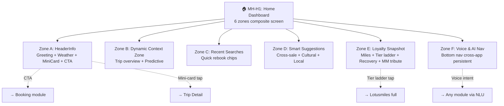
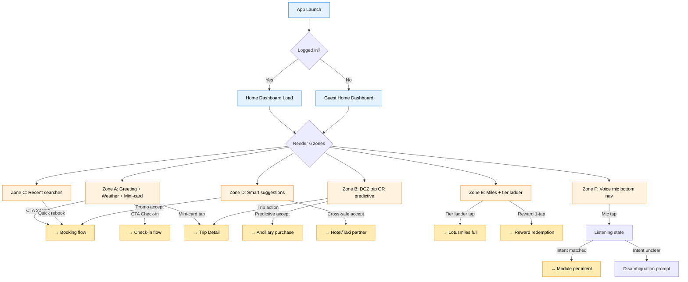

# 🔍 Deep Analysis: SF0 — Home Dashboard

> **Module:** Home Dashboard (HOME) · **URD Source:** `urd/core/home-dashboard.md` §H
> **Page ID:** N/A (synthesized)
> **Screens:** 1 MH (MH-H1) → 1 actual screen (6 zones) · **Role:** Landing page + persistent navigation hub

---

## 1. Tổng quan chức năng

**HOME** là **landing page + navigation hub** sau khi user mở app (login OR guest). Đây là composite screen với **6 zones** (A-F) hiển thị tier identity, current trip, recent context, smart suggestions, loyalty progression, và voice/AI assistant entry.

| | Mô tả |
|---|---|
| **Actors** | KH (passenger), App Client, App Server, Lotusmiles CRM, Weather API, Flight Ops Server, NLU Service, ML Service |
| **Pre-conditions** | KH mở VNA mobile app (logged-in OR guest mode) |
| **Post-conditions** | KH navigate sang module khác (Search/Trips/Tools/Profile/Lotusmiles) HOẶC trigger Voice intent HOẶC accept AI suggestion |
| **Server params** | `USER_TIER` (5-tier Lotusmiles), `CURRENT_TRIP_ID` (nullable), `WEATHER_API_KEY`, `CULTURAL_THEME_OVERRIDE`, `LOTUSMILES_BALANCE`, `RECENT_SEARCHES`, `TIER_EXPIRY_DATE` |

---

## 2. Phân nhóm screens theo URD

URD §H chia HOME thành **1 main screen với 6 zones** (theo I-012 IA blueprint):



| MH | Screen | Depth | Vai trò |
|:--:|---|:-:|---|
| MH-H1 | Home Dashboard (composite 6-zone) | 1 (Entry) | Landing page + navigation hub |

**Depth classification:** MH-H1 is **Depth 1 Entry** — first screen after authentication, gateway to all other modules.

---

## 3. User Flow Map



---

## 4. UI Fields (per Zone)

### Zone A — HeaderInfo

| # | Field | Kiểu | Input | Bắt buộc | Ghi chú |
|:-:|---|---|---|:-:|---|
| A1 | TierBadge | Display | API USER_TIER | ✅ | Persistent across all screens |
| A2 | GreetingText | Display | Template + tier_voice_token | ✅ | Tier-aware + cultural suffix |
| A3 | Avatar | Display + tap | User photo URL | ❌ | Tap → Profile |
| A4 | WeatherDisplay | Display | Weather API + GPS | ✅ | Origin OR destination context |
| A5 | FlightMiniCard | Display + tap | CURRENT_TRIP_ID | Cond | Show if trip in T-7d |
| A6 | QuickActionCTA | Action button | Context-aware logic | ✅ | Max 2 buttons |

### Zone B — DCZ (Dynamic Context Zone)

| # | Field | Kiểu | Input | Bắt buộc | Ghi chú |
|:-:|---|---|---|:-:|---|
| B1 | DCZCurrentTripCard | Composite | Trip API | Cond | Show if trip active |
| B2 | DCZContextActionPills | Action row | Trip + Lotusmiles | Cond | Wallet/WiFi/Bag/Meal/Lounge(Gold+) |
| B3 | PredictiveRecommendation | Suggestion | ML predictions | Cond | "Bạn thường mua Wi-Fi" |
| B4 | CrossSaleModule | Suggestion | Promo Feed | Cond | Hotel/Taxi context-aware |

### Zone C — Recent Searches

| # | Field | Kiểu | Input | Bắt buộc | Ghi chú |
|:-:|---|---|---|:-:|---|
| C1 | RecentSearchChip | Chips | Cache + Cloud sync | ❌ | Max 3-5 visible |

### Zone D — Smart Suggestions

| # | Field | Kiểu | Input | Bắt buộc | Ghi chú |
|:-:|---|---|---|:-:|---|
| D1 | PromoBanner | Banner | Promo Feed | ❌ | Tier-aware + cultural |
| D2 | LocalDiscoveryCard | Card list | External Partner Feed | ❌ | Post-arrival mode |

### Zone E — Loyalty Snapshot

| # | Field | Kiểu | Input | Bắt buộc | Ghi chú |
|:-:|---|---|---|:-:|---|
| E1 | MilesSnapshotCard | Composite | Lotusmiles CRM | ✅ | Miles + ladder |
| E2 | RewardOfferCard | Action card | Lotusmiles + ancillary | ❌ | 1-tap redemption |
| E3 | TierLevelupPrompt | Banner | Tier progress calc | Cond | Within 5 segments/miles |
| E4 | TierRecoveryBanner | Warning | Days-to-expiry calc | Cond | ≤90 days |

### Zone F — Voice & AI Nav (cross-app)

| # | Field | Kiểu | Input | Bắt buộc | Ghi chú |
|:-:|---|---|---|:-:|---|
| F1 | VoiceMicNav | Action button | NLU + Audio | ✅ | Center bottom nav, 56dp oversize |
| F2 | AISuggestionToast | Floating | ML predictions | Cond | Dismissable, max 1 at a time |

---

## 5. Logic xử lý

### 5.1 Tier-state engine (per lotusmiles.json)

```
ON home_load:
  user_tier = read API user/profile.tier
  apply tier_visual_tokens(user_tier)
  apply tier_voice_tone(user_tier)
  IF user_tier == MillionMiler:
    enable tribute_visible
    enable meet_and_greet_cta
```

### 5.2 Current trip detection logic

```
ON home_load OR poll_interval(30s):
  trip = GET /trips/upcoming
  IF trip AND trip.date_from < (now + 7 days):
    Zone B = active_trip_mode (M-DCZCurrentTripCard + M-DCZContextActionPills)
    Zone A.A5 = M-FlightMiniCard visible
  ELSE:
    Zone B = browse_mode (M-PredictiveRecommendation default)
    Zone A.A5 = hidden
```

### 5.3 Cultural theme overlay

```
ON home_load:
  cultural_event = check_cultural_calendar(date.now)
  apply theme_overlay(cultural_event)
  greeting_suffix = template[cultural_event]
```

### 5.4 Tier expiry recovery (per lotusmiles.json ux_implications)

```
days_to_expiry = user_tier.validity_end - now()
IF user_tier ≠ MillionMiler:  # MM lifetime
  CASE days_to_expiry:
    > 90: hidden
    60-90: M-TierRecoveryBanner (gentle)
    30-60: M-TierRecoveryBanner (progressive)
    0-30: M-TierRecoveryBanner (critical with route suggest)
    < 0: downgrade_grace + recovery_path UI
```

### 5.5 Voice intent activation

```
ON voice_mic_tap:
  trigger M-VoiceMicNav listening_animation
  start NLU
  detect_language → vi-VN | en-US | ko-KR | zh-CN | ja-JP | fr-FR
  recognize_intent → 10 known + fallback
  IF confidence ≥ 85%: route to action
  ELIF confidence ≥ 60%: show top 3 candidates (M-IntentRecognitionResult)
  ELSE: fail with examples (M-VoiceFailFallbackPrompt)
```

---

## 6. State Dimensions

| Dimension | Values | UI Impact |
|---|---|---|
| **D1: tier** | Silver / Titanium / Gold / Platinum / MillionMiler (5) | All zones tier_variant tokens |
| **D2: trip_active** | true (with phase) / false (2) | Zone B mode + Zone A mini-card |
| **D3: trip_phase** | T-7d / T-24h / T-2h / boarding / in_air / landed / no_trip (7) | Zone A mini-card status pill + Zone B detail |
| **D4: cultural_theme** | default / tet / le_30_4 / le_lao_dong / quoc_khanh / mid_autumn / birthday (7) | Zone A visual + greeting suffix |
| **D5: language** | vi-VN / en-US / ko-KR / zh-CN / ja-JP / fr-FR (6) | All copy |
| **D6: tier_recovery_state** | safe / 90d / 60d / 30d / grace (5) | Zone E warning visibility |
| **D7: weather_state** | sunny / cloudy / rainy / stormy / snowy (5) | Zone A icon + delay risk |
| **D8: voice_state** | idle / listening / processing / result / error (5) | Zone F bottom nav animation |

**Tổng state space lý thuyết:** `5 × 2 × 7 × 7 × 6 × 5 × 5 × 5 = 367,500 combinations`

**Constraints (invalid combos):**
- `D3=in_air` requires `D2=true` (eliminates ~1/7 of trip_phase × trip_active intersection)
- `D7 weather_state` only applies if `D2=true` (origin/destination context)
- `D6 tier_recovery_state` does NOT apply to MillionMiler tier (D1=MM means D6 always = safe)
- `D4 cultural_theme` mostly = default (only ~5-10% of dates fall into special themes)

**Estimated valid state space (after constraints):** **~3,000 actual UI combinations** (via collapsing + sparse activation)

---

## 7. Depth Distribution

| Depth | Label | Count | Screens | Tỷ lệ |
|:-:|---|:-:|---|:-:|
| 1 | Entry | 1 | MH-H1 | 100% |
| 2 | Browse | 0 | (none — Home is leaf entry) | 0% |
| 3 | Action | 0 | (Voice intents trigger transitions OUT of HOME) | 0% |
| 4 | Result | 0 | (none) | 0% |

**Đặc thù HOME:** Single Depth 1 Entry với composite zones — NOT typical multi-depth flow. State variation drives complexity (3,000 states), not screen count.

---

## 8. API Mapping

| API | Mục đích | Trigger | Actor |
|---|---|---|---|
| `GET /user/profile` | Tier + name + avatar | Home load | App Server |
| `GET /trips/upcoming` | Current trip detection | Home load + 30s poll | App Server |
| `GET /loyalty/miles` | Miles balance + tier validity | Home load | Lotusmiles CRM |
| `GET /loyalty/rewards/eligible` | Reward offer for Zone E | Home load | Lotusmiles CRM |
| `GET /weather/{location}` | Weather + delay risk | Home load (origin) + on trip detected (destination) | Weather API (OpenWeatherMap/AccuWeather) |
| `GET /promos/feed?tier={T}` | Tier-aware promos | Home load | Promo Service |
| `GET /searches/recent` | Recent + cloud sync | Home load | App Server |
| `POST /voice/intent` | NLU intent recognition | Voice mic activation | NLU Service |
| `GET /predictions/ml?context=home` | AI proactive suggestions | Home load + interval | ML Service |
| `GET /cultural/theme` | Cultural moment detection | Home load | Cultural Calendar Service |

---

## 9. Cross-reference

### Reuse từ SF khác

- **Voice mic** (Zone F.F1) — Cross-app persistent, shared with ALL screens
- **Tier badge** (Zone A.A1) — Cross-app persistent, shared with Profile, Trips, all major screens

### Gateway pattern

| From Home Zone | To SF |
|---|---|
| Zone A.CTA | SF1 Booking flow OR SF6 Check-in OR SF3 Trip Detail |
| Zone B trip card | SF3 Trip Detail |
| Zone C recent | SF1 Booking (rebook) |
| Zone D promo | SF1 Booking OR external partner |
| Zone E ladder | SF8 Lotusmiles full screen |
| Zone E reward | SF9 Reward redemption |
| Zone F voice | Any SF via intent routing |

### Shared components

- M-TierBadgePersistent → reused in ALL major screens
- M-FlightMiniCard → reused in Trips list + lockscreen Live Activity
- M-VoiceMicNav → cross-app

---

## 10. Observations cho Design Checklist

> [!WARNING]
> 1. **Persistent tier badge** must render WITHOUT flicker on screen transitions (M-TierBadgePersistent)
> 2. **Mini-card live update** — boarding zone changes must reflect within 30s polling cycle (M-FlightMiniCard)
> 3. **Cultural theme** — Tết overlay must NOT obscure functional elements (M-A02 GreetingHeader theme variants)
> 4. **Tier recovery banner** — graceful tone, not fearmongering (M-TierRecoveryBanner copy review per tier)
> 5. **Million Miler tribute** — only visible to MM tier (privacy + segment exclusivity, M-MillionMilerTributeTimeline)
> 6. **Voice mic** — visible across ALL screens including modal overlays (M-VoiceMicNav z-index check)
> 7. **Predictive frequency cap** — max 2 suggestions/24h per category (M-PredictiveRecommendation)
> 8. **Empty states** — no current trip should suggest search prompt (Zone B browse mode)
> 9. **Multi-language consistency** — VN-primary, EN fallback per AR-A5 (all copy molecules)
> 10. **Privacy disclosure** — AR-PRS-04 on-device badge for AI suggestions (M-AISuggestionToast WhyButton)

### §10b — From EXECUTIVE-SUMMARY (auto-injected from §8 redesign recommendations)

> **[EXEC-SUMM]** Tier badge persistent (Zone A header) — Priority: High — Source: §8 Phase 2 (Insight N-02 tier-driven persona axis = white-space)
> **[EXEC-SUMM]** Live Activity (iOS) for Zone A flight mini-card — Priority: High — Source: §8 Phase 1 (Delta benchmark + AR-A3 lockscreen-first)
> **[EXEC-SUMM]** Tier expiry recovery UI 90/60/30 days — Priority: Medium — Source: §8 Phase 2 (Insight N-06 + lotusmiles.json ux_implications)
> **[EXEC-SUMM]** Million Miler cumulative-flight tribute — Priority: Low (rare segment) — Source: §8 Phase 2 (Insight N-11)
> **[EXEC-SUMM]** Cultural moments (Tết, Lễ, birthday) Zone A theme variants — Priority: Medium — Source: §8 Phase 3 (Insight N-07)
> **[EXEC-SUMM]** Voice mic + AI Assistant Zone F (Pillar 3) — Priority: High — Source: §8 Phase 3 (Insight N-05)
> **[EXEC-SUMM]** Predictive ancillary suggestions Zone B — Priority: High — Source: §8 Phase 3 Pillar 1 (Lufthansa benchmark +12% ancillary)
> **[EXEC-SUMM]** Privacy Center on-device badge — Priority: Medium — Source: §8 Phase 3 (Insight N-10)

> **Note:** [EXEC-SUMM] items represent **to-be redesign recommendations** — chưa có trong as-is URD. Downstream `insight-discovery-validation` sẽ evaluate KEEP/TEST/DEFER và `shell-architecture` Phase 3.2 sẽ convert thành Aspiration Molecules group.
