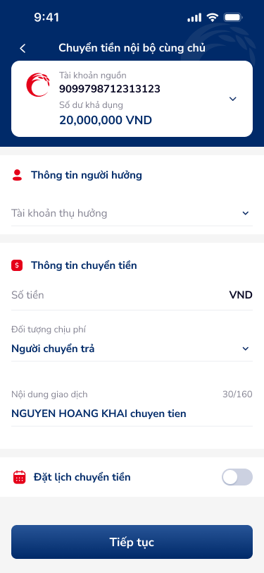
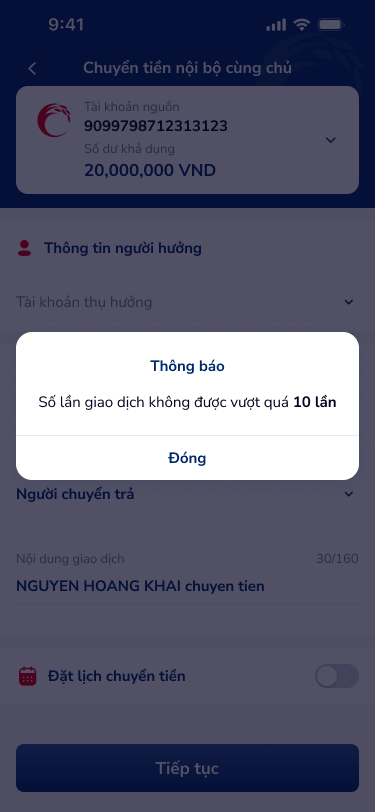
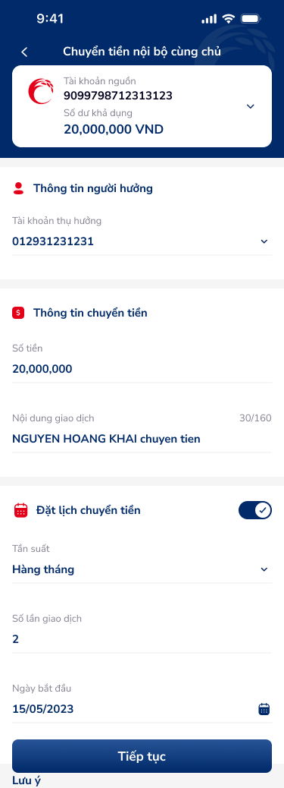
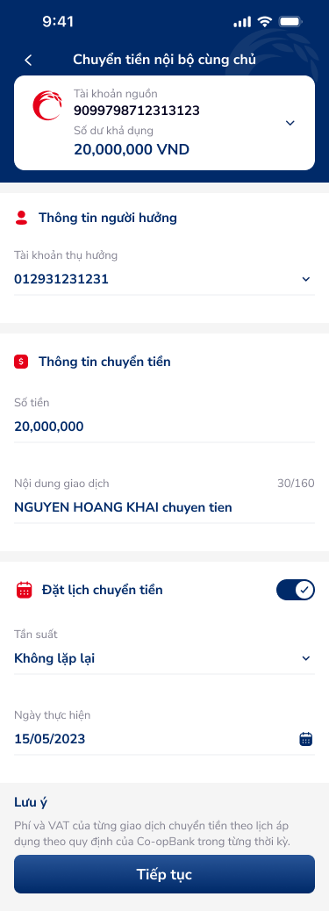

# Chuyển tiền nội bộ cùng chủ — PRD (Form nhập thông tin & đặt lịch)

Tài liệu này mô tả màn hình nhập thông tin chuyển tiền nội bộ cùng chủ và đặt lịch chuyển tiền (các biến thể: mặc định, modal lỗi, đặt lịch bật — hàng tháng / không lặp lại).

---

## Mục lục
1. [User Flow](#1-user-flow)
2. [User Story](#2-user-story)
3. [Wireframe](#3-wireframe)
4. [Thiết kế Database](#4-thiết-kế-database)
5. [Non-functional requirement](#5-non-functional-requirement)

---

## 1. User Flow

### 1.1. Luồng chính — Nhập thông tin và Tiếp tục
| Bước | Tên màn hình | Tên hành động | Kết quả |
|:---:|---|---|---|
| 1 | Chuyển tiền nội bộ cùng chủ | Chọn tài khoản nguồn, tài khoản thụ hưởng, nhập số tiền, nội dung, đối tượng chịu phí | Form hiển thị đầy đủ; đếm ký tự 30/160. |
| 2 | Chuyển tiền nội bộ cùng chủ | (Tùy chọn) Bật "Đặt lịch chuyển tiền", chọn Tần suất, Số lần giao dịch, Ngày bắt đầu/thực hiện | Các trường đặt lịch hiển thị theo state. |
| 3 | Chuyển tiền nội bộ cùng chủ | Chạm "Tiếp tục" | Chuyển đến màn "Xác nhận giao dịch". |

### 1.2. Luồng validation lỗi — Số lần giao dịch vượt quá 10
| Bước | Tên màn hình | Tên hành động | Kết quả |
|:---:|---|---|---|
| 1 | Chuyển tiền nội bộ cùng chủ | Nhập Số lần giao dịch > 10 và chạm "Tiếp tục" | Modal "Thông báo" hiển thị: "Số lần giao dịch không được vượt quá 10 lần". |
| 2 | Modal Thông báo | Chạm "Đóng" | Đóng modal, quay lại form chỉnh sửa. |

### 1.3. Luồng quay lại
| Bước | Tên màn hình | Tên hành động | Kết quả |
|:---:|---|---|---|
| 1 | Chuyển tiền nội bộ cùng chủ | Chạm nút Back (mũi tên trái) | Quay màn trước, giữ data đã nhập (nếu có). |

---

## 2. User Story

| Epic chung | Mã US | Tiêu đề | Mô tả chi tiết | Business Rule | Acceptance Criteria |
|---|---|---|---|---|---|
| Chuyển tiền | US-001 | Chọn tài khoản nguồn | Là khách hàng, tôi muốn chọn tài khoản nguồn từ danh sách tài khoản cùng chủ. | Chỉ hiển thị tài khoản cùng chủ. | Dropdown/selector hiển thị số tài khoản, số dư khả dụng (vd. 20,000,000 VND). |
| Chuyển tiền | US-002 | Chọn tài khoản thụ hưởng | Là khách hàng, tôi muốn chọn tài khoản thụ hưởng trong cùng chủ. | Tài khoản thụ hưởng ≠ tài khoản nguồn. | Dropdown/selector; có thể nhập hoặc chọn từ danh sách. |
| Chuyển tiền | US-003 | Nhập số tiền và nội dung | Là khách hàng, tôi muốn nhập số tiền và nội dung giao dịch. | Số tiền ≤ số dư khả dụng; nội dung tối đa 160 ký tự. | Đơn vị VND; đếm ký tự hiển thị (vd. 30/160). |
| Chuyển tiền | US-004 | Chọn đối tượng chịu phí | Là khách hàng, tôi muốn chọn người chuyển hoặc người nhận chịu phí. | Mặc định có thể "Người chuyển trả". | Dropdown với ít nhất 2 lựa chọn. |
| Chuyển tiền | US-005 | Bật/tắt đặt lịch chuyển tiền | Là khách hàng, tôi muốn bật đặt lịch để chuyển tiền theo tần suất. | Khi bật: hiển thị Tần suất, Số lần giao dịch, Ngày bắt đầu/thực hiện. Số lần không vượt quá 10. | Switch on/off; khi on hiển thị thêm trường tần suất (Hàng tháng, Không lặp lại...), số lần, ngày. |
| Chuyển tiền | US-006 | Tiếp tục sang Xác nhận | Là khách hàng, tôi muốn nhấn "Tiếp tục" để kiểm tra lại thông tin. | Validate đầy đủ trước khi chuyển; nếu số lần > 10 hiển thị modal Thông báo. | Nút "Tiếp tục" chuyển sang màn Xác nhận giao dịch; lỗi hiển thị modal "Số lần giao dịch không được vượt quá 10 lần" + Đóng. |

---

## 3. Wireframe

### Hình ảnh minh họa

---

### Mô tả màn hình

| STT | Tên màn hình | Loại thành phần | Mô tả |
|:---:|---|---|---|
| 1 | Header | Header | Nút back, tiêu đề "Chuyển tiền nội bộ cùng chủ". |
| 2 | Tài khoản nguồn | Section / Read-only Field | Thẻ trắng: logo, "Tài khoản nguồn", số 9099798712313123, "Số dư khả dụng" 20,000,000 VND; chevron chọn tài khoản. |
| 3 | Thông tin người hưởng | Form Section | "Tài khoản thụ hưởng" (ô nhập/selector, chevron). |
| 4 | Thông tin chuyển tiền | Form Section | "Số tiền" (input + VND), "Đối tượng chịu phí" (vd. Người chuyển trả), "Nội dung giao dịch" (text, 30/160 ký tự). |
| 5 | Đặt lịch chuyển tiền | Switch | Label "Đặt lịch chuyển tiền", toggle off/on; khi on: Tần suất (Hàng tháng/Không lặp lại...), Số lần giao dịch, Ngày bắt đầu/Ngày thực hiện. |
| 6 | Lưu ý | Helper Text | "Lưu ý" — phí và VAT theo quy định Co-opBank (khi đặt lịch bật). |
| 7 | Tiếp tục | Button | CTA "Tiếp tục" full width, gradient xanh. |
| 8 | Modal Thông báo | Dialog | Tiêu đề "Thông báo", nội dung "Số lần giao dịch không được vượt quá 10 lần", nút "Đóng". |

---

### Kết quả OCR (toàn bộ)

| Ảnh | Loại | Nội dung | Vị trí | Đã khớp spec (Y/N) |
|:---:|---|---|---|---|
| internal-transaction.png | text | Chuyển tiền nội bộ cùng chủ; Tài khoản nguồn; 9099798712313123; Số dư khả dụng; 20,000,000 VND; Thông tin người hưởng; Tài khoản thụ hưởng; Thông tin chuyển tiền; Số tiền; VND; Đối tượng chịu phí; Người chuyển trả; Nội dung giao dịch; NGUYEN HOANG KHAI chuyen tien; 30/160; Đặt lịch chuyển tiền; Tiếp tục | — | Y |
| internal-transaction.png | icon | Back arrow, chevron, calendar, switch | header; trailing fields; schedule section | Y |
| internal-transaction-2.png | text | Thông báo; Số lần giao dịch không được vượt quá 10 lần; Đóng | modal | Y |
| (Các ảnh 3, 4 tương tự — text + icon đã map vào bảng Mô tả màn hình.) | | | | |

---

### Ngữ cảnh màn hình (từ OCR)

Màn hình form chuyển tiền nội bộ cùng chủ với các khối: tài khoản nguồn (số dư), thông tin người hưởng, thông tin chuyển tiền (số tiền, đối tượng chịu phí, nội dung 160 ký tự), đặt lịch chuyển tiền (toggle + tần suất, số lần, ngày). CTA "Tiếp tục". Biến thể có modal Thông báo khi số lần > 10.

---

### Spec còn thiếu (phát hiện từ ảnh)

Không phát hiện spec thiếu sau khi đối chiếu OCR với bảng Mô tả màn hình.

---

## 4. Thiết kế Database

> **`🤖 by AI`** | Nguồn: figma_inferred:kPft93N2A3gYOC3YwuXpQR/5197:5929 | Độ tin cậy: High
>
> ### Entity: ScheduledTransfer (Đặt lịch chuyển tiền)
> | Field | Data Type | Constraint | Description |
> |---|---|---|---|
> | `id` | UUID | Primary Key | |
> | `from_account` | String(20) | Not Null | Tài khoản nguồn |
> | `to_account` | String(20) | Not Null | Tài khoản thụ hưởng |
> | `amount` | Decimal | Not Null | Số tiền VND |
> | `content` | String(160) | Optional | Nội dung giao dịch |
> | `fee_payer` | Enum | Not Null | Người chuyển trả / Người nhận trả |
> | `frequency` | Enum | Optional | Hàng tháng, Không lặp lại, ... |
> | `transaction_count` | Integer | 1..10 | Số lần giao dịch |
> | `start_date` | Date | Not Null | Ngày bắt đầu |
> | `end_date` | Date | Optional | Ngày kết thúc (suy từ số lần + tần suất) |

---

## 5. Non-functional requirement

- **Bảo mật:** Dữ liệu tài khoản và số dư chỉ hiển thị cho phiên đã xác thực; không log nội dung giao dịch dạng plaintext không cần thiết.
- **Hiệu năng:** Load danh sách tài khoản cùng chủ < 2s; validate form ngay khi blur/change.
- **Trải nghiệm:** Touch target tối thiểu 44pt cho nút và switch; focus ring cho điều hướng bàn phím; thông báo lỗi rõ ràng (vd. modal "Số lần giao dịch không được vượt quá 10 lần").

---
*Generated by VNPAY Agentic Framework*
