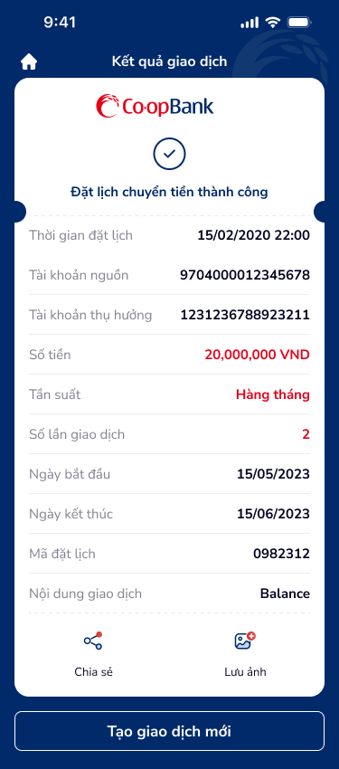

# Kết quả giao dịch — PRD (Màn hình kết quả đặt lịch thành công)

Tài liệu này mô tả màn hình kết quả sau khi đặt lịch chuyển tiền nội bộ cùng chủ thành công, bao gồm chi tiết giao dịch và các hành động Chia sẻ, Lưu ảnh, Tạo giao dịch mới.

---

## Mục lục
1. [User Flow](#1-user-flow)
2. [User Story](#2-user-story)
3. [Wireframe](#3-wireframe)
4. [Thiết kế Database](#4-thiết-kế-database)
5. [Non-functional requirement](#5-non-functional-requirement)

---

## 1. User Flow

### 1.1. Luồng thành công và hành động tiếp theo
| Bước | Tên màn hình | Tên hành động | Kết quả |
|:---:|---|---|---|
| 1 | Kết quả giao dịch | Hệ thống hiển thị sau khi đặt lịch thành công | Icon success, "Đặt lịch chuyển tiền thành công", danh sách chi tiết (thời gian đặt lịch, tài khoản, số tiền, tần suất, số lần, ngày, mã đặt lịch, nội dung). |
| 2 | Kết quả giao dịch | Chạm "Chia sẻ" | Mở sheet/option chia sẻ (vd. link, ảnh). |
| 3 | Kết quả giao dịch | Chạm "Lưu ảnh" | Lưu ảnh/xuất PDF phiên bản xác nhận. |
| 4 | Kết quả giao dịch | Chạm "Tạo giao dịch mới" | Quay về màn Form Chuyển tiền nội bộ cùng chủ (form trống). |

### 1.2. Luồng về trang chủ
| Bước | Tên màn hình | Tên hành động | Kết quả |
|:---:|---|---|---|
| 1 | Kết quả giao dịch | Chạm icon Home (header) | Về trang chủ ứng dụng. |

---

## 2. User Story

| Epic chung | Mã US | Tiêu đề | Mô tả chi tiết | Business Rule | Acceptance Criteria |
|---|---|---|---|---|---|
| Chuyển tiền | US-009 | Xem kết quả đặt lịch thành công | Là khách hàng, tôi muốn thấy xác nhận rõ ràng khi đặt lịch thành công. | Hiển thị mã đặt lịch và toàn bộ thông tin đã gửi. | Icon checkmark, text "Đặt lịch chuyển tiền thành công"; bảng chi tiết: Thời gian đặt lịch, Tài khoản nguồn/thụ hưởng, Số tiền, Tần suất, Số lần, Ngày bắt đầu/kết thúc, Mã đặt lịch, Nội dung. |
| Chuyển tiền | US-010 | Chia sẻ / Lưu ảnh | Là khách hàng, tôi muốn chia sẻ hoặc lưu ảnh xác nhận. | Tuân chính sách bảo mật (không chia sẻ thông tin nhạy cảm tùy ý). | Nút "Chia sẻ" và "Lưu ảnh" với icon; Chia sẻ mở native share; Lưu ảnh lưu vào thư viện/file. |
| Chuyển tiền | US-011 | Tạo giao dịch mới | Là khách hàng, tôi muốn tạo thêm giao dịch đặt lịch mới ngay sau khi xong. | Nút CTA chính. | "Tạo giao dịch mới" chuyển về màn Form (form trống). |

---

## 3. Wireframe

### Hình ảnh minh họa

---

### Mô tả màn hình

| STT | Tên màn hình | Loại thành phần | Mô tả |
|:---:|---|---|---|
| 1 | Header | Header | Icon Home (trái), tiêu đề "Kết quả giao dịch". |
| 2 | Success block | Section | Logo Co-opBank; icon checkmark trong vòng tròn xanh; text "Đặt lịch chuyển tiền thành công". |
| 3 | Chi tiết giao dịch | Section (label-value) | Thời gian đặt lịch: 15/02/2020 22:00; Tài khoản nguồn: 9704000012345678; Tài khoản thụ hưởng: 1231236788923211; Số tiền: 20,000,000 VND; Tần suất: Hàng tháng; Số lần giao dịch: 2; Ngày bắt đầu: 15/05/2023; Ngày kết thúc: 15/06/2023; Mã đặt lịch: 0982312; Nội dung giao dịch: Balance. |
| 4 | Hành động | Quick Action | Icon + label "Chia sẻ"; Icon + label "Lưu ảnh". |
| 5 | Tạo giao dịch mới | Button | CTA "Tạo giao dịch mới" full width, màu xanh. |

---

### Kết quả OCR (toàn bộ)

| Ảnh | Loại | Nội dung | Vị trí | Đã khớp spec (Y/N) |
|:---:|---|---|---|---|
| internal-transaction-6.png | text | Kết quả giao dịch; Co-opBank; Đặt lịch chuyển tiền thành công; Thời gian đặt lịch; 15/02/2020 22:00; Tài khoản nguồn; 9704000012345678; Tài khoản thụ hưởng; 1231236788923211; Số tiền; 20,000,000 VND; Tần suất; Hàng tháng; Số lần giao dịch; 2; Ngày bắt đầu; 15/05/2023; Ngày kết thúc; 15/06/2023; Mã đặt lịch; 0982312; Nội dung giao dịch; Balance; Chia sẻ; Lưu ảnh; Tạo giao dịch mới | — | Y |
| internal-transaction-6.png | icon | Home, checkmark, share, save image | header; success; action row | Y |

---

### Ngữ cảnh màn hình (từ OCR)

Màn kết quả giao dịch: success với logo Co-opBank, icon checkmark, "Đặt lịch chuyển tiền thành công"; bảng chi tiết đầy đủ; hai nút Chia sẻ và Lưu ảnh; CTA "Tạo giao dịch mới".

---

### Spec còn thiếu (phát hiện từ ảnh)

Không phát hiện spec thiếu.

---

## 4. Thiết kế Database

Có thể bổ sung trường `scheduled_id` (Mã đặt lịch) trong response API hoặc entity ScheduledTransfer để hiển thị trên màn kết quả. Chi tiết entity xem feature Chuyển tiền nội bộ cùng chủ.

---

## 5. Non-functional requirement

- **Bảo mật:** Khi chia sẻ/lưu ảnh, cần cân nhắc che/mask thông tin nhạy cảm (vd. số tài khoản) theo chính sách ngân hàng.
- **Hiệu năng:** Màn kết quả hiển thị ngay sau khi API trả thành công; nút "Lưu ảnh" không block UI.
- **Trải nghiệm:** Icon Chia sẻ và Lưu ảnh rõ ràng; "Tạo giao dịch mới" là CTA chính; touch target ≥ 44pt.

---
*Generated by VNPAY Agentic Framework*
