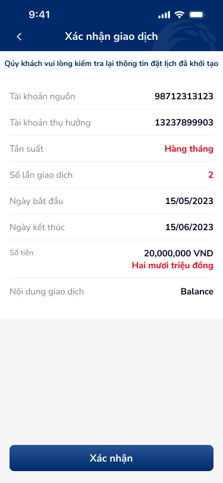

# Xác nhận giao dịch — PRD (Màn hình xác nhận đặt lịch)

Tài liệu này mô tả màn hình xác nhận giao dịch đặt lịch chuyển tiền nội bộ cùng chủ trước khi hệ thống thực hiện.

---

## Mục lục
1. [User Flow](#1-user-flow)
2. [User Story](#2-user-story)
3. [Wireframe](#3-wireframe)
4. [Thiết kế Database](#4-thiết-kế-database)
5. [Non-functional requirement](#5-non-functional-requirement)

---

## 1. User Flow

### 1.1. Luồng xác nhận
| Bước | Tên màn hình | Tên hành động | Kết quả |
|:---:|---|---|---|
| 1 | Xác nhận giao dịch | Đọc lại thông tin: Tài khoản nguồn, Tài khoản thụ hưởng, Tần suất, Số lần giao dịch, Ngày bắt đầu/kết thúc, Số tiền, Nội dung | Hiển thị đầy đủ label-value. |
| 2 | Xác nhận giao dịch | Chạm "Xác nhận" | Gửi lệnh đặt lịch, chuyển màn "Kết quả giao dịch". |

### 1.2. Luồng quay lại
| Bước | Tên màn hình | Tên hành động | Kết quả |
|:---:|---|---|---|
| 1 | Xác nhận giao dịch | Chạm nút Back | Quay màn Form, giữ nguyên thông tin đã nhập. |

---

## 2. User Story

| Epic chung | Mã US | Tiêu đề | Mô tả chi tiết | Business Rule | Acceptance Criteria |
|---|---|---|---|---|---|
| Chuyển tiền | US-007 | Xác nhận thông tin đặt lịch | Là khách hàng, tôi muốn kiểm tra lại toàn bộ thông tin trước khi xác nhận. | Hiển thị đúng dữ liệu từ màn Form. | Bảng label-value: Tài khoản nguồn, Tài khoản thụ hưởng, Tần suất, Số lần giao dịch, Ngày bắt đầu, Ngày kết thúc, Số tiền (số + chữ), Nội dung. |
| Chuyển tiền | US-008 | Xác nhận gửi lệnh | Là khách hàng, tôi muốn nhấn "Xác nhận" để hoàn tất đặt lịch. | Chỉ khi đã hiển thị đầy đủ và user chủ đích xác nhận. | Nút "Xác nhận" → gọi API đặt lịch → chuyển màn Kết quả giao dịch. |

---

## 3. Wireframe

### Hình ảnh minh họa

---

### Mô tả màn hình

| STT | Tên màn hình | Loại thành phần | Mô tả |
|:---:|---|---|---|
| 1 | Header | Header | Nút back, tiêu đề "Xác nhận giao dịch". |
| 2 | Hướng dẫn | Helper Text | "Quý khách vui lòng kiểm tra lại thông tin đặt lịch đã khởi tạo". |
| 3 | Chi tiết giao dịch | Section (label-value) | Tài khoản nguồn: 98712313123; Tài khoản thụ hưởng: 13237899903; Tần suất: Hàng tháng; Số lần giao dịch: 2; Ngày bắt đầu: 15/05/2023; Ngày kết thúc: 15/06/2023; Số tiền: 20,000,000 VND + Hai mươi triệu đồng; Nội dung giao dịch: Balance. |
| 4 | Xác nhận | Button | CTA "Xác nhận" full width, màu xanh. |

---

### Kết quả OCR (toàn bộ)

| Ảnh | Loại | Nội dung | Vị trí | Đã khớp spec (Y/N) |
|:---:|---|---|---|---|
| internal-transaction-5.png | text | Xác nhận giao dịch; Quý khách vui lòng kiểm tra lại thông tin đặt lịch đã khởi tạo; Tài khoản nguồn; 98712313123; Tài khoản thụ hưởng; 13237899903; Tần suất; Hàng tháng; Số lần giao dịch; 2; Ngày bắt đầu; 15/05/2023; Ngày kết thúc; 15/06/2023; Số tiền; 20,000,000 VND; Hai mươi triệu đồng; Nội dung giao dịch; Balance; Xác nhận | — | Y |
| internal-transaction-5.png | icon | Back arrow | header | Y |

---

### Ngữ cảnh màn hình (từ OCR)

Màn xác nhận giao dịch: hướng dẫn kiểm tra lại thông tin đặt lịch; danh sách label-value (tài khoản nguồn/thụ hưởng, tần suất, số lần, ngày bắt đầu/kết thúc, số tiền bằng số và chữ, nội dung); nút "Xác nhận".

---

### Spec còn thiếu (phát hiện từ ảnh)

Không phát hiện spec thiếu.

---

## 4. Thiết kế Database

Không bổ sung entity mới; dữ liệu hiển thị lấy từ entity ScheduledTransfer (đã mô tả tại feature Chuyển tiền nội bộ cùng chủ).

---

## 5. Non-functional requirement

- **Bảo mật:** Không ghi log nội dung đầy đủ ra màn hình nếu có chính sách ẩn một phần số tài khoản.
- **Hiệu năng:** API xác nhận đặt lịch phản hồi trong thời gian chấp nhận được (< 5s); hiển thị loading khi đang gửi.
- **Trải nghiệm:** Nút "Xác nhận" đủ lớn (touch target ≥ 44pt); có thể disable sau khi chạm để tránh double submit.

---
*Generated by VNPAY Agentic Framework*
