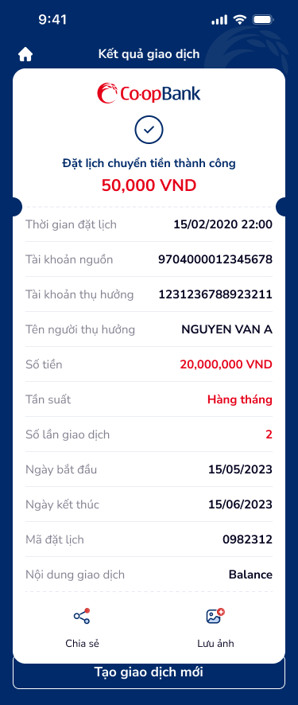

# Kết quả giao dịch

> **Figma:** [134:20066](https://www.figma.com/design/kPft93N2A3gYOC3YwuXpQR/Co-op-Bank-KHCN?node-id=134-20066&m=dev)

---

## 1. Chân dung khách hàng

| Thuộc tính | Mô tả |
|---|---|
| Đối tượng | KHCN đã xác thực OTP thành công |
| Nhu cầu | Xem kết quả giao dịch, lưu bằng chứng (ảnh chụp), chia sẻ biên lai |
| Bối cảnh sử dụng | Bước cuối flow chuyển tiền — xác nhận thành công hoặc thất bại |
| Kỳ vọng | Thông tin đầy đủ, dễ đọc, có thể lưu/chia sẻ nhanh, tạo giao dịch mới |

---

## 2. User Story

| Epic chung | Mã US | Tiêu đề | Mô tả chi tiết | Business Rule | Acceptance Criteria |
|---|---|---|---|---|---|
| Kết quả GD | US-020 | Xem kết quả giao dịch | Là KHCN, tôi muốn xem kết quả đặt lịch chuyển tiền thành công với đầy đủ thông tin. | Hiển thị trạng thái thành công + toàn bộ chi tiết giao dịch. Mã đặt lịch unique. | - Header "Kết quả giao dịch" (icon home hai bên). - Card result: logo Co-op Bank + icon ✓ xanh. - Text "Đặt lịch chuyển tiền thành công" (bold, primary). - Số tiền "50,000 VND" (bold 21px, đỏ #e50019). - Chi tiết: Thời gian đặt lịch, TK nguồn, TK thụ hưởng, Tên, Số tiền, Tần suất, Số lần GD, Ngày bắt đầu, Ngày kết thúc, Mã đặt lịch, Nội dung GD. |
| Kết quả GD | US-021 | Chia sẻ kết quả | Là KHCN, tôi muốn chia sẻ biên lai giao dịch cho người nhận hoặc lưu trữ. | Chia sẻ qua native share sheet. Lưu ảnh vào gallery. | - Icon "Chia sẻ" → mở native share sheet. - Icon "Lưu ảnh" → capture card → save vào photo gallery. - Yêu cầu permission gallery khi lần đầu. |
| Kết quả GD | US-022 | Tạo giao dịch mới | Là KHCN, tôi muốn nhanh chóng tạo giao dịch chuyển tiền mới. | Clear form, quay về màn nhập. | - Nút "Tạo giao dịch mới" (primary) ở bottom. - Nhấn → navigate về form nhập, clear hết data cũ. |

> **`🤖 by AI`** | Nguồn: ux-guidelines — transaction result best practice | Độ tin cậy: Medium
>
> | Epic chung | Mã US | Tiêu đề | Mô tả chi tiết | Business Rule | Acceptance Criteria |
> |---|---|---|---|---|---|
> | Kết quả GD | US-023 | Về trang chủ | Là KHCN, tôi muốn quay về trang chủ sau khi hoàn tất giao dịch. | Clear navigation stack. | - Icon home trên header → navigate về Home, clear stack. - Back gesture disabled (không quay lại OTP). |

---

## 3. Wireframe / Mô tả màn hình

| # | Thành phần | Loại | Mô tả | Figma Node |
|---|---|---|---|---|
| 1 | Header | `header` | "Kết quả giao dịch" (bold 16px, white). Icon home (🏠) cả hai bên (không có back). Gradient header. | 134:20067 |
| 2 | Result Card — Top | `success-header` | Card trắng, border-radius top 16px. Logo Co-op Bank (132×29px). Icon ✓ xanh (done, 40×40px). Text "Đặt lịch chuyển tiền thành công" (bold 15px, primary #002a69). Số tiền "50,000 VND" (bold 21px, đỏ #e50019). | 251:16381 |
| 3 | Dash Divider | `separator` | Đường kẻ dash ngang, width full (343px), height 24px. Hiệu ứng "xé phiếu" (ticket tear). | 251:16382 |
| 4 | Bill Detail — Thời gian đặt lịch | `list-item` | Label "Thời gian đặt lịch" — Value "15/02/2020 22:00". Border-bottom. | 251:16384 |
| 5 | Bill Detail — TK nguồn | `list-item` | Label "Tài khoản nguồn" — Value "9704000012345678". | 251:16385 |
| 6 | Bill Detail — TK thụ hưởng | `list-item` | Label "Tài khoản thụ hưởng" — Value "1231236788923211". | 251:16386 |
| 7 | Bill Detail — Tên người thụ hưởng | `list-item` | Label "Tên người thụ hưởng" — Value "NGUYEN VAN A". | 251:16387 |
| 8 | Bill Detail — Số tiền | `list-item` | Label "Số tiền" — Value "20,000,000 VND". | 251:16388 |
| 9 | Bill Detail — Tần suất | `list-item` | Label "Tần suất" — Value "Hàng tháng". | 251:16389 |
| 10 | Bill Detail — Số lần GD | `list-item` | Label "Số lần giao dịch" — Value "2". | 251:16390 |
| 11 | Bill Detail — Ngày bắt đầu | `list-item` | Label "Ngày bắt đầu" — Value "15/05/2023". | 251:16391 |
| 12 | Bill Detail — Ngày kết thúc | `list-item` | Label "Ngày kết thúc" — Value "15/06/2023". | 251:16392 |
| 13 | Bill Detail — Mã đặt lịch | `list-item` | Label "Mã đặt lịch" — Value "0982312". | 251:16393 |
| 14 | Bill Detail — Nội dung GD | `list-item` | Label "Nội dung giao dịch" — Value "Balance". | 251:16394 |
| 15 | Result Card — Bottom (Actions) | `card-item` | Border-radius bottom 16px. 2 action icons centered, gap 76px: icon "Chia sẻ" (share, 28×28px + label 13px) + icon "Lưu ảnh" (image+, 28×28px + label 13px). | 251:16395 |
| 16 | Button — Tạo giao dịch mới | `button-primary` | "Tạo giao dịch mới" (bold 17px, white). Gradient primary, height 44px, width 343px. Fixed bottom, margin 20px. | 134:20068 |

**Layout đặc biệt:** Background toàn màn hình = primary #002a69 (dark blue). Card result nổi trên nền tối — tạo visual hierarchy mạnh. Card dạng "receipt" với dash divider giữa phần top (success) và bottom (details + actions).

---

## 4. Database / Data Fields

| # | Field | Type | Nguồn | Mô tả |
|---|---|---|---|---|
| 1 | schedule_id | string | System gen | Mã đặt lịch (unique, vd: 0982312) |
| 2 | schedule_created_at | datetime | System | Thời gian đặt lịch (15/02/2020 22:00) |
| 3 | status | enum | System | Trạng thái: "SUCCESS" / "FAILED" / "PENDING" |
| 4 | source_account | string | Carry forward | TK nguồn (9704000012345678) |
| 5 | beneficiary_account | string | Carry forward | TK thụ hưởng (1231236788923211) |
| 6 | beneficiary_name | string | Carry forward | Tên người thụ hưởng (NGUYEN VAN A) |
| 7 | amount | decimal | Carry forward | Số tiền (20,000,000 VND) |
| 8 | frequency | enum | Carry forward | Tần suất (Hàng tháng) |
| 9 | transaction_count | integer | Carry forward | Số lần giao dịch (2) |
| 10 | start_date | date | Carry forward | Ngày bắt đầu (15/05/2023) |
| 11 | end_date | date | Carry forward | Ngày kết thúc (15/06/2023) |
| 12 | transaction_content | string | Carry forward | Nội dung giao dịch |

---

## 5. NFR (Yêu cầu phi chức năng)

| # | Hạng mục | Yêu cầu |
|---|---|---|
| 1 | Navigation | Disable back gesture/button (không cho quay lại OTP). Chỉ cho phép: Home hoặc Tạo GD mới. |
| 2 | Performance | Render result screen < 1s sau khi nhận response. |
| 3 | Accessibility | Success icon có `aria-label="Giao dịch thành công"`. Số tiền đỏ có `role="status"`. Card receipt accessible cho screen reader (đọc tuần tự label → value). |
| 4 | Share/Save | "Chia sẻ" → native share sheet (iOS UIActivityViewController / Android Intent.ACTION_SEND). "Lưu ảnh" → capture card as PNG → save to gallery (yêu cầu permission). |
| 5 | Visual | Background dark blue (#002a69). Card white floating. Dash divider tạo hiệu ứng receipt tear. Amount đỏ (#e50019) nổi bật. |
| 6 | Error State | Nếu GD thất bại: icon × đỏ thay ✓ xanh. Text "Giao dịch thất bại". Nút "Thử lại" thay "Tạo GD mới". Hiển thị mã lỗi + mô tả. |

---

*Figma node: 134:20066 | Section: Chuyển tiền nội bộ khác chủ*
