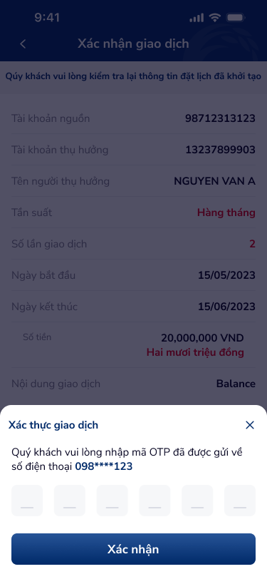

# Xác nhận giao dịch

> **Figma:** [134:19985](https://www.figma.com/design/kPft93N2A3gYOC3YwuXpQR/Co-op-Bank-KHCN?node-id=134-19985&m=dev), [134:20006](https://www.figma.com/design/kPft93N2A3gYOC3YwuXpQR/Co-op-Bank-KHCN?node-id=134-20006&m=dev)

---

## 1. Chân dung khách hàng

| Thuộc tính | Mô tả |
|---|---|
| Đối tượng | KHCN đã hoàn thành nhập thông tin chuyển tiền ở bước trước |
| Nhu cầu | Kiểm tra lại toàn bộ thông tin trước khi xác nhận giao dịch, đảm bảo không sai sót |
| Bối cảnh sử dụng | Bước 2/3 trong flow chuyển tiền, cần sự chú ý và cẩn thận |
| Kỳ vọng | Thông tin rõ ràng, dễ đọc, xác thực nhanh chóng qua OTP |

---

## 2. User Story

| Epic chung | Mã US | Tiêu đề | Mô tả chi tiết | Business Rule | Acceptance Criteria |
|---|---|---|---|---|---|
| Xác nhận GD | US-010 | Review thông tin giao dịch | Là KHCN, tôi muốn xem lại toàn bộ thông tin đã nhập trước khi xác nhận. | Hiển thị tất cả field đã nhập ở bước trước. Không cho sửa trực tiếp — phải quay lại. | - Header "Xác nhận giao dịch". - Text hướng dẫn: "Quý khách vui lòng kiểm tra lại thông tin đặt lịch đã khởi tạo". - Bảng review: TK nguồn, TK thụ hưởng, Tên, Tần suất, Số lần, Ngày bắt đầu, Ngày kết thúc, Số tiền (+ bằng chữ), Nội dung GD. - Dropdown chọn phương thức xác thực (SMS OTP). |
| Xác nhận GD | US-011 | Xác thực OTP | Là KHCN, tôi muốn nhập mã OTP để xác nhận giao dịch an toàn. | OTP 6 số, gửi qua SMS. Timeout 60-120s. Max 3 lần nhập sai. Số điện thoại mask (098****123). | - Nhấn "Xác nhận" → bottom sheet OTP slide up. - Blur overlay toàn màn hình. - Header "Xác thực giao dịch" + icon close (×). - Text: "Quý khách vui lòng nhập mã OTP đã được gửi về số điện thoại 098****123". - 6 ô input OTP (44×44px mỗi ô, auto-focus, auto-advance). - Nút "Xác nhận" (primary, disabled khi chưa đủ 6 số). |

> **`🤖 by AI`** | Nguồn: ux-guidelines — OTP best practice | Độ tin cậy: High
>
> | Epic chung | Mã US | Tiêu đề | Mô tả chi tiết | Business Rule | Acceptance Criteria |
> |---|---|---|---|---|---|
> | Xác nhận GD | US-012 | Gửi lại OTP | Là KHCN, tôi muốn gửi lại mã OTP khi chưa nhận được hoặc hết hạn. | Cooldown 60s giữa 2 lần gửi. Max 5 lần/giao dịch. | - Link "Gửi lại mã" hiện sau countdown 60s. - Hiển thị countdown "Gửi lại sau 59s". - Quá 5 lần → thông báo liên hệ hotline. |
> | Xác nhận GD | US-013 | Quay lại chỉnh sửa | Là KHCN, tôi muốn quay lại bước trước để sửa thông tin nếu phát hiện sai. | Giữ nguyên dữ liệu đã nhập khi back. | - Nhấn icon back (←) → quay lại form nhập, dữ liệu giữ nguyên. - Nhấn close (×) trên OTP sheet → đóng sheet, quay về review. |

---

## 3. Wireframe / Mô tả màn hình

### State 1: Review thông tin xác nhận

| # | Thành phần | Loại | Mô tả | Figma Node |
|---|---|---|---|---|
| 1 | Header | `header` | "Xác nhận giao dịch" (bold 18px, white). Icon back (←) trái, icon home (🏠) phải. Background gradient. Height 86px. | 134:19986 |
| 2 | Helper Text | `helper-text` | "Quý khách vui lòng kiểm tra lại thông tin đặt lịch đã khởi tạo" (bold 13px, primary #002a69). Padding top 12px. | 134:19989 |
| 3 | Bill Detail — Tài khoản nguồn | `list-item` | Label "Tài khoản nguồn" (muted) — Value "98712313123" (bold). Border-bottom. Height 44px. | 134:19991 |
| 4 | Bill Detail — TK thụ hưởng | `list-item` | Label "Tài khoản thụ hưởng" — Value "13237899903". | 134:19992 |
| 5 | Bill Detail — Tên người thụ hưởng | `list-item` | Label "Tên người thụ hưởng" — Value "NGUYEN VAN A". | 134:19993 |
| 6 | Bill Detail — Tần suất | `list-item` | Label "Tần suất" — Value "Hàng tháng" (đỏ #e50019 hoặc primary). | 134:19994 |
| 7 | Bill Detail — Số lần giao dịch | `list-item` | Label "Số lần giao dịch" — Value "2" (đỏ). | 134:19995 |
| 8 | Bill Detail — Ngày bắt đầu | `list-item` | Label "Ngày bắt đầu" — Value "15/05/2023". | 134:19996 |
| 9 | Bill Detail — Ngày kết thúc | `list-item` | Label "Ngày kết thúc" — Value "15/06/2023". | 134:19997 |
| 10 | Bill Detail — Số tiền | `bill-detail` | Label "Số tiền" (muted 13px). Value: "20,000,000 VND" (bold 15px) + "Hai mươi triệu đồng" (bold 15px, đỏ #e50019). Height 64px. | 134:19998 |
| 11 | Bill Detail — Nội dung GD | `list-item` | Label "Nội dung giao dịch" — Value "Balance". | 134:20003 |
| 12 | Dropdown — Phương thức xác thực | `select-field` | Label "Chọn phương thức xác thực" (muted 13px). Value "SMS OTP" (bold 15px). Icon dropdown (↓) phải. | 134:20005 |
| 13 | Button — Xác nhận | `button-primary` | "Xác nhận", height 44px, gradient primary, border-radius 8px. Fixed bottom. | 134:19987 |

### State 2: OTP Bottom Sheet

| # | Thành phần | Loại | Mô tả | Figma Node |
|---|---|---|---|---|
| 1 | Blur overlay | `design-element` | Toàn màn hình, rgba(5,4,33,0.7). | 134:20027 |
| 2 | Bottom Sheet container | `bottom-sheet` | Slide from bottom. Border-radius top 16px. Background white. Height 244px. | 134:20028 |
| 3 | Sheet header | `list-item` | "Xác thực giao dịch" (regular 15px) + icon close (×, 20px) phải. Divider dưới. | 134:20029 |
| 4 | Instruction text | `helper-text` | "Quý khách vui lòng nhập mã OTP đã được gửi về số điện thoại **098****123**" (phone number bold, primary #002a69). | 134:20030 |
| 5 | OTP Input (6 ô) | `otp-input` | 6 ô digit, mỗi ô 44×44px, gap ~15.8px, background #f6f7f9, border-radius 8px. Auto-focus ô đầu, auto-advance. | 134:20032 |
| 6 | Button — Xác nhận OTP | `button-primary` | "Xác nhận", gradient primary, height 44px, width 343px. | 134:20039 |

---

## 4. Database / Data Fields

| # | Field | Type | Nguồn | Mô tả |
|---|---|---|---|---|
| 1 | transaction_id | string | System gen | Mã giao dịch tạm (pending) |
| 2 | otp_code | string(6) | SMS gateway | Mã OTP 6 số |
| 3 | otp_phone | string | User profile | SĐT nhận OTP (masked: 098****123) |
| 4 | otp_sent_at | datetime | System | Thời gian gửi OTP |
| 5 | otp_attempts | integer | System | Số lần nhập OTP (max 3) |
| 6 | auth_method | enum | User chọn | Phương thức xác thực: "SMS OTP" |
| 7 | (các field từ bước trước) | — | Carry forward | TK nguồn, TK hưởng, tên, số tiền, nội dung, scheduled fields |

---

## 5. NFR (Yêu cầu phi chức năng)

| # | Hạng mục | Yêu cầu |
|---|---|---|
| 1 | Security | OTP timeout 60-120s. Mask SĐT (chỉ hiện 3 số đầu + 3 số cuối). Max 3 lần nhập sai OTP → block giao dịch. |
| 2 | Performance | Gửi OTP < 5s. Xác nhận giao dịch < 3s response. |
| 3 | Accessibility | OTP input: hỗ trợ paste (không block clipboard). `inputmode="numeric"` cho OTP. Focus trap trong bottom sheet. `Escape` đóng sheet. |
| 4 | UX | Auto-focus ô OTP đầu tiên khi sheet mở. Auto-advance khi nhập xong 1 ô. Backspace xóa và lùi ô. Hiển thị countdown gửi lại. |
| 5 | Error Handling | OTP sai → shake animation + clear + thông báo "Mã OTP không đúng". Hết hạn → "Mã OTP đã hết hạn, vui lòng gửi lại". Quá 3 lần → "Giao dịch bị khóa, vui lòng thử lại sau". |

---

*Figma nodes: 134:19985, 134:20006 | Section: Chuyển tiền nội bộ khác chủ*
