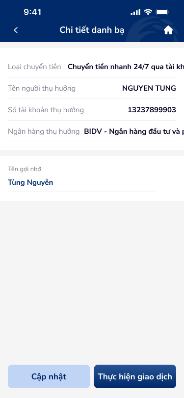
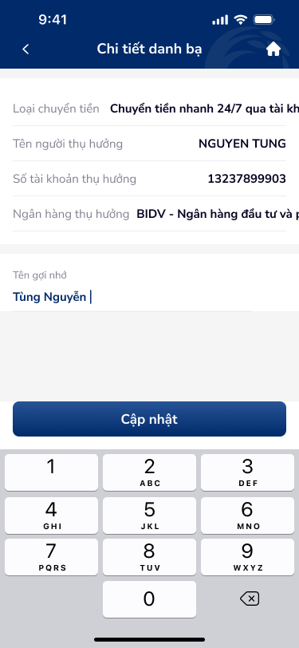
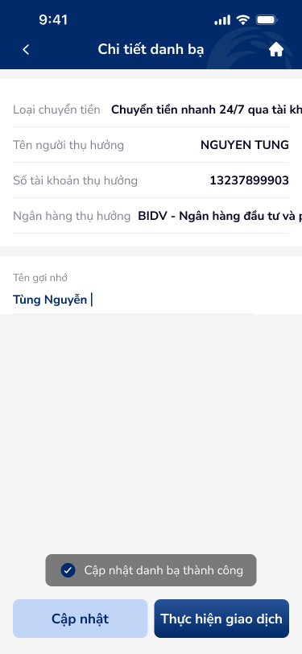

# Chi tiết liên hệ — PRD (Chi tiết danh bạ thụ hưởng)

Màn hình xem và chỉnh sửa chi tiết một danh bạ: loại chuyển tiền, tên người thụ hưởng, số tài khoản, ngân hàng, tên gợi nhớ; nút Cập nhật và Thực hiện giao dịch.

---

## Mục lục
1. [User Flow](#1-user-flow)
2. [User Story](#2-user-story)
3. [Wireframe](#3-wireframe)
4. [Thiết kế Database](#4-thiết-kế-database)
5. [Non-functional requirement](#5-non-functional-requirement)

---

## 1. User Flow

### 1.1. Luồng xem và cập nhật tên gợi nhớ
| Bước | Tên màn hình | Tên hành động | Kết quả |
|:---:|---|---|---|
| 1 | Chi tiết danh bạ | Mở từ danh sách / tìm kiếm | Hiển thị: Loại chuyển tiền, Tên người thụ hưởng, Số tài khoản thụ hưởng, Ngân hàng thụ hưởng, Tên gợi nhớ (có thể chỉnh). |
| 2 | Chi tiết danh bạ | Chạm "Tên gợi nhớ" (link/editable) | Mở chỉnh sửa tên gợi nhớ (inline hoặc modal tùy thiết kế). |
| 3 | Chi tiết danh bạ | Chạm "Cập nhật" | Lưu thay đổi tên gợi nhớ; thông báo thành công hoặc lỗi. |

### 1.2. Luồng thực hiện giao dịch
| Bước | Tên màn hình | Tên hành động | Kết quả |
|:---:|---|---|---|
| 1 | Chi tiết danh bạ | Chạm "Thực hiện giao dịch" | Chuyển sang luồng chuyển tiền với thông tin thụ hưởng đã điền sẵn. |

### 1.3. Luồng quay lại
| Bước | Tên màn hình | Tên hành động | Kết quả |
|:---:|---|---|---|
| 1 | Chi tiết danh bạ | Chạm back (header) | Quay lại Danh sách / Tìm kiếm, giữ data. |
| 2 | Chi tiết danh bạ | Chạm icon Home | Về màn hình chính (dashboard). |

---

## 2. User Story

| Epic chung | Mã US | Tiêu đề | Mô tả chi tiết | Business Rule | Acceptance Criteria |
|---|---|---|---|---|---|
| Danh bạ | US-007 | Xem chi tiết danh bạ | Là người dùng, tôi muốn xem đầy đủ thông tin một danh bạ đã lưu. | Thông tin hiển thị: Loại chuyển tiền, Tên người thụ hưởng, Số tài khoản thụ hưởng, Ngân hàng thụ hưởng, Tên gợi nhớ. | - Các trường read-only hiển thị đúng giá trị. - Tên gợi nhớ có thể chỉnh (link/editable). |
| Danh bạ | US-008 | Cập nhật tên gợi nhớ | Là người dùng, tôi muốn sửa tên gợi nhớ để dễ nhận diện danh bạ. | Nút "Cập nhật" gửi thay đổi lên server. | - Sau Cập nhật: thông báo thành công hoặc lỗi. - Dữ liệu danh sách cập nhật khi quay lại. |
| Danh bạ | US-009 | Thực hiện giao dịch từ danh bạ | Là người dùng, tôi muốn chuyển tiền ngay từ chi tiết danh bạ mà không cần nhập lại. | Nút "Thực hiện giao dịch" mở luồng chuyển tiền với beneficiary pre-filled. | - Chuyển sang màn chuyển tiền với thông tin thụ hưởng đã điền. |

---

## 3. Wireframe

### Hình ảnh minh họa

---

### Mô tả màn hình
| STT | Tên màn hình | Loại thành phần | Mô tả |
|:---:|---|---|---|
| 1 | Header | Header | Back, tiêu đề "Chi tiết danh bạ", icon Home. |
| 2 | Loại chuyển tiền | Read-only Field | Label "Loại chuyển tiền", value ví dụ "Chuyển tiền nhanh 24/7 qua tài khoản". |
| 3 | Tên người thụ hưởng | Read-only Field | Label "Tên người thụ hưởng", value ví dụ "NGUYEN TUNG". |
| 4 | Số tài khoản thụ hưởng | Read-only Field | Label "Số tài khoản thụ hưởng", value ví dụ "13237899903". |
| 5 | Ngân hàng thụ hưởng | Read-only Field | Label "Ngân hàng thụ hưởng", value ví dụ "BIDV - Ngân hàng đầu tư và phát triển Việt Nam". |
| 6 | Tên gợi nhớ | Link / Editable | Label "Tên gợi nhớ", value (vd: "Tùng Nguyễn") hiển thị màu xanh, gạch chân; chạm để sửa. |
| 7 | Cập nhật | Button (Outline) | Nút "Cập nhật", nền xanh nhạt; gửi thay đổi tên gợi nhớ. |
| 8 | Thực hiện giao dịch | Button (Primary) | Nút "Thực hiện giao dịch", nền xanh đậm; mở luồng chuyển tiền. |

---

### Ngữ cảnh màn hình (từ OCR)

Màn chi tiết một danh bạ: thông tin read-only (loại chuyển tiền, tên, số TK, ngân hàng), trường tên gợi nhớ có thể sửa; hai CTA Cập nhật và Thực hiện giao dịch.

---

## 4. Thiết kế Database

Cập nhật trường `nickname` của entity **BeneficiaryContact** khi người dùng chạm "Cập nhật". Các trường còn lại đọc từ entity và (nếu có) từ API tra cứu ngân hàng/tên thụ hưởng.

---

## 5. Non-functional requirement

- **Bảo mật:** Chỉ cho phép cập nhật/xem danh bạ thuộc tài khoản đăng nhập.
- **Trải nghiệm:** Nút Cập nhật và Thực hiện giao dịch đủ lớn (min 44px); loading state khi đang gọi API Cập nhật.

---
*Generated by VNPAY Agentic Framework*
