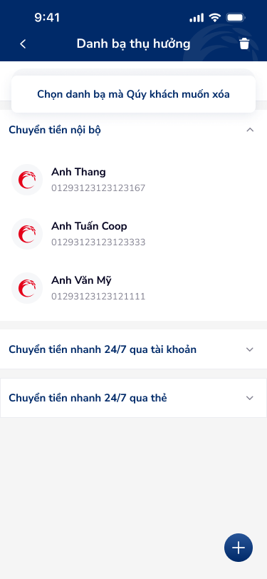
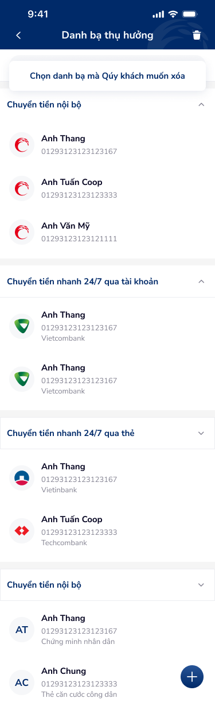
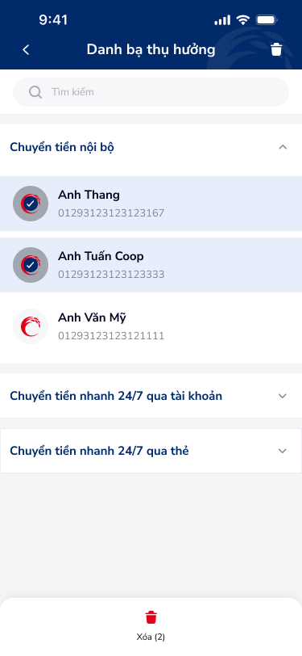

# Danh sách danh bạ — PRD (Danh sách danh bạ thụ hưởng)

Màn hình danh sách danh bạ thụ hưởng, nhóm theo loại chuyển tiền (nội bộ, 24/7 qua tài khoản, 24/7 qua thẻ), có chế độ chọn để xóa và FAB thêm mới.

---

## Mục lục
1. [User Flow](#1-user-flow)
2. [User Story](#2-user-story)
3. [Wireframe](#3-wireframe)
4. [Thiết kế Database](#4-thiết-kế-database)
5. [Non-functional requirement](#5-non-functional-requirement)

---

## 1. User Flow

### 1.1. Luồng xem danh sách và thêm mới
| Bước | Tên màn hình | Tên hành động | Kết quả |
|:---:|---|---|---|
| 1 | Danh sách danh bạ | Mở màn hình | Hiển thị danh sách theo nhóm (Chuyển tiền nội bộ, 24/7 qua tài khoản, 24/7 qua thẻ), có thể thu gọn/mở rộng từng nhóm. |
| 2 | Danh sách danh bạ | Chạm FAB "+" | Chuyển đến màn hình Thêm mới danh bạ. |
| 3 | Danh sách danh bạ | Chạm một danh bạ | Chuyển đến Chi tiết danh bạ. |

### 1.2. Luồng chọn và xóa danh bạ
| Bước | Tên màn hình | Tên hành động | Kết quả |
|:---:|---|---|---|
| 1 | Danh sách danh bạ | Chạm icon thùng rác (header) | Bật chế độ chọn; hiển thị banner "Chọn danh bạ mà Quý khách muốn xóa". |
| 2 | Danh sách danh bạ | Chọn một hoặc nhiều danh bạ | Các mục được chọn có trạng thái selected (checkmark). |
| 3 | Danh sách danh bạ | Thực hiện xóa (hoặc nút xóa) | Hiển thị popup xác nhận: "Quý khách có muốn xóa 02 danh bạ này khỏi danh bạ thụ hưởng?" với Không / Đồng ý. |
| 4 | Popup xác nhận | Chạm "Đồng ý" | Xóa danh bạ đã chọn, đóng popup, cập nhật danh sách. |
| 5 | Popup xác nhận | Chạm "Không" | Đóng popup, giữ nguyên danh sách và lựa chọn. |

### 1.3. Luồng quay lại
| Bước | Tên màn hình | Tên hành động | Kết quả |
|:---:|---|---|---|
| 1 | Danh sách danh bạ | Chạm mũi tên back (header) | Quay lại màn hình trước, giữ data. |

---

## 2. User Story

| Epic chung | Mã US | Tiêu đề | Mô tả chi tiết | Business Rule | Acceptance Criteria |
|---|---|---|---|---|---|
| Danh bạ | US-001 | Xem danh sách danh bạ theo nhóm | Là người dùng, tôi muốn xem danh bạ thụ hưởng được nhóm theo loại chuyển tiền để chọn nhanh người nhận. | Nhóm: Chuyển tiền nội bộ, Chuyển tiền nhanh 24/7 qua tài khoản, Chuyển tiền nhanh 24/7 qua thẻ. Mỗi nhóm có thể thu gọn/mở rộng. | - Hiển thị đúng 3 nhóm. - Mỗi mục danh bạ: avatar/icon, tên, số tài khoản/số (vd: Anh Thang, 01293123123123167). - Chevron mở/đóng theo trạng thái nhóm. |
| Danh bạ | US-002 | Thêm mới danh bạ từ FAB | Là người dùng, tôi muốn chạm nút Thêm mới (FAB) để mở form thêm danh bạ. | FAB cố định góc phải dưới, icon "+". | - Chạm FAB mở màn Thêm mới danh bạ. |
| Danh bạ | US-003 | Chọn nhiều danh bạ để xóa | Là người dùng, tôi muốn chọn nhiều danh bạ rồi xóa một lần. | Khi chạm icon thùng rác trên header, bật chế độ chọn; banner "Chọn danh bạ mà Quý khách muốn xóa". | - Chế độ chọn bật/tắt rõ ràng. - Mục đã chọn có dấu tích (checkmark). - Có popup xác nhận trước khi xóa. |
| Danh bạ | US-004 | Xác nhận xóa danh bạ | Là người dùng, tôi muốn xác nhận trước khi xóa để tránh xóa nhầm. | Popup hiển thị số lượng (vd: 02 danh bạ) và hai nút Không / Đồng ý. | - Popup "Thông báo", nội dung "Quý khách có muốn xóa 02 danh bạ này khỏi danh bạ thụ hưởng?" - Không: đóng popup. - Đồng ý: xóa và cập nhật danh sách. |

---

## 3. Wireframe

### Hình ảnh minh họa

---

### Mô tả màn hình
| STT | Tên màn hình | Loại thành phần | Mô tả |
|:---:|---|---|---|
| 1 | Header | Header | Thanh trên: back (chevron trái), tiêu đề "Danh bạ thụ hưởng", icon thùng rác (bật chế độ xóa). |
| 2 | Banner chế độ xóa | Section | Khi ở chế độ chọn: "Chọn danh bạ mà Quý khách muốn xóa" (nền xám nhạt). |
| 3 | Nhóm Chuyển tiền nội bộ | Accordion | Tiêu đề nhóm + chevron mở/đóng; khi mở hiển thị danh sách con. |
| 4 | Nhóm 24/7 qua tài khoản | Accordion | Tiêu đề "Chuyển tiền nhanh 24/7 qua tài khoản", chevron. |
| 5 | Nhóm 24/7 qua thẻ | Accordion | Tiêu đề "Chuyển tiền nhanh 24/7 qua thẻ", chevron. |
| 6 | Mục danh bạ | Contact Item | Avatar (logo C đỏ), tên (vd: Anh Thang, Anh Tuấn Coop), số (vd: 01293123123123167). Chạm mở Chi tiết danh bạ. |
| 7 | FAB | FAB Button | Nút tròn góc phải dưới, icon "+", mở Thêm mới danh bạ. |

---

### Ngữ cảnh màn hình (từ OCR)

Màn hình danh sách danh bạ thụ hưởng, nhóm theo ba loại chuyển tiền; người dùng có thể mở/đóng từng nhóm, chọn nhiều mục để xóa qua icon thùng rác và xác nhận bằng popup, hoặc thêm mới qua FAB.

---

## 4. Thiết kế Database

> **`🤖 by AI`** | Nguồn: figma_inferred:kPft93N2A3gYOC3YwuXpQR/5199:5932 | Độ tin cậy: Medium
>
> Các entity dưới đây suy luận từ nhãn màn hình và cấu trúc danh bạ; cần đối chiếu với backend hiện có.

### Entity: BeneficiaryContact (Danh bạ thụ hưởng)
| Field | Data Type | Constraint | Description |
|---|---|---|---|
| `id` | UUID | Primary Key | |
| `user_id` | UUID | Foreign Key | Liên kết tài khoản đăng nhập |
| `transfer_type` | Enum | Not Null | Chuyển tiền nội bộ \| 24/7 qua tài khoản \| 24/7 qua thẻ |
| `account_or_card_number` | String(50) | Not Null | Số tài khoản hoặc số thẻ |
| `beneficiary_name` | String(200) | Optional | Tên người thụ hưởng (tra cứu) |
| `bank_code` | String(20) | Optional | Mã ngân hàng (24/7) |
| `nickname` | String(100) | Optional | Tên gợi nhớ |
| `created_at` | DateTime | Not Null | |
| `updated_at` | DateTime | Not Null | |

---

## 5. Non-functional requirement

- **Bảo mật:**
    - Danh bạ gắn với phiên đăng nhập; không hiển thị danh bạ của tài khoản khác.
- **Hiệu năng:**
    - Danh sách có thể phân trang hoặc lazy-load nếu số lượng lớn.
- **Trải nghiệm:**
    - Touch target tối thiểu 44px cho FAB, nút back, icon thùng rác.
    - Trạng thái loading khi đang tải danh sách hoặc đang xóa.

---
*Generated by VNPAY Agentic Framework*
