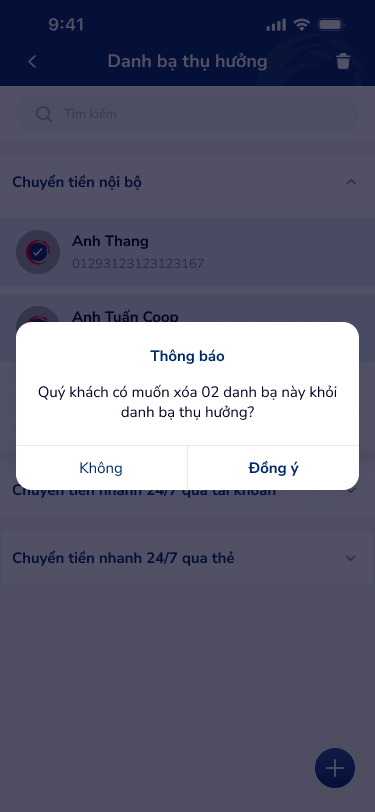

# Popup xác nhận xóa — PRD (Dialog xác nhận xóa danh bạ)

Dialog xác nhận trước khi xóa nhiều danh bạ đã chọn: tiêu đề "Thông báo", nội dung hỏi ý kiến, hai nút Không / Đồng ý.

---

## Mục lục
1. [User Flow](#1-user-flow)
2. [User Story](#2-user-story)
3. [Wireframe](#3-wireframe)
4. [Thiết kế Database](#4-thiết-kế-database)
5. [Non-functional requirement](#5-non-functional-requirement)

---

## 1. User Flow

### 1.1. Luồng xác nhận xóa
| Bước | Tên màn hình | Tên hành động | Kết quả |
|:---:|---|---|---|
| 1 | Danh sách danh bạ (chế độ chọn) | Chọn 1 hoặc nhiều danh bạ rồi thực hiện xóa | Hiển thị popup "Thông báo": "Quý khách có muốn xóa 02 danh bạ này khỏi danh bạ thụ hưởng?" (số 02 thay đổi theo số đã chọn). |
| 2 | Popup xác nhận | Chạm "Không" | Đóng popup, giữ nguyên danh sách và lựa chọn. |
| 3 | Popup xác nhận | Chạm "Đồng ý" | Gọi API xóa các danh bạ đã chọn; đóng popup; cập nhật danh sách; có thể thông báo thành công. |

### 1.2. Luồng lỗi khi xóa
| Bước | Tên màn hình | Tên hành động | Kết quả |
|:---:|---|---|---|
| 1 | Popup xác nhận | Chạm "Đồng ý" nhưng API lỗi | Đóng popup hoặc giữ; hiển thị thông báo lỗi (vd: "Không thể xóa. Vui lòng thử lại."). |

---

## 2. User Story

| Epic chung | Mã US | Tiêu đề | Mô tả chi tiết | Business Rule | Acceptance Criteria |
|---|---|---|---|---|---|
| Danh bạ | US-014 | Xác nhận trước khi xóa danh bạ | Là người dùng, tôi muốn được hỏi lại trước khi xóa để tránh xóa nhầm. | Popup hiển thị khi người dùng thực hiện thao tác xóa (sau khi đã chọn danh bạ). Nội dung hiển thị số lượng danh bạ sẽ xóa. | - Tiêu đề: "Thông báo". - Nội dung: "Quý khách có muốn xóa {n} danh bạ này khỏi danh bạ thụ hưởng?" (n = số đã chọn). - Nút "Không": hủy, đóng popup. - Nút "Đồng ý": xác nhận xóa, gọi API, cập nhật UI. |
| Danh bạ | US-015 | Thông báo lỗi khi xóa thất bại | Là người dùng, tôi muốn biết khi thao tác xóa không thành công. | Khi API xóa trả lỗi, hiển thị message lỗi. | - Hiển thị message rõ ràng (vd: "Không thể xóa. Vui lòng thử lại."). - Có thể retry hoặc đóng. |

---

## 3. Wireframe

### Hình ảnh minh họa

---

### Mô tả màn hình
| STT | Tên màn hình | Loại thành phần | Mô tả |
|:---:|---|---|---|
| 1 | Overlay | (Backdrop) | Nền tối mờ phía sau dialog. |
| 2 | Dialog | Dialog | Khung trắng, bo góc, có tiêu đề và nội dung. |
| 3 | Tiêu đề | Heading | "Thông báo" (bold, căn giữa). |
| 4 | Nội dung | Body text | "Quý khách có muốn xóa 02 danh bạ này khỏi danh bạ thụ hưởng?" (số động theo số đã chọn). |
| 5 | Nút Không | Button (Outline/Text) | "Không" — hủy, đóng popup. |
| 6 | Nút Đồng ý | Button (Primary/Text) | "Đồng ý" — xác nhận xóa. |

---

### Ngữ cảnh màn hình (từ OCR)

Dialog xác nhận xóa nhiều danh bạ: tiêu đề Thông báo, nội dung hỏi ý kiến với số lượng, hai nút Không và Đồng ý.

---

## 4. Thiết kế Database

Không tạo entity mới; thao tác xóa gọi API xóa (soft delete hoặc hard delete) các bản ghi **BeneficiaryContact** tương ứng với danh sách id đã chọn.

---

## 5. Non-functional requirement

- **Trải nghiệm:** Dialog có focus trap và đóng bằng overlay click (tùy thiết kế); nút Đồng ý có thể loading state khi đang gọi API; destructive action rõ ràng (copy "xóa").
- **Accessibility:** Tiêu đề dialog có role/title; nút có label rõ; có thể đóng bằng phím Escape.

---
*Generated by VNPAY Agentic Framework*
