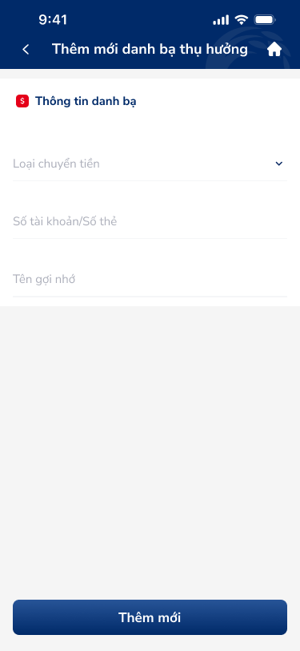
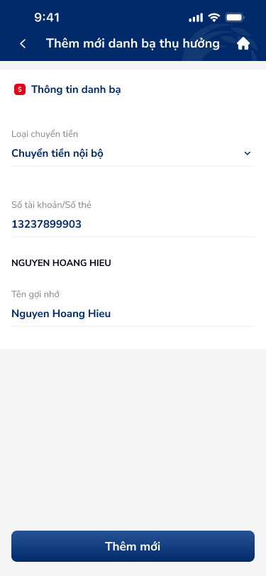
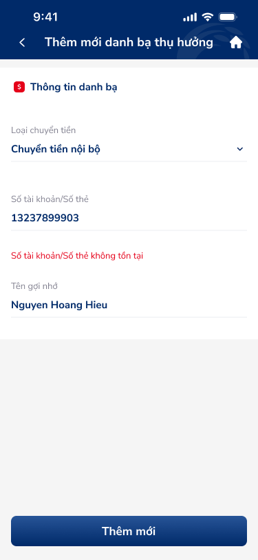
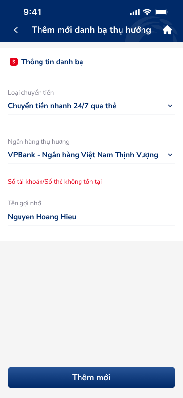

# Thêm mới liên hệ — PRD (Thêm mới danh bạ thụ hưởng)

Form thêm danh bạ thụ hưởng: chọn Loại chuyển tiền, nhập Số tài khoản/Số thẻ, Tên gợi nhớ; nút Thêm mới.

---

## Mục lục
1. [User Flow](#1-user-flow)
2. [User Story](#2-user-story)
3. [Wireframe](#3-wireframe)
4. [Thiết kế Database](#4-thiết-kế-database)
5. [Non-functional requirement](#5-non-functional-requirement)

---

## 1. User Flow

### 1.1. Luồng thêm mới thành công
| Bước | Tên màn hình | Tên hành động | Kết quả |
|:---:|---|---|---|
| 1 | Thêm mới danh bạ | Mở từ FAB / menu | Hiển thị form: Loại chuyển tiền, Số tài khoản/Số thẻ, Tên gợi nhớ. |
| 2 | Thêm mới danh bạ | Chọn Loại chuyển tiền | Dropdown/picker: Chuyển tiền nội bộ, 24/7 qua tài khoản, 24/7 qua thẻ. |
| 3 | Thêm mới danh bạ | Nhập Số tài khoản/Số thẻ | Ô nhập số; có thể tra cứu tên ngân hàng/tên thụ hưởng (nếu API có). |
| 4 | Thêm mới danh bạ | Nhập Tên gợi nhớ | Ô nhập text. |
| 5 | Thêm mới danh bạ | Chạm "Thêm mới" | Validate; gọi API tạo danh bạ; thành công → thông báo và quay danh sách hoặc về Chi tiết vừa tạo. |

### 1.2. Luồng validation lỗi
| Bước | Tên màn hình | Tên hành động | Kết quả |
|:---:|---|---|---|
| 1 | Thêm mới danh bạ | Chạm "Thêm mới" khi thiếu bắt buộc / sai format | Hiển thị lỗi dưới từng trường (vd: "Vui lòng nhập số tài khoản", "Số tài khoản không hợp lệ"). |
| 2 | Thêm mới danh bạ | Sửa lỗi và gửi lại | Validate lại; nếu đúng thì gửi. |

### 1.3. Luồng quay lại
| Bước | Tên màn hình | Tên hành động | Kết quả |
|:---:|---|---|---|
| 1 | Thêm mới danh bạ | Chạm back hoặc Home | Quay lại màn trước; có thể xác nhận "Hủy thay đổi?" nếu đã nhập. |

---

## 2. User Story

| Epic chung | Mã US | Tiêu đề | Mô tả chi tiết | Business Rule | Acceptance Criteria |
|---|---|---|---|---|---|
| Danh bạ | US-010 | Chọn loại chuyển tiền khi thêm | Là người dùng, tôi muốn chọn loại chuyển tiền khi thêm danh bạ để phân nhóm đúng. | Loại: Chuyển tiền nội bộ, Chuyển tiền nhanh 24/7 qua tài khoản, Chuyển tiền nhanh 24/7 qua thẻ. | - Dropdown/selector hiển thị đủ 3 lựa chọn. - Trường bắt buộc. |
| Danh bạ | US-011 | Nhập số tài khoản/số thẻ | Là người dùng, tôi muốn nhập số tài khoản hoặc số thẻ của người thụ hưởng. | Định dạng và độ dài tùy loại chuyển tiền (nội bộ vs 24/7). | - Validate format theo loại đã chọn. - Hiển thị lỗi rõ ràng khi sai. |
| Danh bạ | US-012 | Nhập tên gợi nhớ | Là người dùng, tôi muốn đặt tên gợi nhớ để dễ nhận diện danh bạ. | Tùy chọn hoặc bắt buộc tùy quy định nghiệp vụ. | - Ô nhập "Tên gợi nhớ"; giới hạn ký tự nếu có. |
| Danh bạ | US-013 | Gửi form thêm mới | Là người dùng, tôi muốn chạm "Thêm mới" để lưu danh bạ. | API tạo bản ghi BeneficiaryContact; trùng số TK/ thẻ có thể báo lỗi. | - Loading state khi đang gửi. - Thành công: thông báo + điều hướng. - Lỗi: hiển thị message (vd: "Số tài khoản đã tồn tại trong danh bạ"). |

---

## 3. Wireframe

### Hình ảnh minh họa

---

### Mô tả màn hình
| STT | Tên màn hình | Loại thành phần | Mô tả |
|:---:|---|---|---|
| 1 | Header | Header | Back, tiêu đề "Thêm mới danh bạ thụ hưởng", icon Home. |
| 2 | Section Thông tin danh bạ | Form Section | Tiêu đề "Thông tin danh bạ" (có icon nhấn mạnh). |
| 3 | Loại chuyển tiền | Dropdown | Placeholder "Loại chuyển tiền", chevron; chọn 1 trong 3 loại. |
| 4 | Số tài khoản/Số thẻ | Input Field | Placeholder "Số tài khoản/Số thẻ"; nhập số. |
| 5 | Tên gợi nhớ | Input Field | Placeholder "Tên gợi nhớ"; nhập text. |
| 6 | Thêm mới | Button (Primary) | Nút full-width "Thêm mới", nền xanh đậm; gửi form. |

---

### Ngữ cảnh màn hình (từ OCR)

Form thêm danh bạ: section Thông tin danh bạ với 3 trường (Loại chuyển tiền, Số tài khoản/Số thẻ, Tên gợi nhớ) và nút Thêm mới.

---

## 4. Thiết kế Database

Tạo bản ghi mới trong entity **BeneficiaryContact** với `transfer_type`, `account_or_card_number`, `nickname`; `user_id` = tài khoản đăng nhập. Có thể gọi API tra cứu để điền `beneficiary_name`, `bank_code` sau khi nhập số.

---

## 5. Non-functional requirement

- **Bảo mật:** Chỉ tạo danh bạ gắn với user đăng nhập.
- **Trải nghiệm:** Validation realtime hoặc on submit; loading và disable nút "Thêm mới" khi đang gửi; error message rõ ràng (error state).
- **Hiệu năng:** Gọi API tạo một lần; tránh duplicate submit.

---
*Generated by VNPAY Agentic Framework*
