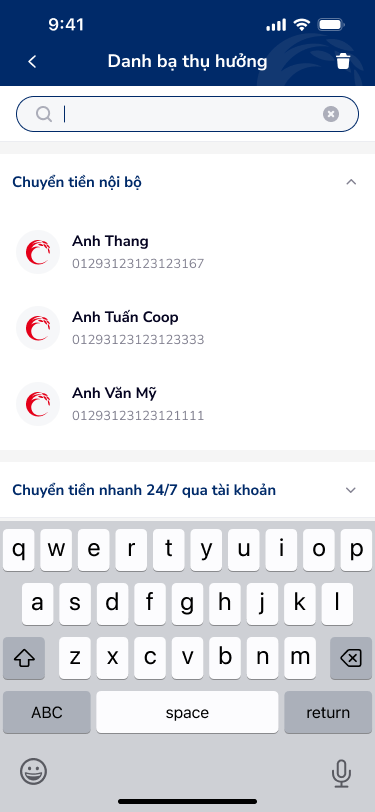
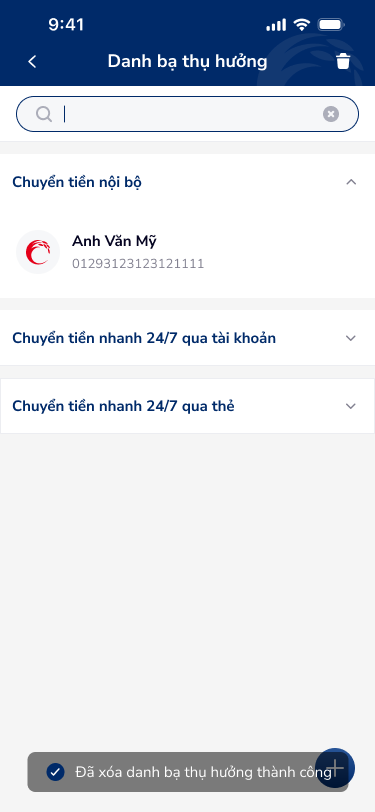
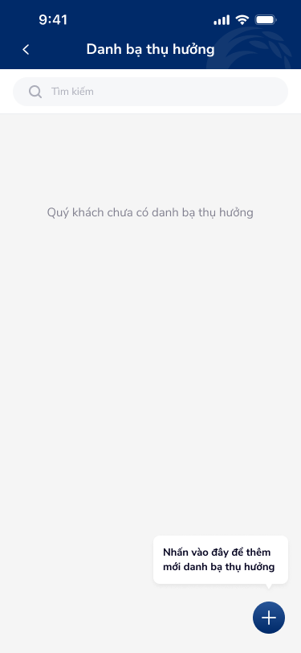
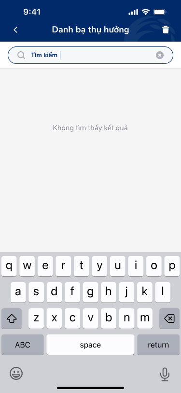

# Tìm kiếm danh bạ — PRD (Tìm kiếm trong danh bạ thụ hưởng)

Màn hình tìm kiếm trong danh bạ thụ hưởng: ô tìm kiếm, bàn phím, danh sách kết quả theo nhóm (collapsible).

---

## Mục lục
1. [User Flow](#1-user-flow)
2. [User Story](#2-user-story)
3. [Wireframe](#3-wireframe)
4. [Thiết kế Database](#4-thiết-kế-database)
5. [Non-functional requirement](#5-non-functional-requirement)

---

## 1. User Flow

### 1.1. Luồng tìm kiếm
| Bước | Tên màn hình | Tên hành động | Kết quả |
|:---:|---|---|---|
| 1 | Danh bạ thụ hưởng (có ô tìm kiếm) | Focus vào ô tìm kiếm | Bàn phím hiển thị, có thể nhập từ khóa. |
| 2 | Tìm kiếm | Nhập từ khóa | Danh sách lọc theo tên/số tài khoản theo nhóm; các nhóm vẫn có thể thu gọn/mở rộng. |
| 3 | Tìm kiếm | Chạm icon x (clear) | Xóa nội dung ô tìm kiếm, hiển thị lại toàn bộ danh sách. |
| 4 | Tìm kiếm | Chạm một kết quả | Chuyển đến Chi tiết danh bạ. |

### 1.2. Luồng quay lại
| Bước | Tên màn hình | Tên hành động | Kết quả |
|:---:|---|---|---|
| 1 | Tìm kiếm | Chạm back (header) | Quay lại danh sách (hoặc đóng bàn phím), giữ nội dung tìm kiếm tùy thiết kế. |

---

## 2. User Story

| Epic chung | Mã US | Tiêu đề | Mô tả chi tiết | Business Rule | Acceptance Criteria |
|---|---|---|---|---|---|
| Danh bạ | US-005 | Tìm kiếm trong danh bạ | Là người dùng, tôi muốn tìm nhanh danh bạ theo tên hoặc số tài khoản. | Ô tìm kiếm có icon kính lúp, placeholder "Tìm kiếm"; có nút xóa nội dung. | - Nhập từ khóa → lọc theo tên/số TK. - Kết quả giữ cấu trúc nhóm (Chuyển tiền nội bộ, 24/7 qua tài khoản, 24/7 qua thẻ). - Clear ô → hiển thị lại toàn bộ. |
| Danh bạ | US-006 | Trạng thái rỗng tìm kiếm | Là người dùng, tôi muốn biết khi không có kết quả nào. | Khi không có kết quả khớp, hiển thị thông báo phù hợp (empty state). | - Empty state có copy rõ ràng (vd: "Không tìm thấy danh bạ phù hợp"). |

---

## 3. Wireframe

### Hình ảnh minh họa

---

### Mô tả màn hình
| STT | Tên màn hình | Loại thành phần | Mô tả |
|:---:|---|---|---|
| 1 | Header | Header | Back, tiêu đề "Danh bạ thụ hưởng", icon thùng rác. |
| 2 | Ô tìm kiếm | Search Bar | Icon kính lúp bên trái, placeholder "Tìm kiếm", icon x (clear) bên phải khi có nội dung. |
| 3 | Danh sách theo nhóm | Accordion + List | Cấu trúc giống Danh sách danh bạ: Chuyển tiền nội bộ (mở), 24/7 qua tài khoản (đóng), 24/7 qua thẻ (đóng); mỗi mục: avatar, tên, số. |
| 4 | Bàn phím | (Hệ thống) | Bàn phím QWERTY khi focus ô tìm kiếm. |

---

### Ngữ cảnh màn hình (từ OCR)

Màn hình tìm kiếm trong danh bạ: ô tìm kiếm nổi bật, danh sách kết quả vẫn theo nhóm loại chuyển tiền; bàn phím hiển thị khi đang nhập.

---

## 4. Thiết kế Database

Sử dụng chung entity **BeneficiaryContact** như màn Danh sách danh bạ; tìm kiếm filter theo `nickname`, `account_or_card_number`, `beneficiary_name` (backend/search API).

---

## 5. Non-functional requirement

- **Hiệu năng:** Tìm kiếm có thể debounce (vd: 300ms) để giảm số lần gọi API.
- **Trải nghiệm:** Ô tìm kiếm đủ cao (min 44px), hỗ trợ bàn phím ảo; empty state rõ ràng.

---
*Generated by VNPAY Agentic Framework*
