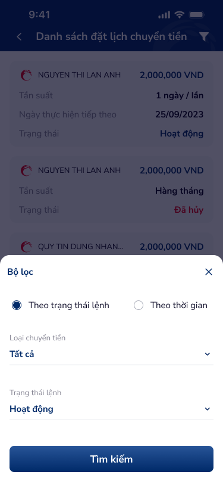
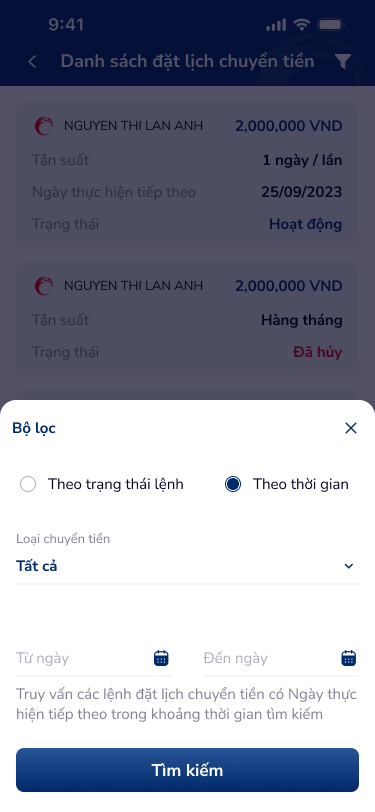

# Bộ lọc tìm kiếm — PRD (Bộ lọc tìm kiếm lệnh đặt lịch chuyển tiền)

Bottom sheet bộ lọc cho màn hình Danh sách đặt lịch chuyển tiền. Hỗ trợ hai chế độ lọc: theo trạng thái lệnh hoặc theo thời gian. Bao gồm dropdown loại chuyển tiền, dropdown trạng thái, date picker khoảng thời gian, và nút Tìm kiếm.

---

## Mục lục
1. [User Flow](#1-user-flow)
2. [User Story](#2-user-story)
3. [Wireframe](#3-wireframe)
4. [Thiết kế Database](#4-thiết-kế-database)
5. [Non-functional requirement](#5-non-functional-requirement)

---

## 1. User Flow

### 1.1. Luồng lọc theo trạng thái lệnh
| Bước | Tên màn hình | Tên hành động | Kết quả |
|:---:|---|---|---|
| 1 | Danh sách đặt lịch chuyển tiền | Chạm icon bộ lọc (header) | Mở bottom sheet "Bộ lọc"; mặc định chọn radio "Theo trạng thái lệnh". |
| 2 | Bộ lọc | Chọn radio "Theo trạng thái lệnh" | Hiển thị: dropdown "Loại chuyển tiền" + dropdown "Trạng thái lệnh". Ẩn phần chọn ngày. |
| 3 | Bộ lọc | Chọn "Loại chuyển tiền" | Mở dropdown; chọn giá trị (Tất cả / Chuyển tiền nội bộ / Liên ngân hàng / …). |
| 4 | Bộ lọc | Chọn "Trạng thái lệnh" | Mở dropdown; chọn giá trị (Hoạt động / Đã hủy / Hết hạn / Tạm dừng / Tất cả). |
| 5 | Bộ lọc | Chạm "Tìm kiếm" | Đóng bottom sheet, danh sách cập nhật theo điều kiện lọc. |

### 1.2. Luồng lọc theo thời gian
| Bước | Tên màn hình | Tên hành động | Kết quả |
|:---:|---|---|---|
| 1 | Bộ lọc | Chọn radio "Theo thời gian" | Hiển thị: dropdown "Loại chuyển tiền" + date picker "Từ ngày" + date picker "Đến ngày" + helper text. Ẩn dropdown trạng thái. |
| 2 | Bộ lọc | Chọn "Loại chuyển tiền" | Mở dropdown; chọn giá trị. |
| 3 | Bộ lọc | Chạm "Từ ngày" | Mở date picker (calendar), chọn ngày bắt đầu. |
| 4 | Bộ lọc | Chạm "Đến ngày" | Mở date picker (calendar), chọn ngày kết thúc. |
| 5 | Bộ lọc | Chạm "Tìm kiếm" | Validate khoảng ngày → đóng bottom sheet, danh sách cập nhật theo lệnh có "Ngày thực hiện tiếp theo" trong khoảng đã chọn. |

### 1.3. Luồng đóng bộ lọc
| Bước | Tên màn hình | Tên hành động | Kết quả |
|:---:|---|---|---|
| 1 | Bộ lọc | Chạm icon X (đóng) | Đóng bottom sheet, không áp dụng thay đổi, giữ nguyên trạng thái lọc trước đó. |
| 2 | Bộ lọc | Chạm vùng overlay ngoài bottom sheet | Đóng bottom sheet, không áp dụng thay đổi. |

---

## 2. User Story

| Epic chung | Mã US | Tiêu đề | Mô tả chi tiết | Business Rule | Acceptance Criteria |
|---|---|---|---|---|---|
| Đặt lịch chuyển tiền | US-311 | Lọc theo trạng thái lệnh | Là người dùng, tôi muốn lọc danh sách đặt lịch theo trạng thái lệnh để xem nhanh các lệnh đang hoạt động, đã hủy, hết hạn, hoặc tạm dừng. | Radio "Theo trạng thái lệnh" (mặc định khi mở bộ lọc). Dropdown "Loại chuyển tiền" (mặc định: Tất cả). Dropdown "Trạng thái lệnh" (mặc định: Hoạt động). | - Mở bộ lọc → radio "Theo trạng thái lệnh" đã được chọn sẵn. - Dropdown "Loại chuyển tiền" có các lựa chọn: Tất cả, Chuyển tiền nội bộ, Liên ngân hàng, … - Dropdown "Trạng thái lệnh" có các lựa chọn: Tất cả, Hoạt động, Đã hủy, Hết hạn, Tạm dừng. - Chạm "Tìm kiếm" → đóng bottom sheet, danh sách cập nhật đúng điều kiện. |
| Đặt lịch chuyển tiền | US-312 | Lọc theo thời gian | Là người dùng, tôi muốn lọc danh sách đặt lịch theo khoảng thời gian để tìm các lệnh có ngày thực hiện tiếp theo trong khoảng ngày chỉ định. | Radio "Theo thời gian". Dropdown "Loại chuyển tiền". Date picker "Từ ngày" và "Đến ngày". Helper text giải thích: "Truy vấn các lệnh đặt lịch chuyển tiền có Ngày thực hiện tiếp theo trong khoảng thời gian tìm kiếm". | - Chọn radio "Theo thời gian" → ẩn dropdown trạng thái, hiện date picker "Từ ngày" / "Đến ngày". - Date picker hiển thị calendar cho chọn ngày. - Helper text hiển thị bên dưới date picker. - "Từ ngày" ≤ "Đến ngày"; nếu sai → hiển thị lỗi validation. - Chạm "Tìm kiếm" → lọc theo lệnh có next_execution_date trong khoảng [Từ ngày, Đến ngày]. |
| Đặt lịch chuyển tiền | US-313 | Đóng bộ lọc không áp dụng | Là người dùng, tôi muốn đóng bộ lọc mà không áp dụng thay đổi nếu tôi đổi ý. | Chạm icon X hoặc chạm overlay → đóng bottom sheet, không thay đổi kết quả lọc. | - Chạm X → đóng bottom sheet, danh sách giữ nguyên. - Chạm overlay ngoài → đóng bottom sheet, danh sách giữ nguyên. - Các giá trị đã chọn trong bộ lọc không được lưu nếu chưa chạm "Tìm kiếm". |
| Đặt lịch chuyển tiền | US-314 | Nhớ trạng thái lọc trước đó | Là người dùng, tôi muốn bộ lọc nhớ lựa chọn lần lọc trước để không phải thiết lập lại. | Khi mở lại bộ lọc, các giá trị đã áp dụng lần gần nhất (radio, dropdown, ngày) được fill sẵn. | - Mở lại bộ lọc sau khi đã lọc → radio, dropdown, date picker hiển thị đúng giá trị đã áp dụng trước đó. - Nếu chưa từng lọc → hiển thị giá trị mặc định. |

> **`🤖 by AI`** | Nguồn: UX-augmented | Độ tin cậy: Medium
>
> **US bổ sung — Validation & Accessibility:**

| Epic chung | Mã US | Tiêu đề | Mô tả chi tiết | Business Rule | Acceptance Criteria |
|---|---|---|---|---|---|
| Đặt lịch chuyển tiền | US-315 | Validation khoảng ngày | Là người dùng, tôi muốn được thông báo nếu chọn khoảng ngày không hợp lệ. | "Từ ngày" phải ≤ "Đến ngày". Khoảng ngày tối đa: 90 ngày (hoặc theo cấu hình). Cả hai trường ngày phải được nhập khi chọn chế độ "Theo thời gian". | - "Từ ngày" > "Đến ngày" → hiển thị lỗi "Ngày bắt đầu không được lớn hơn ngày kết thúc". - Khoảng ngày > 90 ngày → hiển thị lỗi "Khoảng thời gian tìm kiếm tối đa là 90 ngày". - Chưa chọn đủ ngày → nút "Tìm kiếm" disable hoặc hiển thị lỗi. |
| Đặt lịch chuyển tiền | US-316 | Reset bộ lọc | Là người dùng, tôi muốn reset bộ lọc về trạng thái mặc định. | Có thể thêm link/nút "Đặt lại" để reset tất cả về mặc định. | - Chạm "Đặt lại" → radio về "Theo trạng thái lệnh", loại chuyển tiền về "Tất cả", trạng thái về "Hoạt động", xóa ngày đã chọn. - Nút "Đặt lại" chỉ hiện khi có thay đổi so với mặc định. |
| Đặt lịch chuyển tiền | US-317 | Hỗ trợ screen reader cho bộ lọc | Là người dùng khiếm thị, tôi muốn trình đọc màn hình mô tả rõ các thành phần bộ lọc. | Mỗi thành phần (radio, dropdown, date picker, nút) có label accessible. Khi chuyển radio, thông báo trạng thái mới. | - VoiceOver/TalkBack đọc đúng label từng field. - Radio announce "đã chọn" / "chưa chọn". - Dropdown announce giá trị hiện tại. - Nút "Tìm kiếm" có role button và label rõ ràng. |

---

## 3. Wireframe

### Hình ảnh minh họa

---

### Mô tả màn hình
| STT | Tên màn hình | Loại thành phần | Mô tả |
|:---:|---|---|---|
| 1 | Bottom sheet header | Header (bottom sheet) | Tiêu đề "Bộ lọc" (trái), icon X đóng (phải). |
| 2 | Radio group — Chế độ lọc | Radio Button Group | Hai lựa chọn: "Theo trạng thái lệnh" (mặc định selected) và "Theo thời gian". Chuyển radio thay đổi nội dung bên dưới. |
| 3 | Dropdown — Loại chuyển tiền | Select Field (Dropdown) | Label "Loại chuyển tiền", giá trị mặc định "Tất cả". Mở dropdown list khi chạm. Hiển thị ở cả hai chế độ. |
| 4 | Dropdown — Trạng thái lệnh | Select Field (Dropdown) | Label "Trạng thái lệnh", giá trị mặc định "Hoạt động". Chỉ hiển thị khi radio = "Theo trạng thái lệnh". |
| 5 | Date picker — Từ ngày | Date Picker | Label "Từ ngày", icon calendar bên phải. Chạm mở calendar selector. Chỉ hiển thị khi radio = "Theo thời gian". |
| 6 | Date picker — Đến ngày | Date Picker | Label "Đến ngày", icon calendar bên phải. Chạm mở calendar selector. Chỉ hiển thị khi radio = "Theo thời gian". |
| 7 | Helper text | Helper Text | "Truy vấn các lệnh đặt lịch chuyển tiền có Ngày thực hiện tiếp theo trong khoảng thời gian tìm kiếm." Chỉ hiển thị khi radio = "Theo thời gian". |
| 8 | Nút Tìm kiếm | Button Primary | Nút full-width ở cuối bottom sheet, label "Tìm kiếm". Áp dụng bộ lọc và đóng bottom sheet. |
| 9 | Overlay | Backdrop | Vùng tối phía sau bottom sheet; chạm để đóng mà không áp dụng. |

---

### Ngữ cảnh màn hình (từ OCR)

**Biến thể 1 — Lọc theo trạng thái lệnh (filter.png):** Bottom sheet "Bộ lọc" với icon X đóng. Radio "Theo trạng thái lệnh" đang được chọn (selected). Bên dưới: dropdown "Loại chuyển tiền" = "Tất cả", dropdown "Trạng thái lệnh" = "Hoạt động". Nút "Tìm kiếm" ở cuối.

**Biến thể 2 — Lọc theo thời gian (filter-2.png):** Bottom sheet "Bộ lọc" với icon X. Radio "Theo thời gian" đang được chọn. Bên dưới: dropdown "Loại chuyển tiền" = "Tất cả", date picker "Từ ngày" và "Đến ngày" với icon calendar. Annotation text: "Truy vấn các lệnh đặt lịch chuyển tiền có Ngày thực hiện tiếp theo trong khoảng thời gian tìm kiếm". Nút "Tìm kiếm" ở cuối.

---

## 4. Thiết kế Database

Bộ lọc không tạo entity riêng. Sử dụng entity **ScheduledTransfer** từ màn Danh sách đặt lịch chuyển tiền để truy vấn.

### API Filter Parameters (tham chiếu)

> **`🤖 by AI`** | Nguồn: API-inferred | Độ tin cậy: Medium
>
> Tham số lọc suy luận từ UI; cần đối chiếu với API backend thực tế.

| Parameter | Data Type | Mô tả | Giá trị mẫu |
|---|---|---|---|
| `filter_mode` | Enum | Chế độ lọc | BY_STATUS \| BY_DATE |
| `transfer_type` | Enum \| null | Loại chuyển tiền (null = Tất cả) | INTERNAL \| INTERBANK \| null |
| `status` | Enum \| null | Trạng thái lệnh (khi filter_mode = BY_STATUS) | ACTIVE \| CANCELLED \| EXPIRED \| PAUSED \| null |
| `date_from` | Date \| null | Từ ngày (khi filter_mode = BY_DATE) | 2023-09-01 |
| `date_to` | Date \| null | Đến ngày (khi filter_mode = BY_DATE) | 2023-09-30 |
| `page` | Integer | Trang hiện tại | 1 |
| `page_size` | Integer | Số lượng mỗi trang | 10 |

### Quy tắc truy vấn
- **Theo trạng thái lệnh:** `WHERE transfer_type = :transfer_type AND status = :status` (bỏ điều kiện nếu giá trị = Tất cả/null).
- **Theo thời gian:** `WHERE transfer_type = :transfer_type AND next_execution_date BETWEEN :date_from AND :date_to`.
- Kết hợp phân trang: `ORDER BY created_at DESC LIMIT :page_size OFFSET (:page - 1) * :page_size`.

---

## 5. Non-functional requirement

- **Bảo mật:**
    - Bộ lọc chỉ áp dụng trên dữ liệu thuộc tài khoản đăng nhập; backend kiểm tra quyền sở hữu ở cả API filter.
    - Không log thông tin filter parameter có chứa dữ liệu nhạy cảm vào client-side log.

- **Hiệu năng:**
    - API filter trả kết quả ≤ 2 giây (P95).
    - Bottom sheet mở/đóng với animation slide ≤ 300ms.
    - Dropdown list render ≤ 100ms (dữ liệu tĩnh, không gọi API).

- **Trải nghiệm:**
    - Touch target tối thiểu 44×44pt cho radio button, dropdown, date picker, nút Tìm kiếm, icon X.
    - Radio button có hit area mở rộng (cả label text có thể chạm).
    - Date picker hỗ trợ chọn nhanh bằng calendar UI, không yêu cầu nhập text thủ công.
    - Helper text có font size ≥ 12sp, màu secondary (contrast ratio ≥ 4.5:1).
    - Bottom sheet chiều cao tối đa 70% màn hình, có thể scroll nếu nội dung dài trên thiết bị nhỏ.
    - Khi chuyển radio, animation transition mượt giữa hai chế độ (fade/slide, ≤ 200ms).

> **`🤖 by AI`** | Nguồn: UX-augmented | Độ tin cậy: Medium
>
> **Gợi ý bổ sung:**
> - Keyboard dismiss khi chạm ngoài date picker input (nếu cho phép nhập text).
> - Trên thiết bị nhỏ (width < 360dp), dropdown text có thể truncate với ellipsis; cần tooltip hoặc expand khi focus.
> - Hỗ trợ swipe-down gesture trên bottom sheet header để đóng (ngoài icon X và overlay).
> - Error state validation (khoảng ngày không hợp lệ) hiển thị inline dưới date picker, không dùng toast/alert.

---
*Generated by VNPAY Agentic Framework*
