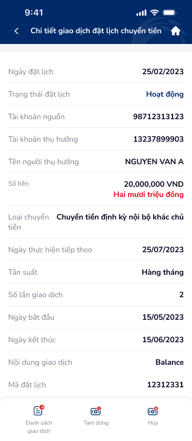
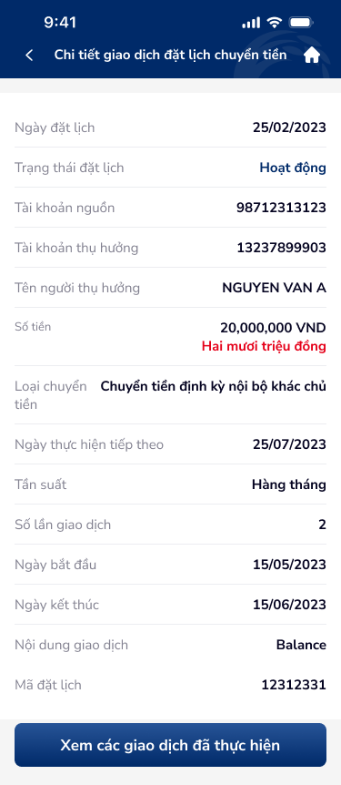
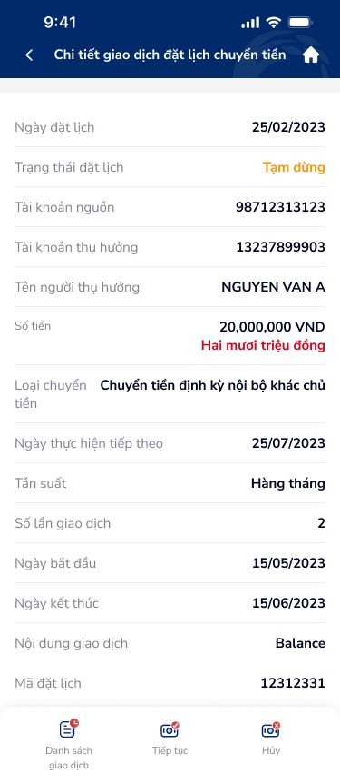
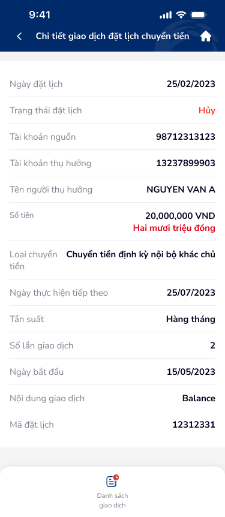
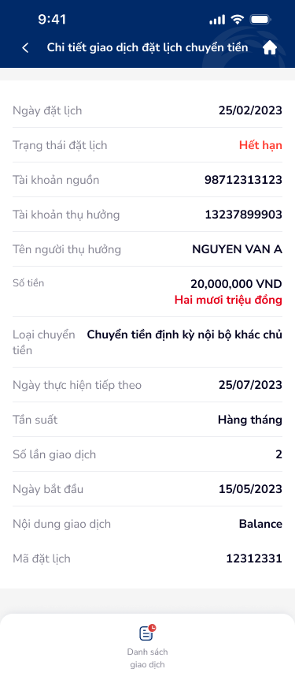

# Chi tiết giao dịch đặt lịch chuyển tiền — PRD (Chi tiết giao dịch đặt lịch chuyển tiền)

Màn hình chi tiết một lệnh đặt lịch chuyển tiền, hiển thị đầy đủ thông tin (ngày, trạng thái, tài khoản, số tiền, tần suất, mã đặt lịch). Bottom navigation thay đổi theo trạng thái: Hoạt động (Tạm dừng + Hủy), Tạm dừng (Tiếp tục + Hủy), Hủy/Hết hạn (chỉ xem giao dịch).

---

## Mục lục
1. [User Flow](#1-user-flow)
2. [User Story](#2-user-story)
3. [Wireframe](#3-wireframe)
4. [Thiết kế Database](#4-thiết-kế-database)
5. [Non-functional requirement](#5-non-functional-requirement)

---

## 1. User Flow

### 1.1. Luồng xem chi tiết lệnh đặt lịch
| Bước | Tên màn hình | Tên hành động | Kết quả |
|:---:|---|---|---|
| 1 | Chi tiết giao dịch đặt lịch | Mở từ danh sách (chạm card) | Hiển thị header "Chi tiết giao dịch đặt lịch chuyển tiền" (back, home icon). Thông tin chi tiết dạng label-value: Ngày đặt lịch, Trạng thái, Tài khoản nguồn, Tài khoản thụ hưởng, Tên người thụ hưởng, Số tiền (kèm chữ), Loại chuyển, Ngày thực hiện tiếp theo, Tần suất, Số lần giao dịch, Ngày bắt đầu, Ngày kết thúc, Nội dung giao dịch, Mã đặt lịch. |
| 2 | Chi tiết giao dịch đặt lịch | Cuộn xem thông tin | Scrollable content hiển thị toàn bộ trường dữ liệu. |

### 1.2. Luồng hành động theo trạng thái Hoạt động
| Bước | Tên màn hình | Tên hành động | Kết quả |
|:---:|---|---|---|
| 1 | Chi tiết (Hoạt động) | Xem bottom nav | Hiển thị 3 nút: "Danh sách giao dịch" (có badge), "Tạm dừng", "Hủy". |
| 2 | Chi tiết (Hoạt động) | Chạm "Tạm dừng" | Gọi API tạm dừng → dialog thành công → trạng thái cập nhật "Tạm dừng", bottom nav thay đổi. |
| 3 | Chi tiết (Hoạt động) | Chạm "Hủy" | Dialog xác nhận → Đồng ý: gọi API hủy → trạng thái "Hủy", bottom nav chỉ còn "Danh sách giao dịch". |
| 4 | Chi tiết (Hoạt động) | Chạm "Danh sách giao dịch" | Chuyển đến màn danh sách các giao dịch đã thực hiện của lệnh này. |

### 1.3. Luồng hành động theo trạng thái Tạm dừng
| Bước | Tên màn hình | Tên hành động | Kết quả |
|:---:|---|---|---|
| 1 | Chi tiết (Tạm dừng) | Xem bottom nav | Hiển thị 3 nút: "Danh sách giao dịch", "Tiếp tục", "Hủy". |
| 2 | Chi tiết (Tạm dừng) | Chạm "Tiếp tục" | Gọi API tiếp tục → trạng thái cập nhật "Hoạt động", bottom nav thay đổi (Tạm dừng + Hủy). |
| 3 | Chi tiết (Tạm dừng) | Chạm "Hủy" | Dialog xác nhận → Đồng ý: gọi API hủy → trạng thái "Hủy". |

### 1.4. Luồng hành động theo trạng thái Hủy / Hết hạn
| Bước | Tên màn hình | Tên hành động | Kết quả |
|:---:|---|---|---|
| 1 | Chi tiết (Hủy / Hết hạn) | Xem bottom nav | Chỉ hiển thị nút "Danh sách giao dịch" (hoặc "Xem các giao dịch đã thực hiện"). |
| 2 | Chi tiết (Hủy / Hết hạn) | Chạm "Danh sách giao dịch" | Chuyển đến danh sách giao dịch đã thực hiện. |

### 1.5. Luồng xem danh sách giao dịch đã thực hiện
| Bước | Tên màn hình | Tên hành động | Kết quả |
|:---:|---|---|---|
| 1 | Chi tiết giao dịch đặt lịch | Chạm "Danh sách giao dịch" (badge) hoặc "Xem các giao dịch đã thực hiện" | Chuyển đến màn danh sách lịch sử các giao dịch thuộc lệnh đặt lịch này. |

### 1.6. Luồng quay lại
| Bước | Tên màn hình | Tên hành động | Kết quả |
|:---:|---|---|---|
| 1 | Chi tiết giao dịch đặt lịch | Chạm mũi tên back (header) | Quay lại Quản lý đặt lịch chuyển tiền, giữ data và trạng thái lọc. |
| 2 | Chi tiết giao dịch đặt lịch | Chạm icon Home (header) | Về màn hình chính (dashboard). |

---

## 2. User Story

| Epic chung | Mã US | Tiêu đề | Mô tả chi tiết | Business Rule | Acceptance Criteria |
|---|---|---|---|---|---|
| Đặt lịch chuyển tiền | US-331 | Xem chi tiết lệnh đặt lịch | Là người dùng, tôi muốn xem đầy đủ thông tin một lệnh đặt lịch để kiểm tra và quản lý. | Hiển thị tất cả trường: Ngày đặt lịch, Trạng thái, Tài khoản nguồn, Tài khoản thụ hưởng, Tên người thụ hưởng, Số tiền (số + chữ), Loại chuyển, Ngày thực hiện tiếp theo, Tần suất, Số lần giao dịch, Ngày bắt đầu, Ngày kết thúc, Nội dung giao dịch, Mã đặt lịch. | - Tất cả 14 trường hiển thị đúng giá trị từ API. - Số tiền hiển thị định dạng VND (vd: 20,000,000 VND) + đọc chữ (vd: Hai mươi triệu đồng) — số tiền màu đỏ. - Trạng thái hiển thị đúng badge màu: Hoạt động (xanh dương), Tạm dừng (cam), Hủy (đỏ), Hết hạn (đỏ). - Header: back, tiêu đề, icon Home. |
| Đặt lịch chuyển tiền | US-332 | Bottom nav theo trạng thái Hoạt động | Là người dùng khi lệnh đang hoạt động, tôi muốn thấy các hành động Tạm dừng và Hủy để quản lý lệnh. | Trạng thái = Hoạt động → bottom nav: "Danh sách giao dịch" (badge), "Tạm dừng", "Hủy". | - 3 nút hiển thị đúng thứ tự. - "Danh sách giao dịch" có badge số giao dịch đã thực hiện. - Chạm "Tạm dừng": gọi API → dialog thành công → trạng thái cập nhật. - Chạm "Hủy": dialog xác nhận → xử lý tương ứng. |
| Đặt lịch chuyển tiền | US-333 | Bottom nav theo trạng thái Tạm dừng | Là người dùng khi lệnh tạm dừng, tôi muốn tiếp tục hoặc hủy lệnh. | Trạng thái = Tạm dừng → bottom nav: "Danh sách giao dịch", "Tiếp tục", "Hủy". | - 3 nút: "Danh sách giao dịch", "Tiếp tục", "Hủy". - Chạm "Tiếp tục": gọi API → trạng thái chuyển "Hoạt động" → bottom nav cập nhật. - Chạm "Hủy": dialog xác nhận → xử lý. |
| Đặt lịch chuyển tiền | US-334 | Bottom nav theo trạng thái Hủy | Là người dùng khi lệnh đã hủy, tôi chỉ muốn xem lịch sử giao dịch. | Trạng thái = Hủy → bottom nav: chỉ "Danh sách giao dịch". Không hiển thị nút Tạm dừng / Tiếp tục / Hủy. | - Chỉ 1 nút "Danh sách giao dịch". - Không có action button nào khác. - Chạm → chuyển đến danh sách giao dịch đã thực hiện. |
| Đặt lịch chuyển tiền | US-335 | Bottom nav theo trạng thái Hết hạn | Là người dùng khi lệnh hết hạn, tôi chỉ muốn xem lịch sử. | Trạng thái = Hết hạn → bottom nav: chỉ "Danh sách giao dịch". Tương tự trạng thái Hủy. | - Chỉ 1 nút "Danh sách giao dịch". - Trạng thái badge hiển thị "Hết hạn" (đỏ). |
| Đặt lịch chuyển tiền | US-336 | Tạm dừng lệnh từ chi tiết | Là người dùng, tôi muốn tạm dừng lệnh đặt lịch trực tiếp từ màn chi tiết. | Gọi API tạm dừng. Thành công: dialog xác nhận, trạng thái cập nhật realtime trên màn hiện tại. | - Chạm "Tạm dừng" → gọi API. - Thành công: dialog icon ✓ + thông báo. - Trạng thái badge chuyển "Tạm dừng" (cam). - Bottom nav cập nhật: "Tiếp tục" thay "Tạm dừng". - Lỗi: hiển thị thông báo lỗi, giữ nguyên trạng thái. |
| Đặt lịch chuyển tiền | US-337 | Tiếp tục lệnh đã tạm dừng | Là người dùng, tôi muốn kích hoạt lại lệnh đang tạm dừng. | Gọi API tiếp tục. Thành công: trạng thái chuyển "Hoạt động", next_execution_date được tính lại. | - Chạm "Tiếp tục" → gọi API. - Thành công: trạng thái "Hoạt động" (xanh dương), bottom nav cập nhật. - Trường "Ngày thực hiện tiếp theo" cập nhật giá trị mới. - Lỗi: thông báo lỗi, giữ nguyên. |
| Đặt lịch chuyển tiền | US-338 | Hủy lệnh từ chi tiết | Là người dùng, tôi muốn hủy vĩnh viễn lệnh đặt lịch từ màn chi tiết. | Dialog xác nhận trước khi hủy. Sau khi hủy: trạng thái "Hủy", không thể phục hồi. | - Chạm "Hủy" → dialog "Quý khách có chắc chắn muốn hủy lệnh đặt lịch chuyển tiền này?" - "Đồng ý": gọi API → trạng thái "Hủy" (đỏ), bottom nav chỉ còn "Danh sách giao dịch". - "Không": đóng dialog, giữ nguyên. |
| Đặt lịch chuyển tiền | US-339 | Xem danh sách giao dịch đã thực hiện | Là người dùng, tôi muốn xem lịch sử các giao dịch đã được thực hiện bởi lệnh đặt lịch này. | Nút "Danh sách giao dịch" (hoặc "Xem các giao dịch đã thực hiện") chuyển đến màn danh sách giao dịch con. Badge trên nút hiển thị số lần đã giao dịch. | - Chạm nút → chuyển đến danh sách giao dịch đã thực hiện. - Badge hiển thị đúng số lần (khớp trường "Số lần giao dịch"). - Trường hợp chưa có giao dịch: badge = 0 hoặc ẩn, danh sách hiển thị empty state. |

> **`🤖 by AI`** | Suy luận bổ sung từ ngữ cảnh màn hình
>
> - **Status-driven UI:** Bottom nav là ví dụ điển hình của status-driven UI pattern — cùng một màn hình nhưng action bar thay đổi hoàn toàn theo trạng thái lệnh. Cần đảm bảo transition mượt khi trạng thái thay đổi (vd: sau tạm dừng, bottom nav animate chuyển từ "Tạm dừng" sang "Tiếp tục").
> - **Color-coded status badge:** Hoạt động (xanh dương #007AFF), Tạm dừng (cam #FF9500), Hủy (đỏ #FF3B30), Hết hạn (đỏ #FF3B30) — cần kiểm tra contrast ratio ≥ 4.5:1 trên nền trắng.
> - **Amount display pattern:** Số tiền hiển thị đỏ (accent) kèm đọc chữ — pattern phổ biến trong banking app VN để giảm sai sót khi kiểm tra giao dịch lớn.
> - **Biến thể calendar-details-2.png:** Nút "Xem các giao dịch đã thực hiện" (full-width button) là biến thể khi lệnh có ít action — có thể là layout khi trạng thái Hủy/Hết hạn hoặc khi chỉ cần CTA đơn.

---

## 3. Wireframe

### Hình ảnh minh họa

---

### Mô tả màn hình
| STT | Tên màn hình | Loại thành phần | Mô tả |
|:---:|---|---|---|
| 1 | Header | Header | Thanh trên: mũi tên back (trái), tiêu đề "Chi tiết giao dịch đặt lịch chuyển tiền", icon Home (phải). |
| 2 | Ngày đặt lịch | Label-Value | Label "Ngày đặt lịch", value vd: "25/02/2023". |
| 3 | Trạng thái đặt lịch | Label-Value + Badge | Label "Trạng thái đặt lịch", value badge màu: "Hoạt động" (xanh dương), "Tạm dừng" (cam), "Hủy" (đỏ), "Hết hạn" (đỏ). |
| 4 | Tài khoản nguồn | Label-Value | Label "Tài khoản nguồn", value vd: "98712313123". |
| 5 | Tài khoản thụ hưởng | Label-Value | Label "Tài khoản thụ hưởng", value vd: "13237899903". |
| 6 | Tên người thụ hưởng | Label-Value | Label "Tên người thụ hưởng", value vd: "NGUYEN VAN A". |
| 7 | Số tiền | Label-Value (Highlight) | Label "Số tiền", value số (đỏ, bold) vd: "20,000,000 VND" + dòng phụ đọc chữ "Hai mươi triệu đồng". |
| 8 | Loại chuyển | Label-Value | Label "Loại chuyển", value vd: "Chuyển tiền định kỳ nội bộ khác chủ tiền". |
| 9 | Ngày thực hiện tiếp theo | Label-Value | Label "Ngày thực hiện tiếp theo", value vd: "25/07/2023". Ẩn khi trạng thái Hủy / Hết hạn. |
| 10 | Tần suất | Label-Value | Label "Tần suất", value vd: "Hàng tháng". |
| 11 | Số lần giao dịch | Label-Value | Label "Số lần giao dịch", value vd: "2". |
| 12 | Ngày bắt đầu | Label-Value | Label "Ngày bắt đầu", value vd: "15/05/2023". |
| 13 | Ngày kết thúc | Label-Value | Label "Ngày kết thúc", value vd: "15/06/2023". |
| 14 | Nội dung giao dịch | Label-Value | Label "Nội dung giao dịch", value vd: "Balance". |
| 15 | Mã đặt lịch | Label-Value | Label "Mã đặt lịch", value vd: "12312331". |
| 16 | Bottom nav — Hoạt động | Sub Navigation Bar | 3 nút: "Danh sách giao dịch" (badge số, icon list), "Tạm dừng" (icon pause), "Hủy" (icon cancel). |
| 17 | Bottom nav — Tạm dừng | Sub Navigation Bar | 3 nút: "Danh sách giao dịch" (icon list), "Tiếp tục" (icon play), "Hủy" (icon cancel). |
| 18 | Bottom nav — Hủy / Hết hạn | Sub Navigation Bar | 1 nút: "Danh sách giao dịch" (full-width) hoặc "Xem các giao dịch đã thực hiện". |

---

### Ngữ cảnh màn hình (từ OCR)

Màn chi tiết lệnh đặt lịch chuyển tiền dạng bill-detail (label-value pairs). Hiển thị 14 trường thông tin từ ngày đặt lịch đến mã đặt lịch. Trạng thái hiển thị badge màu (xanh = Hoạt động, cam = Tạm dừng, đỏ = Hủy/Hết hạn). Số tiền nổi bật màu đỏ kèm đọc chữ. Bottom navigation thay đổi hoàn toàn theo trạng thái lệnh: Hoạt động có Tạm dừng + Hủy; Tạm dừng có Tiếp tục + Hủy; Hủy và Hết hạn chỉ có nút xem danh sách giao dịch.

> **`🤖 by AI`** | Nhận diện UX pattern
>
> - **Bill-detail pattern:** Layout label-value phổ biến trong banking app — dễ scan, dễ đối chiếu. Các trường sắp xếp theo thứ tự ưu tiên: thông tin quan trọng (trạng thái, số tiền) ở trên, thông tin phụ (mã, nội dung) ở dưới.
> - **Status-driven bottom nav:** Pattern quan trọng — cùng màn hình nhưng action bar khác nhau theo lifecycle của lệnh. Giảm cognitive load bằng cách chỉ hiển thị action khả dụng.
> - **Amount readability:** Số tiền hiển thị cả số (20,000,000 VND) và chữ (Hai mươi triệu đồng) — pattern bắt buộc trong banking VN, giúp giảm rủi ro sai sót khi giao dịch số tiền lớn.
> - **5 biến thể từ 1 màn hình:** calendar-details.png (Hoạt động), calendar-details-2.png (biến thể CTA), onhold.png (Tạm dừng), cancel.png (Hủy), expired.png (Hết hạn) — cần thiết kế component-based để tái sử dụng.

---

## 4. Thiết kế Database

> **`🤖 by AI`** | Nguồn: OCR screen inferred | Độ tin cậy: Medium
>
> Màn hình Chi tiết sử dụng entity ScheduledTransfer đã định nghĩa tại file `quan-ly-dat-lich.md`. Dưới đây bổ sung entity liên quan.

### Entity: ScheduledTransfer (Tham chiếu từ file quan-ly-dat-lich.md)

Màn chi tiết đọc toàn bộ trường từ entity `ScheduledTransfer`. Mapping field → UI label:

| Field | UI Label | Ghi chú |
|---|---|---|
| `created_at` | Ngày đặt lịch | Format: dd/MM/yyyy |
| `status` | Trạng thái đặt lịch | Badge màu theo enum |
| `source_account` | Tài khoản nguồn | |
| `beneficiary_account` | Tài khoản thụ hưởng | |
| `beneficiary_name` | Tên người thụ hưởng | UPPERCASE |
| `amount` + `currency` | Số tiền | Format: #,###,### VND + đọc chữ |
| `transfer_type` | Loại chuyển | Label đầy đủ |
| `next_execution_date` | Ngày thực hiện tiếp theo | Ẩn khi Hủy/Hết hạn |
| `frequency` | Tần suất | |
| `total_executions` | Số lần giao dịch | |
| `start_date` | Ngày bắt đầu | Format: dd/MM/yyyy |
| `end_date` | Ngày kết thúc | Format: dd/MM/yyyy |
| `description` | Nội dung giao dịch | |
| `schedule_code` | Mã đặt lịch | |

### Entity: ScheduledTransferExecution (Lịch sử giao dịch đã thực hiện)
| Field | Data Type | Constraint | Description |
|---|---|---|---|
| `id` | UUID | Primary Key | |
| `scheduled_transfer_id` | UUID | Foreign Key → ScheduledTransfer | Lệnh đặt lịch cha |
| `execution_date` | DateTime | Not Null | Ngày thực hiện giao dịch |
| `amount` | Decimal(18,2) | Not Null | Số tiền thực hiện |
| `status` | Enum | Not Null | Thành công · Thất bại · Đang xử lý |
| `transaction_ref` | String(50) | Unique | Mã tham chiếu giao dịch |
| `error_code` | String(20) | Optional | Mã lỗi (nếu thất bại) |
| `error_message` | String(500) | Optional | Mô tả lỗi |
| `created_at` | DateTime | Not Null | |

### Entity: ScheduledTransferAction (Tham chiếu từ file quan-ly-dat-lich.md)

Các thao tác Tạm dừng / Tiếp tục / Hủy từ màn chi tiết được ghi vào entity `ScheduledTransferAction` với `action_type` tương ứng.

---

## 5. Non-functional requirement

- **Bảo mật:**
    - Chỉ cho phép xem/thao tác chi tiết lệnh thuộc tài khoản đăng nhập; kiểm tra ownership server-side.
    - API tạm dừng / tiếp tục / hủy yêu cầu xác thực phiên hợp lệ.
    - Số tài khoản nguồn có thể mask một phần (vd: ****3123) tùy chính sách bảo mật.
    - Ghi log audit trail cho mọi thao tác thay đổi trạng thái.
- **Hiệu năng:**
    - API chi tiết phản hồi ≤ 2 giây.
    - API thay đổi trạng thái (tạm dừng, tiếp tục, hủy) phản hồi ≤ 3 giây.
    - Cache dữ liệu chi tiết trong bộ nhớ; invalidate khi thay đổi trạng thái.
    - Optimistic UI update cho trạng thái badge và bottom nav (rollback nếu API lỗi).
- **Trải nghiệm:**
    - Touch target tối thiểu 44×44px cho back, Home, các nút bottom nav.
    - Loading state (skeleton hoặc spinner) khi đang tải dữ liệu chi tiết.
    - Số tiền màu đỏ (accent) nổi bật, font-weight bold, kèm dòng đọc chữ font nhỏ hơn.
    - Badge trạng thái có border-radius, padding đồng nhất; màu sắc đủ contrast trên nền trắng.
    - Bottom nav cố định (sticky bottom); transition mượt khi trạng thái thay đổi.
    - Dialog xác nhận hủy hiển thị rõ ràng hậu quả ("không thể phục hồi") để tránh thao tác nhầm.
    - Hỗ trợ pull-to-refresh để cập nhật trạng thái mới nhất.

---
*Generated by VNPAY Agentic Framework*
