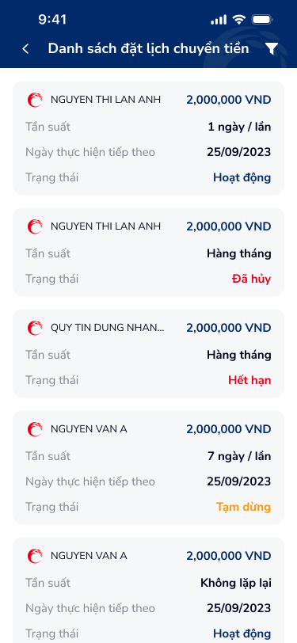

# Danh sách đặt lịch chuyển tiền — PRD (Danh sách đặt lịch chuyển tiền)

Màn hình danh sách các lệnh đặt lịch chuyển tiền, hiển thị thông tin người thụ hưởng, số tiền, tần suất, ngày thực hiện tiếp theo và trạng thái (Hoạt động / Đã hủy / Hết hạn / Tạm dừng). Hỗ trợ lọc và truy cập chi tiết từng lệnh.

---

## Mục lục
1. [User Flow](#1-user-flow)
2. [User Story](#2-user-story)
3. [Wireframe](#3-wireframe)
4. [Thiết kế Database](#4-thiết-kế-database)
5. [Non-functional requirement](#5-non-functional-requirement)

---

## 1. User Flow

### 1.1. Luồng xem danh sách đặt lịch
| Bước | Tên màn hình | Tên hành động | Kết quả |
|:---:|---|---|---|
| 1 | Danh sách đặt lịch chuyển tiền | Mở màn hình | Gọi API lấy danh sách lệnh đặt lịch; hiển thị các card lệnh với thông tin người nhận, số tiền, tần suất, ngày thực hiện tiếp theo, trạng thái. Mặc định hiển thị tất cả trạng thái. |
| 2 | Danh sách đặt lịch chuyển tiền | Cuộn danh sách | Tải thêm dữ liệu (lazy-load/phân trang) nếu số lượng lớn. |
| 3 | Danh sách đặt lịch chuyển tiền | Chạm một card lệnh | Chuyển đến màn hình Chi tiết lệnh đặt lịch tương ứng. |

### 1.2. Luồng lọc danh sách
| Bước | Tên màn hình | Tên hành động | Kết quả |
|:---:|---|---|---|
| 1 | Danh sách đặt lịch chuyển tiền | Chạm icon bộ lọc (header) | Mở bottom sheet Bộ lọc tìm kiếm. |
| 2 | Bộ lọc tìm kiếm | Thiết lập điều kiện lọc và chạm "Tìm kiếm" | Đóng bottom sheet, danh sách được cập nhật theo điều kiện lọc. |
| 3 | Danh sách đặt lịch chuyển tiền | Xem kết quả lọc | Hiển thị danh sách phù hợp; nếu không có kết quả → empty state. |

### 1.3. Luồng quay lại
| Bước | Tên màn hình | Tên hành động | Kết quả |
|:---:|---|---|---|
| 1 | Danh sách đặt lịch chuyển tiền | Chạm mũi tên back (header) | Quay lại màn hình trước (menu chuyển tiền hoặc trang chủ). |

---

## 2. User Story

| Epic chung | Mã US | Tiêu đề | Mô tả chi tiết | Business Rule | Acceptance Criteria |
|---|---|---|---|---|---|
| Đặt lịch chuyển tiền | US-301 | Xem danh sách lệnh đặt lịch | Là người dùng, tôi muốn xem toàn bộ lệnh đặt lịch chuyển tiền của mình để theo dõi trạng thái và lịch trình thực hiện. | Hiển thị tất cả lệnh đặt lịch thuộc tài khoản đăng nhập. Mỗi card hiển thị: logo ngân hàng, tên người thụ hưởng, số tiền (VND), tần suất, ngày thực hiện tiếp theo, trạng thái. Sắp xếp mặc định theo ngày tạo mới nhất. | - Hiển thị danh sách card lệnh đặt lịch. - Mỗi card gồm: icon/logo ngân hàng, tên người thụ hưởng, số tiền (format x,xxx,xxx VND), tần suất (1 ngày/lần, 7 ngày/lần, Hàng tháng, Không lặp lại), ngày thực hiện tiếp theo (dd/MM/yyyy), trạng thái. - Trạng thái color-code: Hoạt động (xanh dương), Đã hủy (đỏ), Hết hạn (đỏ), Tạm dừng (cam). - Có separator giữa các card. |
| Đặt lịch chuyển tiền | US-302 | Xem chi tiết lệnh đặt lịch | Là người dùng, tôi muốn chạm vào một lệnh để xem chi tiết đầy đủ. | Chạm card chuyển đến màn Chi tiết lệnh đặt lịch. | - Chạm bất kỳ card → điều hướng đến Chi tiết lệnh. - Truyền đúng ID lệnh đặt lịch sang màn chi tiết. |
| Đặt lịch chuyển tiền | US-303 | Mở bộ lọc tìm kiếm | Là người dùng, tôi muốn lọc danh sách theo trạng thái hoặc thời gian để tìm nhanh lệnh cần theo dõi. | Icon bộ lọc nằm ở header bên phải. Chạm mở bottom sheet Bộ lọc. | - Chạm icon bộ lọc → mở bottom sheet Bộ lọc. - Sau khi lọc, danh sách chỉ hiển thị các lệnh thỏa điều kiện. |
| Đặt lịch chuyển tiền | US-304 | Phân trang / lazy-load danh sách | Là người dùng, tôi muốn danh sách tải mượt mà khi có nhiều lệnh. | Khi cuộn đến cuối danh sách, tự động tải thêm (infinite scroll) hoặc nút "Xem thêm". | - Cuộn đến cuối → tải thêm dữ liệu. - Hiển thị loading indicator khi đang tải thêm. - Không duplicate dữ liệu khi tải thêm. |
| Đặt lịch chuyển tiền | US-305 | Trạng thái rỗng danh sách | Là người dùng, tôi muốn biết khi chưa có lệnh đặt lịch nào hoặc bộ lọc không có kết quả. | Khi danh sách rỗng → hiển thị empty state phù hợp với ngữ cảnh (chưa tạo lệnh / không có kết quả lọc). | - Chưa có lệnh nào: hiển thị illustration + "Quý khách chưa có lệnh đặt lịch chuyển tiền nào". - Lọc không có kết quả: hiển thị "Không tìm thấy lệnh phù hợp". |

> **`🤖 by AI`** | Nguồn: UX-augmented | Độ tin cậy: Medium
>
> **US bổ sung — Accessibility & Error Handling:**

| Epic chung | Mã US | Tiêu đề | Mô tả chi tiết | Business Rule | Acceptance Criteria |
|---|---|---|---|---|---|
| Đặt lịch chuyển tiền | US-306 | Pull-to-refresh danh sách | Là người dùng, tôi muốn kéo xuống để làm mới danh sách khi cần cập nhật trạng thái mới nhất. | Hỗ trợ gesture pull-to-refresh trên toàn danh sách. | - Kéo xuống từ đầu danh sách → hiển thị loading spinner → gọi lại API → cập nhật danh sách. - Giữ vị trí cuộn sau refresh nếu dữ liệu không thay đổi. |
| Đặt lịch chuyển tiền | US-307 | Xử lý lỗi tải danh sách | Là người dùng, tôi muốn biết khi không tải được dữ liệu và có thể thử lại. | Khi API lỗi (timeout, mất mạng, server error), hiển thị error state có nút "Thử lại". | - Lỗi mạng: hiển thị illustration + "Không thể tải dữ liệu. Vui lòng thử lại." + nút "Thử lại". - Chạm "Thử lại" → gọi lại API. |
| Đặt lịch chuyển tiền | US-308 | Hỗ trợ screen reader | Là người dùng khiếm thị, tôi muốn trình đọc màn hình mô tả đầy đủ thông tin mỗi card. | Mỗi card có contentDescription/aria-label bao gồm: tên người thụ hưởng, số tiền, tần suất, trạng thái. | - VoiceOver/TalkBack đọc đầy đủ thông tin card. - Trạng thái color-code có label text tương ứng (không chỉ dựa vào màu). |

---

## 3. Wireframe

### Hình ảnh minh họa

---

### Mô tả màn hình
| STT | Tên màn hình | Loại thành phần | Mô tả |
|:---:|---|---|---|
| 1 | Header | Header | Thanh trên cùng: mũi tên back (trái), tiêu đề "Danh sách đặt lịch chuyển tiền" (giữa), icon bộ lọc (phải). |
| 2 | Card lệnh đặt lịch | Card Item | Mỗi card gồm: (a) Icon/logo ngân hàng bên trái, (b) Tên người thụ hưởng (vd: NGUYEN THI LAN ANH), (c) Số tiền chuyển (vd: 2,000,000 VND), (d) Tần suất — label "Tần suất" + giá trị (1 ngày/lần, 7 ngày/lần, Hàng tháng, Không lặp lại), (e) Ngày thực hiện tiếp theo — label + giá trị (dd/MM/yyyy), (f) Badge trạng thái góc phải. |
| 3 | Badge trạng thái | Status Badge | Chip/badge hiển thị trạng thái: "Hoạt động" (text xanh dương, nền xanh nhạt), "Đã hủy" (text đỏ, nền đỏ nhạt), "Hết hạn" (text đỏ, nền đỏ nhạt), "Tạm dừng" (text cam, nền cam nhạt). |
| 4 | Separator | Divider | Đường kẻ ngang giữa các card, tạo phân tách thị giác. |
| 5 | Icon back | Icon Button | Mũi tên chevron trái, chạm quay về màn hình trước. |
| 6 | Icon bộ lọc | Icon Button | Icon filter (phễu/funnel), chạm mở bottom sheet Bộ lọc tìm kiếm. |

---

### Ngữ cảnh màn hình (từ OCR)

Màn hình danh sách đặt lịch chuyển tiền hiển thị các card xếp dọc, mỗi card chứa logo ngân hàng, tên người thụ hưởng (NGUYEN THI LAN ANH, QUY TIN DUNG NHAN…, NGUYEN VAN A), số tiền (2,000,000 VND), tần suất (1 ngày/lần, Hàng tháng, 7 ngày/lần, Không lặp lại), ngày thực hiện tiếp theo (25/09/2023), và badge trạng thái với color-code: Hoạt động (xanh dương), Đã hủy (đỏ), Hết hạn (đỏ), Tạm dừng (cam). Header có mũi tên back và icon bộ lọc.

---

## 4. Thiết kế Database

> **`🤖 by AI`** | Nguồn: figma_inferred:kPft93N2A3gYOC3YwuXpQR | Độ tin cậy: Medium
>
> Các entity dưới đây suy luận từ nhãn màn hình và cấu trúc card; cần đối chiếu với backend hiện có.

### Entity: ScheduledTransfer (Lệnh đặt lịch chuyển tiền)
| Field | Data Type | Constraint | Description |
|---|---|---|---|
| `id` | UUID | Primary Key | Mã lệnh đặt lịch |
| `user_id` | UUID | Foreign Key → User | Tài khoản đăng nhập tạo lệnh |
| `source_account_id` | UUID | Foreign Key → Account | Tài khoản nguồn |
| `beneficiary_name` | String(200) | Not Null | Tên người thụ hưởng |
| `beneficiary_account` | String(50) | Not Null | Số tài khoản/số thẻ người thụ hưởng |
| `beneficiary_bank_code` | String(20) | Optional | Mã ngân hàng thụ hưởng |
| `beneficiary_bank_name` | String(200) | Optional | Tên ngân hàng thụ hưởng |
| `amount` | Decimal(18,2) | Not Null | Số tiền chuyển (VND) |
| `transfer_type` | Enum | Not Null | Nội bộ cùng chủ \| Nội bộ khác chủ \| Liên ngân hàng |
| `frequency` | Enum | Not Null | DAILY \| WEEKLY \| MONTHLY \| ONCE |
| `frequency_interval` | Integer | Optional | Chu kỳ (vd: 1 ngày, 7 ngày) — dùng khi frequency = DAILY hoặc WEEKLY |
| `next_execution_date` | Date | Not Null | Ngày thực hiện tiếp theo |
| `start_date` | Date | Not Null | Ngày bắt đầu lệnh |
| `end_date` | Date | Optional | Ngày kết thúc (null nếu không giới hạn) |
| `status` | Enum | Not Null | ACTIVE \| CANCELLED \| EXPIRED \| PAUSED |
| `description` | String(500) | Optional | Nội dung chuyển tiền |
| `created_at` | DateTime | Not Null | Ngày tạo |
| `updated_at` | DateTime | Not Null | Ngày cập nhật cuối |

### Entity: ScheduledTransferExecution (Lịch sử thực hiện)
| Field | Data Type | Constraint | Description |
|---|---|---|---|
| `id` | UUID | Primary Key | |
| `scheduled_transfer_id` | UUID | Foreign Key → ScheduledTransfer | Lệnh đặt lịch gốc |
| `execution_date` | DateTime | Not Null | Ngày giờ thực hiện |
| `result_status` | Enum | Not Null | SUCCESS \| FAILED \| PENDING |
| `error_code` | String(20) | Optional | Mã lỗi nếu thất bại |
| `transaction_id` | UUID | Optional | Liên kết giao dịch thành công |
| `created_at` | DateTime | Not Null | |

### Enum: TransferStatus
| Giá trị | Nhãn hiển thị | Màu |
|---|---|---|
| ACTIVE | Hoạt động | Xanh dương (#2196F3) |
| CANCELLED | Đã hủy | Đỏ (#F44336) |
| EXPIRED | Hết hạn | Đỏ (#F44336) |
| PAUSED | Tạm dừng | Cam (#FF9800) |

### Enum: Frequency
| Giá trị | Nhãn hiển thị |
|---|---|
| DAILY | {n} ngày/lần |
| WEEKLY | {n} ngày/lần |
| MONTHLY | Hàng tháng |
| ONCE | Không lặp lại |

---

## 5. Non-functional requirement

- **Bảo mật:**
    - Danh sách chỉ hiển thị lệnh thuộc tài khoản đăng nhập; API kiểm tra quyền sở hữu.
    - Tên người thụ hưởng có thể mask một phần (vd: NGUYEN T** L** A**) tùy cấu hình bảo mật.
    - Phiên đăng nhập hết hạn → yêu cầu đăng nhập lại trước khi truy cập dữ liệu.

- **Hiệu năng:**
    - API trả danh sách ≤ 2 giây (P95).
    - Hỗ trợ phân trang (page size 10–20), lazy-load khi cuộn.
    - Cache danh sách trong phiên (invalidate khi pull-to-refresh hoặc thay đổi trạng thái).

- **Trải nghiệm:**
    - Touch target tối thiểu 44×44pt cho card, icon back, icon bộ lọc.
    - Skeleton loading hiển thị 3–4 placeholder card khi đang tải lần đầu.
    - Badge trạng thái phải có text label (không chỉ dựa vào màu sắc) để hỗ trợ người dùng mù màu.
    - Pull-to-refresh với loading spinner.
    - Transition mượt khi mở bottom sheet bộ lọc (slide up animation, 300ms).

> **`🤖 by AI`** | Nguồn: UX-augmented | Độ tin cậy: Medium
>
> **Gợi ý bổ sung:**
> - Hỗ trợ VoiceOver/TalkBack: mỗi card cần contentDescription dạng "Chuyển tiền cho [tên], [số tiền] VND, tần suất [tần suất], trạng thái [trạng thái]".
> - Haptic feedback nhẹ khi chạm card (iOS: UIImpactFeedbackGenerator light).
> - Font size tối thiểu 14sp cho nội dung card, 12sp cho label phụ (Tần suất, Ngày thực hiện).
> - Contrast ratio ≥ 4.5:1 cho text trạng thái trên nền badge.

---
*Generated by VNPAY Agentic Framework*
