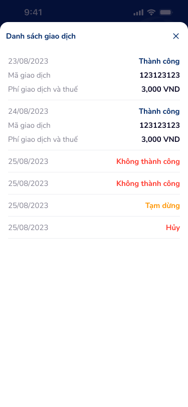

# Lịch sử giao dịch — PRD (Lịch sử giao dịch đặt lịch chuyển tiền)

Overlay bottom sheet hiển thị danh sách giao dịch theo lịch chuyển tiền đã thực hiện, bao gồm ngày giao dịch, trạng thái (Thành công / Không thành công / Tạm dừng / Hủy), mã giao dịch và phí giao dịch.

---

## Mục lục
1. [User Flow](#1-user-flow)
2. [User Story](#2-user-story)
3. [Wireframe](#3-wireframe)
4. [Thiết kế Database](#4-thiết-kế-database)
5. [Non-functional requirement](#5-non-functional-requirement)

---

## 1. User Flow

### 1.1. Luồng mở và xem lịch sử giao dịch
| Bước | Tên màn hình | Tên hành động | Kết quả |
|:---:|---|---|---|
| 1 | Chi tiết đặt lịch | Chạm "Xem lịch sử giao dịch" | Hiển thị overlay bottom sheet "Danh sách giao dịch" với danh sách giao dịch đã thực hiện. |
| 2 | Danh sách giao dịch | Cuộn danh sách | Xem thêm các giao dịch cũ hơn (lazy-load nếu có). |
| 3 | Danh sách giao dịch | Chạm vào một giao dịch Thành công | Mở rộng chi tiết: hiển thị Mã giao dịch, Phí giao dịch và thuế. |

### 1.2. Luồng đóng overlay
| Bước | Tên màn hình | Tên hành động | Kết quả |
|:---:|---|---|---|
| 1 | Danh sách giao dịch | Chạm icon X (góc phải trên) | Đóng bottom sheet, quay lại màn Chi tiết đặt lịch. |
| 2 | Danh sách giao dịch | Vuốt xuống bottom sheet | Đóng bottom sheet, quay lại màn Chi tiết đặt lịch. |
| 3 | Danh sách giao dịch | Chạm vùng overlay ngoài sheet | Đóng bottom sheet, quay lại màn Chi tiết đặt lịch. |

---

## 2. User Story

| Epic chung | Mã US | Tiêu đề | Mô tả chi tiết | Business Rule | Acceptance Criteria |
|---|---|---|---|---|---|
| Đặt lịch chuyển tiền | US-341 | Xem danh sách giao dịch đã thực hiện | Là người dùng, tôi muốn xem lịch sử các giao dịch đã chạy theo lịch chuyển tiền để biết kết quả từng lần chuyển. | Danh sách giao dịch lấy theo `schedule_id`; sắp xếp theo ngày giao dịch mới nhất trước. Chỉ hiển thị giao dịch thuộc lịch hiện tại. | - Bottom sheet hiển thị tiêu đề "Danh sách giao dịch". - Mỗi dòng giao dịch gồm: ngày (dd/MM/yyyy) và badge trạng thái. - Danh sách sắp xếp theo ngày giảm dần. - Nếu không có giao dịch, hiển thị trạng thái trống "Chưa có giao dịch nào". |
| Đặt lịch chuyển tiền | US-342 | Phân biệt trạng thái giao dịch bằng màu | Là người dùng, tôi muốn nhận biết nhanh trạng thái từng giao dịch qua màu badge để không cần đọc chi tiết. | Trạng thái và màu: Thành công = xanh dương (#2196F3), Không thành công = đỏ (#F44336), Tạm dừng = cam (#FF9800), Hủy = đỏ (#F44336). | - Badge "Thành công" hiển thị nền/text xanh dương. - Badge "Không thành công" hiển thị nền/text đỏ. - Badge "Tạm dừng" hiển thị nền/text cam. - Badge "Hủy" hiển thị nền/text đỏ. - Contrast ratio tối thiểu 4.5:1. |
| Đặt lịch chuyển tiền | US-343 | Xem chi tiết giao dịch thành công | Là người dùng, tôi muốn xem mã giao dịch và phí khi giao dịch thành công để đối soát. | Chỉ giao dịch trạng thái "Thành công" mới hiển thị mã giao dịch và phí giao dịch + thuế. Giao dịch khác chỉ hiển thị ngày + trạng thái. | - Giao dịch "Thành công": hiển thị Mã giao dịch (vd: 123123123), Phí giao dịch và thuế (vd: 3,000 VND). - Giao dịch "Không thành công" / "Tạm dừng" / "Hủy": chỉ hiển thị ngày + badge trạng thái. |
| Đặt lịch chuyển tiền | US-344 | Đóng overlay lịch sử giao dịch | Là người dùng, tôi muốn đóng bottom sheet bằng nhiều cách để thao tác linh hoạt. | Hỗ trợ đóng bằng: icon X, vuốt xuống, chạm overlay ngoài sheet. | - Chạm X: đóng sheet, focus về Chi tiết đặt lịch. - Vuốt xuống: đóng sheet với animation slide-down. - Chạm overlay: đóng sheet. |

> **`🤖 by AI`** | Augmented: US-342 color mapping, US-344 gesture closing | Độ tin cậy: High
>
> Màu trạng thái suy luận từ OCR badge; hành vi vuốt xuống đóng sheet là pattern chuẩn bottom-sheet trên mobile.

---

## 3. Wireframe

### Hình ảnh minh họa

---

### Mô tả màn hình
| STT | Tên thành phần | Loại thành phần | Mô tả |
|:---:|---|---|---|
| 1 | Overlay backdrop | Overlay | Nền mờ phía sau bottom sheet, chạm để đóng. |
| 2 | Bottom Sheet container | Bottom Sheet | Sheet trượt lên từ dưới, bo góc trên 16px, nền trắng. Chiều cao tối đa 70% viewport. |
| 3 | Header bottom sheet | Header | Tiêu đề "Danh sách giao dịch" (font bold, 16sp), icon X đóng (góc phải, 24x24px). |
| 4 | Dòng giao dịch — Thành công | List Item | Ngày (23/08/2023), badge "Thành công" (xanh dương). Mở rộng: Mã giao dịch: 123123123, Phí giao dịch và thuế: 3,000 VND. |
| 5 | Dòng giao dịch — Không thành công | List Item | Ngày (24/08/2023), badge "Không thành công" (đỏ). Chỉ hiển thị ngày + badge. |
| 6 | Dòng giao dịch — Tạm dừng | List Item | Ngày (25/08/2023), badge "Tạm dừng" (cam). Chỉ hiển thị ngày + badge. |
| 7 | Dòng giao dịch — Hủy | List Item | Ngày giao dịch, badge "Hủy" (đỏ). Chỉ hiển thị ngày + badge. |
| 8 | Separator | Divider | Đường kẻ ngang 1px (#E0E0E0) giữa các dòng giao dịch. |

---

### Ngữ cảnh màn hình (từ OCR)

Overlay bottom sheet tiêu đề "Danh sách giao dịch" với nút X đóng. Các dòng giao dịch hiển thị ngày và trạng thái bằng badge màu; giao dịch thành công bổ sung mã giao dịch và phí; các trạng thái khác chỉ hiển thị tóm tắt.

> **`🤖 by AI`** | Suy luận bổ sung từ OCR
>
> - Bottom sheet sử dụng pattern **persistent list overlay** — người dùng cuộn trong sheet mà không ảnh hưởng màn hình phía sau.
> - Giao dịch thành công dùng **expandable row** để tiết lộ thông tin chi tiết (progressive disclosure), giảm cognitive load ban đầu.
> - Badge trạng thái dùng **color coding kết hợp text label** để hỗ trợ cả người dùng bình thường và người có khiếm thị màu (accessibility).

---

## 4. Thiết kế Database

> **`🤖 by AI`** | Nguồn: OCR overlay list.png + business context | Độ tin cậy: Medium
>
> Các entity dưới đây suy luận từ nhãn trên overlay và flow lịch sử giao dịch; cần đối chiếu với hệ thống core banking.

### Entity: ScheduleTransactionHistory (Lịch sử giao dịch đặt lịch)
| Field | Data Type | Constraint | Description |
|---|---|---|---|
| `id` | UUID | Primary Key | Mã định danh giao dịch |
| `schedule_id` | UUID | Foreign Key, Not Null | Liên kết đến bản ghi đặt lịch chuyển tiền |
| `transaction_code` | String(50) | Unique, Nullable | Mã giao dịch (chỉ có khi thành công, vd: 123123123) |
| `execution_date` | Date | Not Null | Ngày thực hiện giao dịch (dd/MM/yyyy) |
| `status` | Enum | Not Null | Thành công \| Không thành công \| Tạm dừng \| Hủy |
| `fee_amount` | Decimal(15,2) | Nullable | Phí giao dịch và thuế (VND), chỉ có khi thành công |
| `transfer_amount` | Decimal(15,2) | Not Null | Số tiền chuyển thực tế |
| `from_account` | String(30) | Not Null | Tài khoản nguồn |
| `to_account` | String(30) | Not Null | Tài khoản thụ hưởng |
| `failure_reason` | String(500) | Nullable | Lý do thất bại (khi status ≠ Thành công) |
| `created_at` | DateTime | Not Null | Thời điểm tạo bản ghi |

### Entity: ScheduleTransfer (Đặt lịch chuyển tiền — tham chiếu)
| Field | Data Type | Constraint | Description |
|---|---|---|---|
| `id` | UUID | Primary Key | Mã đặt lịch |
| `user_id` | UUID | Foreign Key, Not Null | Liên kết tài khoản đăng nhập |
| `schedule_type` | Enum | Not Null | Hàng ngày \| Hàng tuần \| Hàng tháng \| Một lần |
| `next_execution_date` | Date | Nullable | Ngày thực hiện tiếp theo |
| `total_executions` | Integer | Not Null | Tổng số lần đã thực hiện |
| `status` | Enum | Not Null | Đang hoạt động \| Tạm dừng \| Hủy \| Hoàn thành |
| `created_at` | DateTime | Not Null | |
| `updated_at` | DateTime | Not Null | |

---

## 5. Non-functional requirement

- **Bảo mật:**
    - Lịch sử giao dịch gắn với phiên đăng nhập và `user_id`; API trả về lỗi 403 nếu truy vấn lịch sử không thuộc user.
    - Mã giao dịch hiển thị đầy đủ (không mask) vì phục vụ đối soát.
- **Hiệu năng:**
    - Bottom sheet hỗ trợ lazy-load / phân trang: tải tối đa 20 giao dịch mỗi lần, cuộn đến cuối tải thêm.
    - Thời gian mở bottom sheet ≤ 300ms (animation + API first page).
    - Cache danh sách trong session để tránh gọi lại khi mở/đóng sheet.
- **Trải nghiệm:**
    - Touch target icon X tối thiểu 44x44px.
    - Bottom sheet hỗ trợ gesture vuốt xuống để đóng (velocity threshold ≥ 500dp/s hoặc kéo quá 50% chiều cao).
    - Trạng thái loading: skeleton shimmer cho danh sách khi đang tải.
    - Trạng thái trống: icon + text "Chưa có giao dịch nào" khi danh sách rỗng.
    - Badge trạng thái sử dụng cả màu + label text để đảm bảo accessibility (WCAG 2.1 AA).

---
*Generated by VNPAY Agentic Framework*
