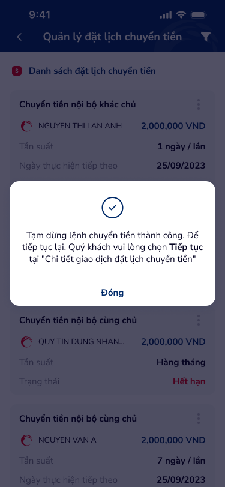
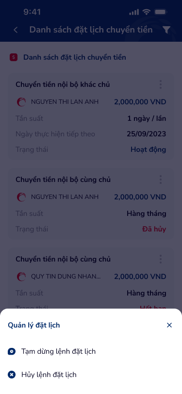

# Quản lý đặt lịch chuyển tiền — PRD (Quản lý đặt lịch chuyển tiền)

Màn hình danh sách quản lý các lệnh đặt lịch chuyển tiền. Hiển thị danh sách card theo loại giao dịch (nội bộ khác chủ, cùng chủ), hỗ trợ lọc, quản lý (tạm dừng / hủy) qua bottom sheet, xác nhận bằng dialog thành công.

---

## Mục lục
1. [User Flow](#1-user-flow)
2. [User Story](#2-user-story)
3. [Wireframe](#3-wireframe)
4. [Thiết kế Database](#4-thiết-kế-database)
5. [Non-functional requirement](#5-non-functional-requirement)

---

## 1. User Flow

### 1.1. Luồng xem danh sách đặt lịch
| Bước | Tên màn hình | Tên hành động | Kết quả |
|:---:|---|---|---|
| 1 | Quản lý đặt lịch chuyển tiền | Mở màn hình | Hiển thị header "Quản lý đặt lịch chuyển tiền" với icon filter. Tab "Danh sách đặt lịch chuyển tiền" kèm badge số lượng (xanh). |
| 2 | Quản lý đặt lịch chuyển tiền | Cuộn danh sách | Hiển thị danh sách card: mỗi card có label loại giao dịch (vd: "Chuyển tiền nội bộ khác chủ"), icon vertical-dot menu, logo ngân hàng, tên người thụ hưởng, số tiền (VND). |
| 3 | Quản lý đặt lịch chuyển tiền | Chạm vào card | Chuyển đến màn hình Chi tiết giao dịch đặt lịch chuyển tiền. |

### 1.2. Luồng lọc danh sách
| Bước | Tên màn hình | Tên hành động | Kết quả |
|:---:|---|---|---|
| 1 | Quản lý đặt lịch chuyển tiền | Chạm icon filter (header) | Mở bộ lọc (theo trạng thái, loại giao dịch, khoảng thời gian). |
| 2 | Quản lý đặt lịch chuyển tiền | Chọn tiêu chí lọc → Áp dụng | Danh sách cập nhật theo bộ lọc; badge số lượng thay đổi tương ứng. |

### 1.3. Luồng tạm dừng lệnh đặt lịch
| Bước | Tên màn hình | Tên hành động | Kết quả |
|:---:|---|---|---|
| 1 | Quản lý đặt lịch chuyển tiền | Chạm icon vertical-dot trên card | Hiển thị bottom sheet "Quản lý đặt lịch" với nút đóng (X). Hai tùy chọn: "⏸ Tạm dừng lệnh đặt lịch", "🚫 Hủy lệnh đặt lịch". |
| 2 | Bottom sheet | Chạm "Tạm dừng lệnh đặt lịch" | Gọi API tạm dừng. Hiển thị dialog thành công: icon checkmark, thông báo "Tạm dừng lệnh chuyển tiền thành công. Để tiếp tục lại, Quý khách vui lòng chọn Tiếp tục tại 'Chi tiết giao dịch đặt lịch chuyển tiền'", nút "Đóng". |
| 3 | Dialog thành công | Chạm "Đóng" | Đóng dialog, quay lại danh sách đã cập nhật trạng thái. |

### 1.4. Luồng hủy lệnh đặt lịch
| Bước | Tên màn hình | Tên hành động | Kết quả |
|:---:|---|---|---|
| 1 | Quản lý đặt lịch chuyển tiền | Chạm icon vertical-dot trên card | Hiển thị bottom sheet "Quản lý đặt lịch". |
| 2 | Bottom sheet | Chạm "Hủy lệnh đặt lịch" | Hiển thị dialog xác nhận hủy: "Quý khách có chắc chắn muốn hủy lệnh đặt lịch chuyển tiền này?" với Không / Đồng ý. |
| 3 | Dialog xác nhận | Chạm "Đồng ý" | Gọi API hủy. Hiển thị dialog thành công "Hủy lệnh đặt lịch chuyển tiền thành công", nút "Đóng". |
| 4 | Dialog xác nhận | Chạm "Không" | Đóng dialog, giữ nguyên trạng thái. |

### 1.5. Luồng đóng bottom sheet
| Bước | Tên màn hình | Tên hành động | Kết quả |
|:---:|---|---|---|
| 1 | Bottom sheet | Chạm icon X (đóng) | Đóng bottom sheet, quay lại danh sách. |

---

## 2. User Story

| Epic chung | Mã US | Tiêu đề | Mô tả chi tiết | Business Rule | Acceptance Criteria |
|---|---|---|---|---|---|
| Đặt lịch chuyển tiền | US-321 | Xem danh sách đặt lịch chuyển tiền | Là người dùng, tôi muốn xem toàn bộ lệnh đặt lịch chuyển tiền để theo dõi và quản lý. | Danh sách hiển thị tất cả lệnh đặt lịch thuộc tài khoản đăng nhập. Mỗi card gồm: label loại giao dịch, logo ngân hàng, tên thụ hưởng, số tiền VND. Tab header có badge đếm tổng số lệnh. | - Danh sách hiển thị đúng các lệnh đặt lịch thuộc user. - Mỗi card: label loại giao dịch (vd: "Chuyển tiền nội bộ khác chủ"), tên thụ hưởng, số tiền định dạng VND. - Badge trên tab hiển thị tổng số lệnh. - Chạm card chuyển đến Chi tiết giao dịch đặt lịch. |
| Đặt lịch chuyển tiền | US-322 | Lọc danh sách đặt lịch | Là người dùng, tôi muốn lọc danh sách theo tiêu chí để tìm nhanh lệnh cần quản lý. | Bộ lọc hỗ trợ: trạng thái (Hoạt động, Tạm dừng, Hủy, Hết hạn), loại giao dịch, khoảng thời gian. Áp dụng lọc cập nhật ngay danh sách và badge. | - Icon filter trên header mở bộ lọc. - Chọn tiêu chí → danh sách cập nhật realtime. - Badge đếm đúng sau khi lọc. - Xóa bộ lọc: hiển thị lại toàn bộ danh sách. |
| Đặt lịch chuyển tiền | US-323 | Mở menu quản lý đặt lịch | Là người dùng, tôi muốn truy cập nhanh tùy chọn quản lý (tạm dừng / hủy) từ danh sách. | Chạm icon vertical-dot (⋮) trên card mở bottom sheet "Quản lý đặt lịch" với icon X đóng và hai tùy chọn. Bottom sheet chỉ hiển thị khi lệnh có trạng thái Hoạt động. | - Chạm ⋮ trên card → bottom sheet hiển thị. - Hai option: "⏸ Tạm dừng lệnh đặt lịch", "🚫 Hủy lệnh đặt lịch". - Chạm X hoặc vùng ngoài → đóng bottom sheet. - Lệnh không Hoạt động: icon ⋮ ẩn hoặc disabled. |
| Đặt lịch chuyển tiền | US-324 | Tạm dừng lệnh đặt lịch | Là người dùng, tôi muốn tạm dừng lệnh đặt lịch khi chưa muốn thực hiện nhưng không muốn hủy. | Gọi API tạm dừng. Sau khi thành công: trạng thái lệnh chuyển sang "Tạm dừng", hiển thị dialog thành công hướng dẫn tiếp tục tại Chi tiết. | - Chạm "Tạm dừng lệnh đặt lịch" → gọi API. - Thành công: dialog icon ✓, thông báo "Tạm dừng lệnh chuyển tiền thành công. Để tiếp tục lại, Quý khách vui lòng chọn Tiếp tục tại 'Chi tiết giao dịch đặt lịch chuyển tiền'". - Nút "Đóng" → đóng dialog, danh sách cập nhật trạng thái. - Lỗi: hiển thị thông báo lỗi tương ứng. |
| Đặt lịch chuyển tiền | US-325 | Hủy lệnh đặt lịch | Là người dùng, tôi muốn hủy hoàn toàn lệnh đặt lịch không còn cần thiết. | Hiển thị dialog xác nhận trước khi hủy. Sau khi hủy thành công: trạng thái chuyển "Hủy", lệnh không thể phục hồi. | - Chạm "Hủy lệnh đặt lịch" → dialog xác nhận. - "Đồng ý": gọi API hủy → dialog thành công → danh sách cập nhật. - "Không": đóng dialog, giữ nguyên. - Lệnh đã hủy không hiển thị icon ⋮. |
| Đặt lịch chuyển tiền | US-326 | Xem dialog kết quả thao tác | Là người dùng, tôi muốn thấy xác nhận rõ ràng sau khi tạm dừng hoặc hủy. | Dialog hiển thị icon checkmark, nội dung thông báo tùy thao tác, nút "Đóng". | - Dialog: icon ✓ xanh, text mô tả kết quả, nút "Đóng". - Chạm "Đóng" → dismiss dialog. - Danh sách phía dưới đã refresh trạng thái mới. |

> **`🤖 by AI`** | Suy luận bổ sung từ ngữ cảnh màn hình
>
> - US-323: Bottom sheet chỉ xuất hiện cho lệnh trạng thái Hoạt động — lệnh Tạm dừng / Hủy / Hết hạn không có icon ⋮ hoặc icon ở trạng thái disabled.
> - US-322: Badge số lượng trên tab thay đổi theo kết quả lọc, đảm bảo người dùng luôn biết số lệnh đang xem.
> - Khi danh sách rỗng (sau lọc hoặc chưa có lệnh), hiển thị empty state với illustration và hướng dẫn tạo lệnh đặt lịch mới.

---

## 3. Wireframe

### Hình ảnh minh họa

---

### Mô tả màn hình
| STT | Tên màn hình | Loại thành phần | Mô tả |
|:---:|---|---|---|
| 1 | Header | Header | Thanh trên: mũi tên back, tiêu đề "Quản lý đặt lịch chuyển tiền", icon filter (phải). |
| 2 | Tab danh sách | Filter Tab | Tab "Danh sách đặt lịch chuyển tiền" với badge số lượng (nền xanh, chữ trắng). |
| 3 | Card lệnh đặt lịch | Card Item | Gồm: label loại giao dịch trên cùng (vd: "Chuyển tiền nội bộ khác chủ", "Chuyển tiền nội bộ cùng chủ"), icon vertical-dot (⋮) góc phải trên. Phần thân: logo ngân hàng (tròn), tên thụ hưởng (vd: NGUYEN THI LAN ANH, QUY TIN DUNG NHAN..., NGUYEN VAN A), số tiền (vd: 2,000,000 VND). |
| 4 | Icon vertical-dot (⋮) | Icon Button | Nút ba chấm dọc trên mỗi card, mở bottom sheet quản lý. Chỉ hiển thị cho lệnh trạng thái Hoạt động. |
| 5 | Bottom sheet | Bottom Sheet | Tiêu đề "Quản lý đặt lịch", icon X đóng (góc phải). Hai tùy chọn: "⏸ Tạm dừng lệnh đặt lịch" và "🚫 Hủy lệnh đặt lịch", mỗi option có icon + text. |
| 6 | Dialog thành công | Dialog / Modal | Overlay: icon checkmark tròn xanh, text thông báo kết quả (vd: "Tạm dừng lệnh chuyển tiền thành công..."), nút "Đóng" (primary, full-width). |
| 7 | Nút Đóng | Button Primary | Nút xanh "Đóng" trong dialog, dismiss dialog và refresh danh sách. |

---

### Ngữ cảnh màn hình (từ OCR)

Màn hình danh sách quản lý các lệnh đặt lịch chuyển tiền dạng card. Header có icon filter để lọc. Mỗi card hiển thị loại giao dịch, tên thụ hưởng (kèm logo ngân hàng), số tiền. Chạm icon ⋮ trên card mở bottom sheet với hai tùy chọn: tạm dừng hoặc hủy lệnh. Thao tác thành công hiển thị dialog xác nhận với checkmark và thông báo hướng dẫn tiếp tục tại Chi tiết.

> **`🤖 by AI`** | Nhận diện UX pattern
>
> - **Card-list pattern:** Danh sách card với action menu (vertical-dot) phù hợp mobile banking — dễ scan, dễ thao tác.
> - **Bottom sheet confirmation:** Tách thao tác nguy hiểm (hủy) ra bottom sheet thay vì inline — giảm thao tác nhầm.
> - **Success dialog with guidance:** Dialog không chỉ xác nhận mà còn hướng dẫn bước tiếp theo (đến Chi tiết để "Tiếp tục") — giảm confusion khi tạm dừng.
> - **Badge count:** Giúp user nhận biết tổng lệnh đang quản lý mà không cần đếm thủ công.

---

## 4. Thiết kế Database

> **`🤖 by AI`** | Nguồn: OCR screen inferred | Độ tin cậy: Medium
>
> Các entity dưới đây suy luận từ nhãn màn hình và cấu trúc card danh sách; cần đối chiếu với backend hiện có.

### Entity: ScheduledTransfer (Lệnh đặt lịch chuyển tiền)
| Field | Data Type | Constraint | Description |
|---|---|---|---|
| `id` | UUID | Primary Key | Mã định danh lệnh đặt lịch |
| `user_id` | UUID | Foreign Key → User | Người tạo lệnh |
| `schedule_code` | String(20) | Unique, Not Null | Mã đặt lịch (hiển thị trên UI, vd: 12312331) |
| `source_account` | String(30) | Not Null | Số tài khoản nguồn |
| `beneficiary_account` | String(30) | Not Null | Số tài khoản thụ hưởng |
| `beneficiary_name` | String(200) | Not Null | Tên người thụ hưởng |
| `beneficiary_bank_code` | String(20) | Optional | Mã ngân hàng thụ hưởng (nếu liên ngân hàng) |
| `amount` | Decimal(18,2) | Not Null | Số tiền giao dịch |
| `currency` | String(3) | Default 'VND' | Đơn vị tiền tệ |
| `transfer_type` | Enum | Not Null | Nội bộ cùng chủ · Nội bộ khác chủ · Liên ngân hàng |
| `frequency` | Enum | Not Null | Hàng ngày · Hàng tuần · Hàng tháng · Hàng quý |
| `status` | Enum | Not Null | Hoạt động · Tạm dừng · Hủy · Hết hạn |
| `start_date` | Date | Not Null | Ngày bắt đầu |
| `end_date` | Date | Not Null | Ngày kết thúc |
| `next_execution_date` | Date | Optional | Ngày thực hiện tiếp theo |
| `total_executions` | Integer | Default 0 | Tổng số lần đã giao dịch |
| `description` | String(500) | Optional | Nội dung giao dịch |
| `created_at` | DateTime | Not Null | Ngày tạo lệnh |
| `updated_at` | DateTime | Not Null | Ngày cập nhật gần nhất |

### Entity: ScheduledTransferAction (Lịch sử thao tác quản lý)
| Field | Data Type | Constraint | Description |
|---|---|---|---|
| `id` | UUID | Primary Key | |
| `scheduled_transfer_id` | UUID | Foreign Key → ScheduledTransfer | Lệnh đặt lịch liên quan |
| `action_type` | Enum | Not Null | Tạm dừng · Tiếp tục · Hủy |
| `performed_by` | UUID | Foreign Key → User | Người thực hiện |
| `performed_at` | DateTime | Not Null | Thời điểm thao tác |
| `note` | String(500) | Optional | Ghi chú |

---

## 5. Non-functional requirement

- **Bảo mật:**
    - Danh sách chỉ hiển thị lệnh đặt lịch thuộc tài khoản đăng nhập; kiểm tra quyền trước mỗi thao tác tạm dừng / hủy.
    - API tạm dừng / hủy yêu cầu xác thực phiên (session token) hợp lệ.
    - Ghi log audit trail mỗi thao tác quản lý (tạm dừng, hủy) để truy vết.
- **Hiệu năng:**
    - Danh sách hỗ trợ phân trang (pagination) hoặc infinite scroll; tải tối đa 20 card/lần.
    - API danh sách phản hồi ≤ 2 giây; API tạm dừng / hủy phản hồi ≤ 3 giây.
    - Cache bộ lọc đã chọn trong session để không mất khi quay lại từ Chi tiết.
- **Trải nghiệm:**
    - Touch target tối thiểu 44×44px cho icon filter, icon ⋮, nút Đóng, các option trong bottom sheet.
    - Loading skeleton cho danh sách card khi đang tải dữ liệu.
    - Bottom sheet có animation slide-up/down mượt (300ms ease).
    - Dialog thành công có icon checkmark animation (scale + fade) để tăng cảm nhận hoàn thành.
    - Empty state khi danh sách rỗng: illustration + text hướng dẫn.

---
*Generated by VNPAY Agentic Framework*
