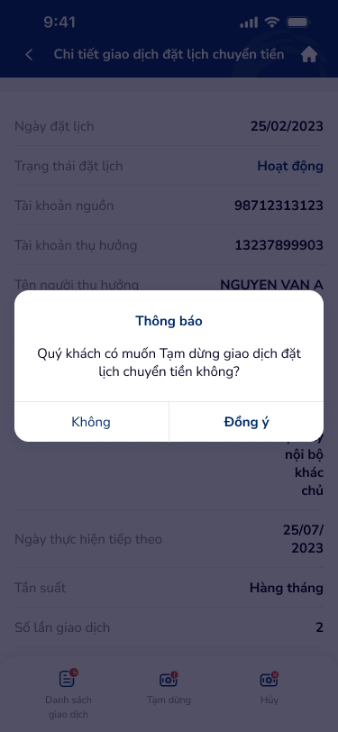

# Xác nhận hành động — PRD (Xác nhận hành động đặt lịch chuyển tiền)

Dialog xác nhận khi người dùng thực hiện hành động Tạm dừng hoặc Hủy giao dịch đặt lịch chuyển tiền từ màn hình chi tiết. Hai lựa chọn: "Không" (hủy bỏ) và "Đồng ý" (xác nhận thực hiện).

---

## Mục lục
1. [User Flow](#1-user-flow)
2. [User Story](#2-user-story)
3. [Wireframe](#3-wireframe)
4. [Thiết kế Database](#4-thiết-kế-database)
5. [Non-functional requirement](#5-non-functional-requirement)

---

## 1. User Flow

### 1.1. Luồng xác nhận Tạm dừng
| Bước | Tên màn hình | Tên hành động | Kết quả |
|:---:|---|---|---|
| 1 | Chi tiết đặt lịch | Chạm nút "Tạm dừng" | Hiển thị dialog "Thông báo" với nội dung "Quý khách có muốn Tạm dừng giao dịch đặt lịch chuyển tiền không?" |
| 2 | Dialog xác nhận | Chạm "Đồng ý" | Gọi API tạm dừng → chuyển sang màn Xác thực Soft OTP (nếu yêu cầu) hoặc cập nhật trạng thái → quay lại Chi tiết. |
| 3 | Dialog xác nhận | Chạm "Không" | Đóng dialog, quay lại Chi tiết đặt lịch, không thay đổi trạng thái. |

### 1.2. Luồng xác nhận Hủy
| Bước | Tên màn hình | Tên hành động | Kết quả |
|:---:|---|---|---|
| 1 | Chi tiết đặt lịch | Chạm nút "Hủy" | Hiển thị dialog "Thông báo" với nội dung "Quý khách có muốn Hủy giao dịch đặt lịch chuyển tiền không?" |
| 2 | Dialog xác nhận | Chạm "Đồng ý" | Gọi API hủy → chuyển sang màn Xác thực Soft OTP (nếu yêu cầu) hoặc cập nhật trạng thái → quay lại Chi tiết. |
| 3 | Dialog xác nhận | Chạm "Không" | Đóng dialog, quay lại Chi tiết đặt lịch, không thay đổi trạng thái. |

### 1.3. Luồng đóng dialog bằng hành vi hệ thống
| Bước | Tên màn hình | Tên hành động | Kết quả |
|:---:|---|---|---|
| 1 | Dialog xác nhận | Chạm vùng overlay ngoài dialog | Đóng dialog (tương đương "Không"). |
| 2 | Dialog xác nhận | Nhấn nút Back (Android) | Đóng dialog (tương đương "Không"). |

---

## 2. User Story

| Epic chung | Mã US | Tiêu đề | Mô tả chi tiết | Business Rule | Acceptance Criteria |
|---|---|---|---|---|---|
| Đặt lịch chuyển tiền | US-351 | Hiển thị dialog xác nhận Tạm dừng | Là người dùng, tôi muốn được hỏi xác nhận trước khi tạm dừng lịch chuyển tiền để tránh thao tác nhầm. | Dialog hiển thị khi chạm "Tạm dừng" từ Chi tiết. Nội dung thay đổi động theo hành động (Tạm dừng / Hủy). | - Dialog hiển thị tiêu đề "Thông báo". - Nội dung: "Quý khách có muốn Tạm dừng giao dịch đặt lịch chuyển tiền không?" - Hai nút: "Không" (trái, outline) và "Đồng ý" (phải, primary). - Dialog có backdrop mờ phía sau. |
| Đặt lịch chuyển tiền | US-352 | Hiển thị dialog xác nhận Hủy | Là người dùng, tôi muốn được hỏi xác nhận trước khi hủy lịch chuyển tiền vì hành động này không thể hoàn tác. | Dialog hiển thị khi chạm "Hủy" từ Chi tiết. Hủy là hành động không thể khôi phục — cần cảnh báo rõ. | - Dialog hiển thị tiêu đề "Thông báo". - Nội dung: "Quý khách có muốn Hủy giao dịch đặt lịch chuyển tiền không?" - Hai nút: "Không" (trái, outline) và "Đồng ý" (phải, primary). - Hành động Hủy không thể hoàn tác (irreversible). |
| Đặt lịch chuyển tiền | US-353 | Xử lý nút "Đồng ý" | Là người dùng, khi tôi chạm "Đồng ý", hệ thống thực hiện hành động tương ứng (tạm dừng hoặc hủy). | Nếu giao dịch yêu cầu xác thực OTP: chuyển đến Xác thực Soft OTP. Nếu không: gọi API trực tiếp, hiển thị loading, cập nhật trạng thái. | - Chạm "Đồng ý": đóng dialog → chuyển Xác thực OTP hoặc gọi API. - Loading indicator khi đang xử lý. - Thành công: cập nhật trạng thái trên Chi tiết + toast "Thành công". - Lỗi API: hiển thị toast lỗi, giữ nguyên trạng thái cũ. |
| Đặt lịch chuyển tiền | US-354 | Xử lý nút "Không" và đóng dialog | Là người dùng, tôi muốn hủy bỏ hành động bằng cách chạm "Không" hoặc đóng dialog để quay lại xem chi tiết. | "Không", chạm overlay, hoặc nút Back: đều đóng dialog mà không thay đổi dữ liệu. | - Chạm "Không": đóng dialog, không gọi API. - Chạm vùng overlay ngoài: đóng dialog. - Nút Back (Android): đóng dialog. - Trạng thái đặt lịch không thay đổi. |

> **`🤖 by AI`** | Augmented: US-352 irreversible warning, US-353 OTP flow branching, US-354 system dismiss | Độ tin cậy: High
>
> Hành vi đóng dialog bằng overlay/Back suy luận từ Material Design guideline. Flow OTP branching suy luận từ ngữ cảnh bảo mật ngân hàng.

---

## 3. Wireframe

### Hình ảnh minh họa

---

### Mô tả màn hình
| STT | Tên thành phần | Loại thành phần | Mô tả |
|:---:|---|---|---|
| 1 | Overlay backdrop | Overlay | Nền mờ (blur + dim 50%) phủ toàn màn hình Chi tiết đặt lịch phía sau. |
| 2 | Dialog container | Dialog / Modal | Hộp thoại trung tâm màn hình, bo góc 12px, nền trắng, padding 24px. Max-width 320px. |
| 3 | Tiêu đề dialog | Text | "Thông báo" — font bold, 18sp, color #212121, căn giữa hoặc căn trái. |
| 4 | Nội dung dialog | Text | "Quý khách có muốn {Tạm dừng/Hủy} giao dịch đặt lịch chuyển tiền không?" — font regular, 14sp, color #616161. |
| 5 | Nút "Không" | Button Outline | Nút trái, viền 1px (#BDBDBD), text "Không" (#616161), border-radius 8px. Chiều rộng 50% - gap. |
| 6 | Nút "Đồng ý" | Button Primary | Nút phải, nền primary (gradient hoặc solid #1976D2), text "Đồng ý" (bold, trắng), border-radius 8px. Chiều rộng 50% - gap. |

---

### Ngữ cảnh màn hình (từ OCR)

Dialog modal hiển thị phía trên màn hình Chi tiết đặt lịch (có blur overlay). Tiêu đề "Thông báo", nội dung hỏi xác nhận Tạm dừng hoặc Hủy. Hai nút cạnh nhau: "Không" (outline, secondary) bên trái, "Đồng ý" (primary, bold) bên phải.

> **`🤖 by AI`** | Suy luận bổ sung từ OCR
>
> - Nội dung dialog là **dynamic text** — thay đổi theo hành động (Tạm dừng / Hủy) thay vì hai dialog riêng biệt.
> - Layout hai nút ngang hàng tuân theo **Fitts's Law**: nút primary ("Đồng ý") đặt bên phải (vùng ngón cái thuận phải) để giảm lỗi thao tác.
> - Backdrop blur tạo **depth hierarchy** rõ ràng, giúp người dùng nhận biết dialog là foreground action bắt buộc.
> - Nút "Đồng ý" dùng **bold + primary color** để tạo visual weight, nhưng cần cân nhắc swap primary cho "Không" khi hành động là Hủy (destructive action) theo UX best practice.

---

## 4. Thiết kế Database

> **`🤖 by AI`** | Nguồn: OCR popup.png + business flow | Độ tin cậy: Medium
>
> Dialog xác nhận là UI-only component, không tạo entity riêng. Tuy nhiên, hành động Tạm dừng / Hủy cập nhật entity ScheduleTransfer và tạo audit log.

### Entity: ScheduleTransfer — Cập nhật trạng thái (đã khai báo ở file khác, bổ sung field liên quan)
| Field | Data Type | Constraint | Description |
|---|---|---|---|
| `id` | UUID | Primary Key | Mã đặt lịch |
| `status` | Enum | Not Null | Đang hoạt động \| Tạm dừng \| Hủy \| Hoàn thành |
| `paused_at` | DateTime | Nullable | Thời điểm tạm dừng (cập nhật khi status → Tạm dừng) |
| `cancelled_at` | DateTime | Nullable | Thời điểm hủy (cập nhật khi status → Hủy) |
| `cancel_reason` | String(500) | Nullable | Lý do hủy (nếu có) |
| `updated_at` | DateTime | Not Null | Thời điểm cập nhật cuối |
| `updated_by` | UUID | Not Null | User thực hiện thay đổi |

### Entity: ScheduleActionAudit (Nhật ký hành động)
| Field | Data Type | Constraint | Description |
|---|---|---|---|
| `id` | UUID | Primary Key | Mã bản ghi audit |
| `schedule_id` | UUID | Foreign Key, Not Null | Liên kết đặt lịch |
| `user_id` | UUID | Foreign Key, Not Null | Người thực hiện |
| `action` | Enum | Not Null | PAUSE \| CANCEL \| RESUME \| CREATE |
| `previous_status` | Enum | Not Null | Trạng thái trước khi thay đổi |
| `new_status` | Enum | Not Null | Trạng thái sau khi thay đổi |
| `otp_verified` | Boolean | Not Null | Đã xác thực OTP hay chưa |
| `ip_address` | String(50) | Nullable | IP thiết bị thực hiện |
| `device_info` | String(500) | Nullable | Thông tin thiết bị |
| `created_at` | DateTime | Not Null | Thời điểm ghi log |

---

## 5. Non-functional requirement

- **Bảo mật:**
    - Hành động Tạm dừng / Hủy yêu cầu xác thực Soft OTP trước khi gọi API (tùy cấu hình risk level).
    - Mọi hành động thay đổi trạng thái đều ghi audit log (IP, device, timestamp, user).
    - API endpoint cần kiểm tra `user_id` sở hữu `schedule_id` trước khi xử lý.
- **Hiệu năng:**
    - Dialog hiển thị ngay (< 100ms) vì là UI-only component, không gọi API khi mở.
    - Nút "Đồng ý" disable sau lần chạm đầu tiên để chống double-tap (debounce 2s).
- **Trải nghiệm:**
    - Touch target tối thiểu 44x44px cho cả hai nút.
    - Animation fade-in dialog 200ms, fade-out 150ms.
    - Backdrop chạm để đóng (dismiss on outside tap) — coi như chọn "Không".
    - Nội dung dialog thay đổi động theo action type, không hiển thị hai dialog riêng.
    - Khi hành động là Hủy (destructive), cân nhắc thêm visual cue (icon cảnh báo hoặc text đỏ) để tăng awareness.

---
*Generated by VNPAY Agentic Framework*
