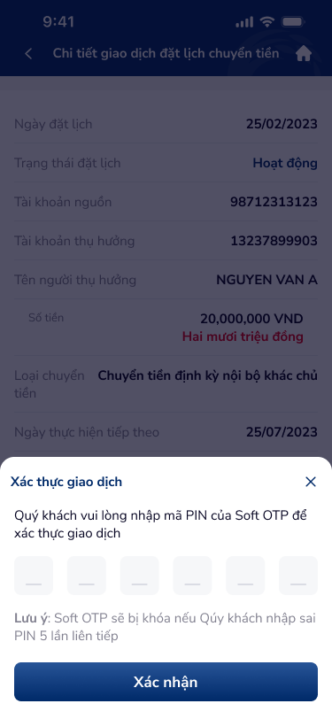

# Xác thực Soft OTP — PRD (Xác thực Soft OTP đặt lịch chuyển tiền)

Bottom sheet xác thực giao dịch bằng mã PIN Soft OTP (6 chữ số) khi người dùng thực hiện hành động Tạm dừng hoặc Hủy giao dịch đặt lịch chuyển tiền. Có cảnh báo khóa Soft OTP nếu nhập sai 5 lần.

---

## Mục lục
1. [User Flow](#1-user-flow)
2. [User Story](#2-user-story)
3. [Wireframe](#3-wireframe)
4. [Thiết kế Database](#4-thiết-kế-database)
5. [Non-functional requirement](#5-non-functional-requirement)

---

## 1. User Flow

### 1.1. Luồng xác thực thành công
| Bước | Tên màn hình | Tên hành động | Kết quả |
|:---:|---|---|---|
| 1 | Dialog xác nhận | Chạm "Đồng ý" | Hiển thị bottom sheet "Xác thực giao dịch" với ô nhập OTP 6 chữ số. |
| 2 | Xác thực Soft OTP | Nhập 6 chữ số PIN | Các ô input lần lượt được điền, nút "Xác nhận" active khi đủ 6 số. |
| 3 | Xác thực Soft OTP | Chạm "Xác nhận" | Gọi API xác thực OTP → Thành công: thực hiện hành động (Tạm dừng / Hủy) → Quay lại Chi tiết với trạng thái mới + toast "Thành công". |

### 1.2. Luồng xác thực thất bại (sai PIN)
| Bước | Tên màn hình | Tên hành động | Kết quả |
|:---:|---|---|---|
| 1 | Xác thực Soft OTP | Nhập sai PIN + chạm "Xác nhận" | Hiển thị lỗi "Mã PIN không chính xác. Quý khách còn {n} lần thử." Xóa ô input, focus ô đầu tiên. |
| 2 | Xác thực Soft OTP | Nhập sai lần thứ 5 liên tiếp | Khóa Soft OTP. Hiển thị thông báo "Soft OTP đã bị khóa. Vui lòng liên hệ ngân hàng." Đóng bottom sheet. |

### 1.3. Luồng đóng / hủy xác thực
| Bước | Tên màn hình | Tên hành động | Kết quả |
|:---:|---|---|---|
| 1 | Xác thực Soft OTP | Chạm icon X (góc phải trên) | Đóng bottom sheet, quay lại Chi tiết đặt lịch, hành động không được thực hiện. |
| 2 | Xác thực Soft OTP | Vuốt xuống bottom sheet | Đóng bottom sheet, quay lại Chi tiết đặt lịch. |

---

## 2. User Story

| Epic chung | Mã US | Tiêu đề | Mô tả chi tiết | Business Rule | Acceptance Criteria |
|---|---|---|---|---|---|
| Đặt lịch chuyển tiền | US-361 | Hiển thị bottom sheet xác thực Soft OTP | Là người dùng, tôi muốn xác thực bằng Soft OTP trước khi hệ thống thực hiện Tạm dừng hoặc Hủy để bảo vệ giao dịch. | Bottom sheet hiển thị sau khi chạm "Đồng ý" trên dialog xác nhận. Tiêu đề: "Xác thực giao dịch". | - Bottom sheet hiển thị tiêu đề "Xác thực giao dịch" + icon X đóng. - Hướng dẫn: "Quý khách vui lòng nhập mã PIN của Soft OTP để xác thực giao dịch". - 6 ô input cho mã PIN. - Cảnh báo: "Lưu ý: Soft OTP sẽ bị khóa nếu Quý khách nhập sai PIN 5 lần liên tiếp". - Nút "Xác nhận" ở dưới cùng. |
| Đặt lịch chuyển tiền | US-362 | Nhập mã PIN 6 chữ số | Là người dùng, tôi muốn nhập mã PIN Soft OTP dễ dàng với 6 ô riêng biệt và bàn phím số. | Input mask: mỗi ô chỉ nhận 1 chữ số (0-9). Auto-focus ô tiếp theo khi nhập xong. Hỗ trợ xóa ngược (backspace). PIN ẩn bằng dấu • sau 300ms. | - Bàn phím số hiển thị tự động khi mở sheet. - Focus tự động chuyển sang ô tiếp theo khi nhập xong 1 số. - Backspace: xóa ô hiện tại và focus về ô trước. - Ký tự hiển thị 300ms rồi chuyển thành •. - Nút "Xác nhận" disabled khi chưa đủ 6 số, enabled khi đủ. |
| Đặt lịch chuyển tiền | US-363 | Xác thực PIN thành công | Là người dùng, khi tôi nhập đúng PIN, hệ thống thực hiện hành động và thông báo kết quả. | API xác thực PIN → thành công → gọi API thực hiện hành động (Tạm dừng / Hủy) → cập nhật trạng thái. | - Chạm "Xác nhận" với PIN đúng: loading indicator trên nút. - Thành công: đóng bottom sheet → quay lại Chi tiết → trạng thái cập nhật → toast "Thành công". - Lỗi server: hiển thị thông báo lỗi, giữ bottom sheet mở. |
| Đặt lịch chuyển tiền | US-364 | Xử lý nhập sai PIN | Là người dùng, khi tôi nhập sai PIN, hệ thống thông báo rõ ràng số lần còn lại để tôi cẩn thận hơn. | Tối đa 5 lần nhập sai liên tiếp. Mỗi lần sai: hiển thị số lần còn lại. Lần thứ 5: khóa Soft OTP. | - Sai PIN: hiển thị lỗi đỏ "Mã PIN không chính xác. Quý khách còn {n} lần thử." - Xóa toàn bộ ô input, focus ô đầu. - Lần thứ 5 sai: thông báo "Soft OTP đã bị khóa", đóng sheet sau 3 giây. - Bộ đếm reset khi nhập đúng hoặc hết session. |
| Đặt lịch chuyển tiền | US-365 | Hủy xác thực OTP | Là người dùng, tôi muốn hủy xác thực OTP nếu đổi ý, bằng cách đóng bottom sheet. | Đóng bằng X hoặc vuốt xuống: hủy flow xác thực, không gọi API hành động. Quay lại Chi tiết giữ nguyên trạng thái. | - Chạm X: đóng sheet, không thay đổi trạng thái đặt lịch. - Vuốt xuống: đóng sheet. - Không gọi API Tạm dừng / Hủy khi đóng sheet. |

> **`🤖 by AI`** | Augmented: US-362 PIN masking + auto-focus, US-364 lockout logic, US-365 gesture dismiss | Độ tin cậy: High
>
> PIN masking delay 300ms là pattern phổ biến trên mobile banking. Lockout 5 lần theo quy chuẩn bảo mật Soft OTP ngân hàng Việt Nam.

---

## 3. Wireframe

### Hình ảnh minh họa

---

### Mô tả màn hình
| STT | Tên thành phần | Loại thành phần | Mô tả |
|:---:|---|---|---|
| 1 | Overlay backdrop | Overlay | Nền mờ phía sau bottom sheet, chạm để đóng (hoặc không cho đóng tùy policy). |
| 2 | Bottom Sheet container | Bottom Sheet | Sheet trượt lên từ dưới, bo góc trên 16px, nền trắng. Chiều cao tự động theo nội dung. |
| 3 | Header bottom sheet | Header | Tiêu đề "Xác thực giao dịch" (font bold, 16sp), icon X đóng (góc phải, 24x24px). |
| 4 | Hướng dẫn nhập | Text | "Quý khách vui lòng nhập mã PIN của Soft OTP để xác thực giao dịch" — font regular, 14sp, color #616161, căn giữa. |
| 5 | OTP Input (6 ô) | OTP Input | 6 ô vuông (48x48px mỗi ô, gap 12px), viền 1px (#BDBDBD), focus viền primary (#1976D2). Chỉ nhận số 0-9. Ký tự ẩn thành • sau 300ms. |
| 6 | Cảnh báo (Lưu ý) | Infobox / Helper Text | Nền vàng nhạt (#FFF8E1) hoặc text cam, icon ⚠️. Nội dung: "Lưu ý: Soft OTP sẽ bị khóa nếu Quý khách nhập sai PIN 5 lần liên tiếp". Font 12sp. |
| 7 | Thông báo lỗi | Error Text | Hiển thị khi sai PIN: text đỏ (#F44336), "Mã PIN không chính xác. Quý khách còn {n} lần thử." Font 12sp. Ẩn khi chưa có lỗi. |
| 8 | Nút "Xác nhận" | Button Primary | Nút full-width, nền primary (gradient hoặc solid #1976D2), text "Xác nhận" (bold, trắng, 16sp), border-radius 8px, height 48px. Disabled state (opacity 0.5) khi chưa đủ 6 số. |

---

### Ngữ cảnh màn hình (từ OCR)

Bottom sheet "Xác thực giao dịch" với icon X đóng. Hướng dẫn nhập mã PIN Soft OTP. 6 ô input OTP. Cảnh báo khóa Soft OTP nếu nhập sai 5 lần. Nút "Xác nhận" ở dưới cùng.

> **`🤖 by AI`** | Suy luận bổ sung từ OCR
>
> - 6 ô OTP dùng **segmented input pattern** — mỗi ô một ký tự, giúp người dùng đếm chính xác số ký tự đã nhập (reducing input error).
> - Cảnh báo Soft OTP lockout đặt **trước nút Xác nhận** theo pattern **progressive disclosure of risk** — người dùng thấy cảnh báo ngay trước khi hành động.
> - Bottom sheet thay vì full-screen modal giúp giữ **context of action** — người dùng vẫn thấy một phần màn hình Chi tiết phía trên, biết mình đang xác thực cho hành động nào.
> - PIN masking (ẩn thành •) cân bằng giữa **security** (tránh nhìn trộm) và **usability** (hiển thị tạm 300ms để xác nhận đã nhập đúng).

---

## 4. Thiết kế Database

> **`🤖 by AI`** | Nguồn: OCR popup-2.png + security context | Độ tin cậy: Medium
>
> Xác thực Soft OTP liên quan đến entity OTP tracking và audit. Các entity dưới đây suy luận từ business flow; cần đối chiếu với module OTP hiện có.

### Entity: SoftOtpVerification (Xác thực Soft OTP)
| Field | Data Type | Constraint | Description |
|---|---|---|---|
| `id` | UUID | Primary Key | Mã phiên xác thực |
| `user_id` | UUID | Foreign Key, Not Null | Người thực hiện xác thực |
| `schedule_id` | UUID | Foreign Key, Not Null | Đặt lịch liên quan |
| `action_type` | Enum | Not Null | PAUSE \| CANCEL |
| `status` | Enum | Not Null | PENDING \| VERIFIED \| FAILED \| LOCKED |
| `attempt_count` | Integer | Not Null, Default 0 | Số lần nhập (tối đa 5) |
| `max_attempts` | Integer | Not Null, Default 5 | Giới hạn số lần thử |
| `verified_at` | DateTime | Nullable | Thời điểm xác thực thành công |
| `locked_at` | DateTime | Nullable | Thời điểm bị khóa (attempt_count = max_attempts) |
| `expires_at` | DateTime | Not Null | Thời hạn phiên xác thực (timeout) |
| `created_at` | DateTime | Not Null | Thời điểm tạo phiên |

### Entity: SoftOtpAttemptLog (Log từng lần nhập)
| Field | Data Type | Constraint | Description |
|---|---|---|---|
| `id` | UUID | Primary Key | |
| `verification_id` | UUID | Foreign Key, Not Null | Liên kết phiên xác thực |
| `attempt_number` | Integer | Not Null | Lần thử thứ mấy (1-5) |
| `is_correct` | Boolean | Not Null | Đúng hay sai |
| `ip_address` | String(50) | Nullable | IP thiết bị |
| `device_fingerprint` | String(200) | Nullable | Vân tay thiết bị |
| `created_at` | DateTime | Not Null | Thời điểm nhập |

### Entity: SoftOtpLockout (Khóa Soft OTP)
| Field | Data Type | Constraint | Description |
|---|---|---|---|
| `id` | UUID | Primary Key | |
| `user_id` | UUID | Foreign Key, Not Null | Người bị khóa |
| `locked_at` | DateTime | Not Null | Thời điểm khóa |
| `unlock_method` | Enum | Nullable | AUTO_EXPIRE \| MANUAL_UNLOCK \| BANK_SUPPORT |
| `unlocked_at` | DateTime | Nullable | Thời điểm mở khóa |
| `locked_reason` | String(200) | Not Null | "Nhập sai PIN 5 lần liên tiếp" |

---

## 5. Non-functional requirement

- **Bảo mật:**
    - Mã PIN truyền qua HTTPS, mã hóa end-to-end; không lưu PIN dạng plain text ở client hoặc log.
    - Giới hạn 5 lần nhập sai liên tiếp → khóa Soft OTP; yêu cầu liên hệ ngân hàng để mở khóa.
    - Phiên xác thực có timeout (mặc định 5 phút); quá hạn phải khởi tạo lại.
    - Ghi log mỗi lần nhập (đúng/sai) kèm IP, device fingerprint để phát hiện brute-force.
    - Không cho phép paste vào ô OTP để giảm rủi ro clipboard hijacking.
- **Hiệu năng:**
    - Bottom sheet hiển thị ngay (< 200ms), bàn phím số xuất hiện đồng thời.
    - API xác thực PIN: response ≤ 2 giây; nếu quá → timeout → thông báo lỗi.
    - Nút "Xác nhận" disable ngay sau chạm để chống double-submit.
- **Trải nghiệm:**
    - Auto-focus ô đầu tiên khi mở sheet + hiển thị bàn phím số.
    - Touch target mỗi ô OTP tối thiểu 44x44px; khoảng cách giữa ô ≥ 8px.
    - Hiệu ứng focus ô hiện tại: viền đổi màu primary + scale nhẹ (1.05x).
    - Lỗi sai PIN: shake animation trên dãy ô (300ms), text lỗi đỏ hiển thị bên dưới.
    - Cảnh báo lockout luôn hiển thị (không phải chỉ khi gần hết lần thử) để người dùng biết trước hậu quả.
    - Loading state trên nút "Xác nhận": text chuyển thành spinner khi đang gọi API.

---
*Generated by VNPAY Agentic Framework*
